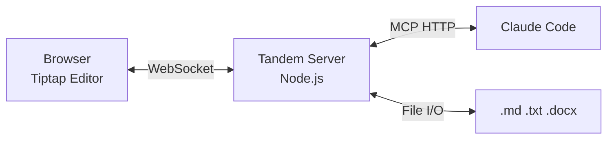

# Tandem

A collaborative document editor where Claude and a human work on the same document in real-time -- editing, highlighting, commenting, and annotating together.



## Quickstart

```bash
# Prerequisites: Node.js 18+
cd tandem
npm install
npm run dev:server   # Starts MCP HTTP (:3479) + WebSocket (:3478)
# In another terminal:
npm run dev:client   # Starts Vite (:5173)
```

Then from Claude Code:

```
"Let's review report.md together"
→ Claude calls tandem_open("C:\path\to\report.md")
→ Browser shows the document
→ Claude highlights, comments, suggests -- you see it live
```

## MCP Configuration

Tandem uses HTTP transport. Add to your project's `.mcp.json`:

```json
{
  "mcpServers": {
    "tandem": {
      "type": "http",
      "url": "http://localhost:3479/mcp"
    }
  }
}
```

The server must be running before Claude Code connects (`npm run dev:server`). Claude Code does not auto-start HTTP-based MCP servers.

## What Works Now

- Open `.md`, `.txt`, `.docx` files in a shared editor
- Multi-document tabs with per-document Y.Doc rooms
- Claude edits text that appears live in the browser
- Highlights (5 colors), comments, and tracked-change suggestions
- Keyboard review mode (Tab/Y/N), annotation filtering, bulk accept/dismiss
- Search and safe range resolution for concurrent editing
- Claude's presence: status text, focus paragraph highlight
- User→Claude communication via inbox (highlights, comments, questions)
- Session persistence across server restarts
- Markdown round-trip (lossless), .docx review-only mode
- Atomic file saves

## Scripts

| Command | What it does |
|---------|-------------|
| `npm run dev:server` | Backend: Hocuspocus (:3478) + MCP HTTP (:3479) |
| `npm run dev:client` | Frontend: Vite dev server (:5173) |
| `npm run dev:standalone` | Both frontend + backend (via concurrently) |
| `npm run dev` | Alias for `vite` (frontend only) |
| `npm run build` | Production build |
| `npm test` | Run vitest |

## Documentation

- [MCP Tool Reference](docs/mcp-tools.md) -- All 24 tools with parameters, returns, and examples
- [Architecture](docs/architecture.md) -- System design, data flows, coordinate systems
- [Workflows](docs/workflows.md) -- Real-world usage patterns
- [Roadmap](docs/roadmap.md) -- Phase 2+ roadmap, known issues, future extensions
- [Design Decisions](docs/decisions.md) -- ADR-001 through ADR-012
- [Lessons Learned](docs/lessons-learned.md) -- 14 implementation lessons

## Tech Stack

**Frontend:** React 18, Tiptap, Vite, TypeScript
**Backend:** Node.js, Hocuspocus (Yjs WebSocket), MCP SDK (Streamable HTTP transport), Express
**Collaboration:** Yjs (CRDT), @hocuspocus/provider, y-prosemirror
**File I/O:** mammoth.js (.docx), unified/remark (.md)
