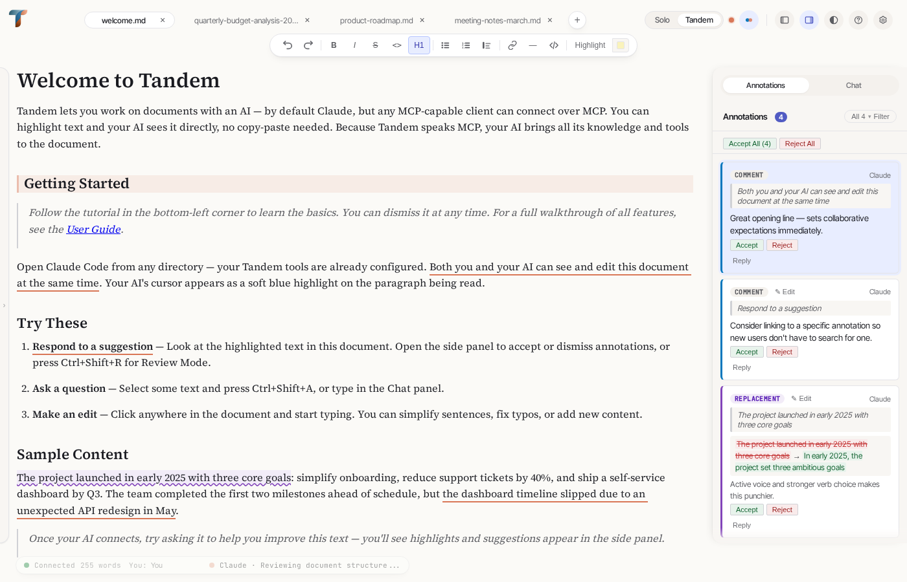
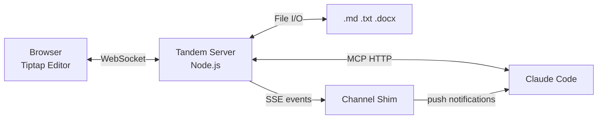
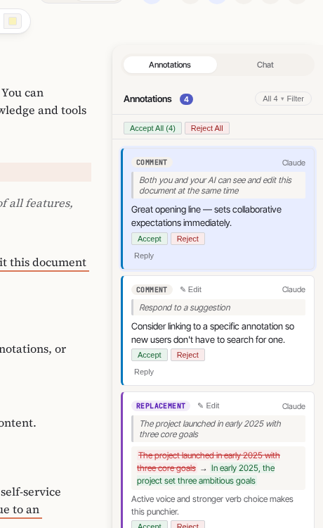
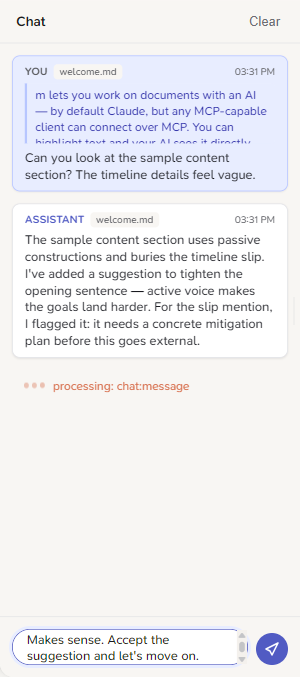
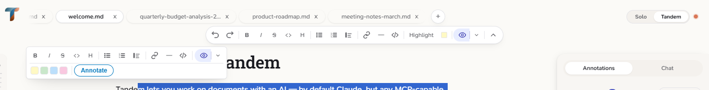
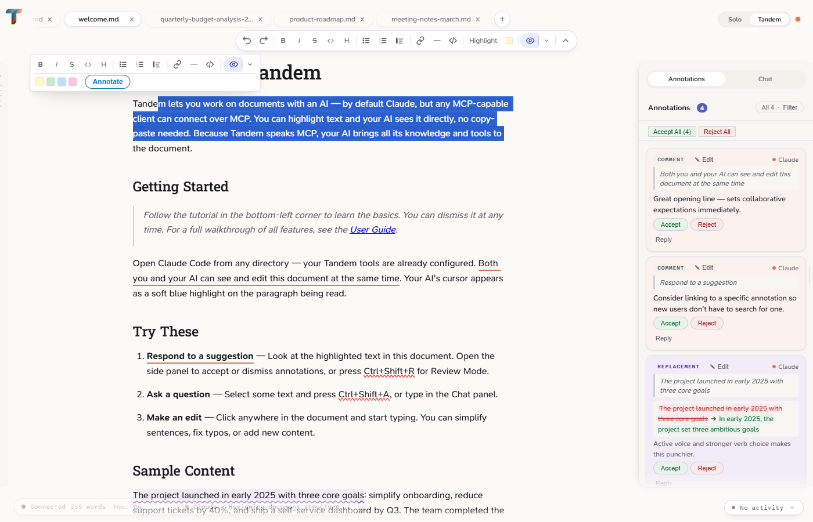
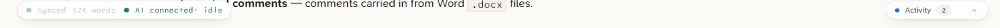
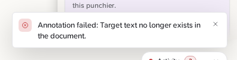
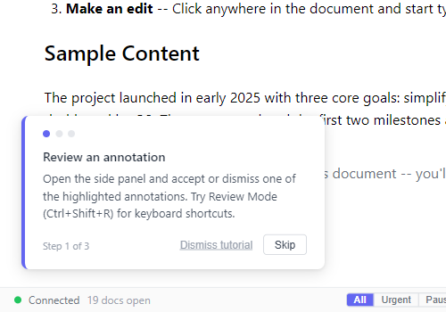

<p align="center">
  
</p>

A collaborative document editor where Claude and a human work on the same document in real-time -- editing, highlighting, commenting, and annotating together.





## Getting Started

### Prerequisites

- **Node.js 22+** ([download](https://nodejs.org))
- **Claude Code** (`irm https://claude.ai/install.ps1 | iex`)

### Option A: Global Install (recommended)

```bash
npm install -g tandem-editor
tandem setup     # registers MCP tools with Claude Code / Claude Desktop
tandem           # starts server + opens browser
```

`tandem setup` auto-detects Claude Code and Claude Desktop and writes MCP configuration so tools work from any directory. Re-run after upgrading (`npm update -g tandem-editor`).

### Option B: Development Setup

```bash
git clone https://github.com/bloknayrb/tandem.git
cd tandem
npm install
npm run dev:standalone   # starts server (:3478/:3479) + browser client (:5173)
```

Open http://localhost:5173 -- you'll see `sample/welcome.md` loaded automatically on first run. The `.mcp.json` in the repo configures Claude Code automatically when run from this directory.

### Connect Claude Code

Start Claude Code and try:

```
"Review the welcome document with me"
```

Claude calls `tandem_open`, the document appears in the browser, and annotations start flowing.

### Verify (if something seems wrong)

```bash
npm run doctor    # from the repo, or after global install
```

This checks Node.js version, MCP configuration (both `.mcp.json` and `~/.claude/mcp_settings.json`), server health, and port status with actionable fix suggestions. You can also check the raw health endpoint:

```bash
curl http://localhost:3479/health
# → {"status":"ok","version":"0.1.0","transport":"http","hasSession":false}
```

`hasSession` becomes `true` once Claude Code connects.

## MCP Configuration

Tandem uses two MCP connections: **HTTP** for document tools (27 tools including annotation editing), and a **channel shim** for real-time push notifications.

**Global install** (`tandem setup`): Automatically writes both entries to `~/.claude/mcp_settings.json` (Claude Code) and/or `claude_desktop_config.json` (Claude Desktop) with absolute paths. No manual configuration needed.

**Development setup** (`.mcp.json`): The repo includes a `.mcp.json` that configures both entries automatically when Claude Code runs from the repo directory:

```json
{
  "mcpServers": {
    "tandem": {
      "type": "http",
      "url": "http://localhost:3479/mcp"
    },
    "tandem-channel": {
      "command": "npx",
      "args": ["tsx", "src/channel/index.ts"],
      "env": { "TANDEM_URL": "http://localhost:3479" }
    }
  }
}
```

Both entries are cross-platform -- no platform-specific configuration needed.

The channel shim is optional -- without it, Claude relies on polling via `tandem_checkInbox` instead of receiving real-time push events.

**Important:** The server must be running before Claude Code connects.

## Environment Variables

All optional -- defaults work out of the box.

| Variable | Default | Description |
|----------|---------|-------------|
| `TANDEM_PORT` | `3478` | Hocuspocus WebSocket port |
| `TANDEM_MCP_PORT` | `3479` | MCP HTTP + REST API port |
| `TANDEM_URL` | `http://localhost:3479` | Channel shim server URL |
| `TANDEM_TRANSPORT` | `http` | Transport mode (`http` or `stdio`) |
| `TANDEM_NO_SAMPLE` | unset | Set to `1` to skip auto-opening `sample/welcome.md` |

See `.env.example` for a copy-paste template.

## Troubleshooting

Run `npm run doctor` for a quick diagnostic of your setup. It checks Node.js version, `.mcp.json` config, server health, and port status.

**Claude Code says "MCP failed to connect"**
Start the server first (`tandem` for global install, or `npm run dev:standalone` for dev setup), then open Claude Code. The server must be running before Claude Code probes the MCP URL. If you restart the server, run `/mcp` in Claude Code to reconnect.

**Port already in use**
Tandem kills stale processes on :3478/:3479 at startup. If another app uses those ports, set `TANDEM_PORT` / `TANDEM_MCP_PORT` to different values and update `TANDEM_URL` to match.

**Channel shim fails to start**
The `tandem-channel` entry spawns a subprocess. For global installs, `tandem setup` writes absolute paths to the bundled `dist/channel/index.js` -- re-run `tandem setup` after upgrading. For dev setup, if you see `MODULE_NOT_FOUND` with a production config (`node dist/channel/index.js`), run `npm run build`. The default dev config uses `npx tsx` and doesn't require a build step.

**Browser shows "Cannot reach the Tandem server"**
The browser connects to the server via WebSocket. For global installs, run `tandem` to start the server. For dev setup, use `npm run dev:standalone` (or `npm run dev:server`). The message appears after 3 seconds of failed connection.

**Empty browser with no document**
On first run, `sample/welcome.md` auto-opens. If you've cleared sessions or deleted the sample file, click the **+** button in the tab bar or drop a file onto the editor.

## Features

### Annotations

Claude adds highlights, comments, suggestions, and flags directly in the document. Each annotation type has distinct styling -- colored backgrounds for highlights, dashed underlines for comments, wavy underlines for suggestions -- so you can scan at a glance.



The side panel lists all annotations with filtering by type, author, and status. Each card shows a preview of the annotated text. Bulk accept/dismiss buttons appear when multiple annotations are pending. Annotations can be edited after creation via the pencil button -- typos in comments or suggestions no longer require deleting and recreating.

### Chat Sidebar



The right sidebar toggles between **Annotations** and **Chat** views. In chat mode, send freeform messages to Claude alongside annotation review. If you have text selected when you hit Send, it is attached as a clickable anchor -- clicking it later scrolls the editor back to that passage. Claude's responses are rendered as Markdown. An unread badge on the Chat tab appears when Claude has replied while you were in the Annotations view.

### Toolbar



Select text in the editor to activate the toolbar buttons: Highlight (with color picker), Comment, Suggest, Flag, and Ask Claude. The tab bar shows open documents with format indicators (M for Markdown, W for Word, T for Text). Tabs scroll horizontally when they overflow, and can be reordered via drag-and-drop or Alt+Left/Right.

### Keyboard Review Mode



Press **Ctrl+Shift+R** or click "Review in sequence" to enter review mode. The editor dims non-annotated text so annotations stand out. Navigate with **Tab/Shift+Tab**, accept with **Y**, dismiss with **N**, or examine with **E**. The side panel tracks your position (e.g. "Reviewing 1 / 7").

### Claude's Presence



The status bar shows real-time connection state with reconnect attempt count and elapsed time, open document count, and Claude's current activity. A prominent banner appears after 30 seconds of continuous disconnect with actionable guidance. Claude's focus paragraph gets a subtle blue highlight in the editor. Interruption modes (All / Urgent / Paused) control which annotations surface immediately vs. get held for later.

### Toast Notifications



Annotation failures and save errors surface as dismissible toast notifications. Toasts auto-dismiss by severity (errors linger longest) and deduplicate with a count badge when the same message repeats.

### Onboarding Tutorial



On first launch, a 3-step guided walkthrough appears over the welcome document. Pre-placed annotations let you practice reviewing, asking Claude a question, and editing -- then the tutorial dismisses itself. Progress persists in localStorage so it only shows once.

### More

- **Multi-document tabs** -- open `.md`, `.txt`, `.docx` files side by side, each in its own Y.Doc room
- **Browser file open** -- click "+" in the tab bar or drag-and-drop a file onto the editor (no Claude needed); recent files remembered
- **Markdown round-trip** -- lossless MDAST-based conversion preserves formatting through load/save cycles
- **.docx review-only mode** -- open Word documents for annotation; a banner makes clear edits aren't saved back to the original
- **Session persistence** -- Y.Doc state and annotations survive server restarts
- **Real-time channel push** -- annotation accepts/dismisses, chat messages, and document switches push to Claude instantly via the Channels API (no polling)
- **User→Claude inbox** -- highlights, comments, and questions you add are surfaced to Claude via push events or `tandem_checkInbox` fallback
- **Unsaved-changes indicator** -- dot on the tab title when a document has pending edits
- **Configurable display name** -- set your name so Claude knows who's reviewing
- **Annotation text preview** -- each card in the side panel shows an excerpt of the annotated text
- **Keyboard shortcuts reference** -- press `?` to open the in-app shortcut reference
- **E2E tested** -- Playwright tests cover the annotation lifecycle end-to-end
- **Atomic file saves** -- write to temp, then rename, preventing partial writes

## CLI Commands

| Command | What it does |
|---------|-------------|
| `tandem` | Start server and open browser (global install) |
| `tandem setup` | Register MCP tools with Claude Code / Claude Desktop |
| `tandem setup --force` | Register to default paths regardless of auto-detection |
| `tandem --version` | Show installed version |
| `tandem --help` | Show usage |

## Development Scripts

| Command | What it does |
|---------|-------------|
| `npm run dev:standalone` | **Recommended** -- both frontend + backend (via concurrently) |
| `npm run dev:server` | Backend only: Hocuspocus (:3478) + MCP HTTP (:3479) |
| `npm run dev:client` | Frontend only: Vite dev server (:5173) |
| `npm run build` | Production build (`dist/server/` + `dist/channel/` + `dist/cli/` + `dist/client/`) |
| `npm test` | Run vitest (unit tests) |
| `npm run test:e2e` | Run Playwright E2E tests |
| `npm run test:e2e:ui` | Playwright UI mode |

## Documentation

- [MCP Tool Reference](docs/mcp-tools.md) -- 27 MCP tools + channel API endpoints
- [Architecture](docs/architecture.md) -- System design, data flows, coordinate systems, channel push
- [Workflows](docs/workflows.md) -- Real-world usage patterns
- [Roadmap](docs/roadmap.md) -- Phase 2+ roadmap, known issues, future extensions
- [Design Decisions](docs/decisions.md) -- ADR-001 through ADR-021
- [Lessons Learned](docs/lessons-learned.md) -- 31 implementation lessons

## Tech Stack

**Frontend:** React 19, Tiptap, Vite, TypeScript
**Backend:** Node.js, Hocuspocus (Yjs WebSocket), MCP SDK (Streamable HTTP transport), Express
**Collaboration:** Yjs (CRDT), @hocuspocus/provider, y-prosemirror
**File I/O:** mammoth.js (.docx), unified/remark (.md)
