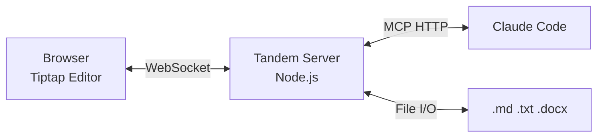

<p align="center">
  
</p>

A collaborative document editor where Claude and a human work on the same document in real-time -- editing, highlighting, commenting, and annotating together.




## Quickstart

```bash
# Prerequisites: Node.js 18+
cd tandem
npm install
npm run dev:server   # Starts MCP HTTP (:3479) + WebSocket (:3478)
# In another terminal:
npm run dev:client   # Starts Vite (:5173)
```

Then from Claude Code:

```
"Let's review report.md together"
→ Claude calls tandem_open("C:\path\to\report.md")
→ Browser shows the document
→ Claude highlights, comments, suggests -- you see it live
```

## MCP Configuration

Tandem uses HTTP transport. Add to your project's `.mcp.json`:

```json
{
  "mcpServers": {
    "tandem": {
      "type": "http",
      "url": "http://localhost:3479/mcp"
    }
  }
}
```

The server must be running before Claude Code connects (`npm run dev:server`). Claude Code does not auto-start HTTP-based MCP servers.

## Features

### Annotations

Claude adds highlights, comments, suggestions, and flags directly in the document. Each annotation type has distinct styling -- colored backgrounds for highlights, dashed underlines for comments, wavy underlines for suggestions -- so you can scan at a glance.


The side panel lists all annotations with filtering by type, author, and status. Bulk accept/dismiss buttons appear when multiple annotations are pending.

### Toolbar


Select text in the editor to activate the toolbar buttons: Highlight (with color picker), Comment, Suggest, Flag, and Ask Claude. The tab bar shows open documents with format indicators (M for Markdown, W for Word, T for Text).

### Keyboard Review Mode


Press **Ctrl+Shift+R** or click "Review in sequence" to enter review mode. The editor dims non-annotated text so annotations stand out. Navigate with **Tab/Shift+Tab**, accept with **Y**, dismiss with **N**, or examine with **E**. The side panel tracks your position (e.g. "Reviewing 1 / 7").

### Claude's Presence


The status bar shows real-time connection state, open document count, and Claude's current activity. Claude's focus paragraph gets a subtle blue highlight in the editor. Interruption modes (All / Urgent / Paused) control which annotations surface immediately vs. get held for later.

### More

- **Multi-document tabs** -- open `.md`, `.txt`, `.docx` files side by side, each in its own Y.Doc room
- **Markdown round-trip** -- lossless MDAST-based conversion preserves formatting through load/save cycles
- **.docx review-only mode** -- open Word documents for annotation without modifying the original
- **Session persistence** -- Y.Doc state and annotations survive server restarts
- **User→Claude inbox** -- highlights, comments, and questions you add are surfaced to Claude via `tandem_checkInbox`
- **Atomic file saves** -- write to temp, then rename, preventing partial writes

## Scripts

| Command | What it does |
|---------|-------------|
| `npm run dev:server` | Backend: Hocuspocus (:3478) + MCP HTTP (:3479) |
| `npm run dev:client` | Frontend: Vite dev server (:5173) |
| `npm run dev:standalone` | Both frontend + backend (via concurrently) |
| `npm run dev` | Alias for `vite` (frontend only) |
| `npm run build` | Production build |
| `npm test` | Run vitest |

## Documentation

- [MCP Tool Reference](docs/mcp-tools.md) -- All 25 tools with parameters, returns, and examples
- [Architecture](docs/architecture.md) -- System design, data flows, coordinate systems
- [Workflows](docs/workflows.md) -- Real-world usage patterns
- [Roadmap](docs/roadmap.md) -- Phase 2+ roadmap, known issues, future extensions
- [Design Decisions](docs/decisions.md) -- ADR-001 through ADR-012
- [Lessons Learned](docs/lessons-learned.md) -- 14 implementation lessons

## Tech Stack

**Frontend:** React 18, Tiptap, Vite, TypeScript
**Backend:** Node.js, Hocuspocus (Yjs WebSocket), MCP SDK (Streamable HTTP transport), Express
**Collaboration:** Yjs (CRDT), @hocuspocus/provider, y-prosemirror
**File I/O:** mammoth.js (.docx), unified/remark (.md)
