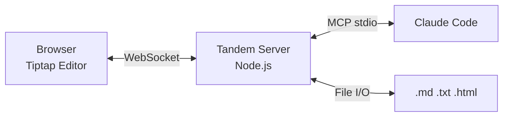

# Tandem

A collaborative document editor where Claude and a human work on the same document in real-time -- editing, highlighting, commenting, and annotating together.



## Quickstart

```bash
# Prerequisites: Node.js 18+
cd tandem
npm install
npm run dev        # Starts editor (port 5173) + server (port 3478)
```

Then from Claude Code:

```
"Let's review report.md together"
→ Claude calls tandem_open("C:\path\to\report.md")
→ Browser opens, document loads
→ Claude highlights, comments, suggests -- you see it live
```

## MCP Configuration

Add to your Claude Code MCP settings:

```json
{
  "mcpServers": {
    "tandem": {
      "type": "stdio",
      "command": "node",
      "args": ["path/to/tandem/dist/server/index.js"],
      "env": { "TANDEM_PORT": "3478" }
    }
  }
}
```

For development (with tsx):
```json
{
  "mcpServers": {
    "tandem": {
      "type": "stdio",
      "command": "npx",
      "args": ["tsx", "path/to/tandem/src/server/index.ts"],
      "env": { "TANDEM_PORT": "3478" }
    }
  }
}
```

## What Works Now

- Open `.md`, `.txt`, `.html` files in a shared editor
- Claude edits text that appears live in the browser
- Highlights (5 colors), comments, and tracked-change suggestions
- Search and safe range resolution for concurrent editing
- Claude's presence: status text, focus paragraph highlight
- User activity detection (typing, selection)
- Section-based reading for token efficiency on large docs
- Atomic file saves
- Auto-opens browser on first use

## Scripts

| Command | What it does |
|---------|-------------|
| `npm run dev` | Start frontend + backend concurrently |
| `npm run dev:client` | Vite dev server only (port 5173) |
| `npm run dev:server` | Tandem server only (MCP + WebSocket) |
| `npm run build` | Production build |
| `npm test` | Run vitest |

## Documentation

- [MCP Tool Reference](docs/mcp-tools.md) -- All 20 tools with parameters, returns, and examples
- [Architecture](docs/architecture.md) -- System design, data flows, coordinate systems
- [Workflows](docs/workflows.md) -- Real-world usage patterns (DRPA reviews, invoice cross-references, RFP drafting)
- [Design Decisions](docs/decisions.md) -- ADR-001 through ADR-008
- [Lessons Learned](docs/lessons-learned.md) -- Critical implementation lessons

## Tech Stack

**Frontend:** React 18, Tiptap, Vite, TypeScript
**Backend:** Node.js, Hocuspocus (Yjs WebSocket), MCP SDK
**Collaboration:** Yjs (CRDT), y-websocket, y-prosemirror
**File I/O:** mammoth.js (planned .docx), unified/remark (.md)
