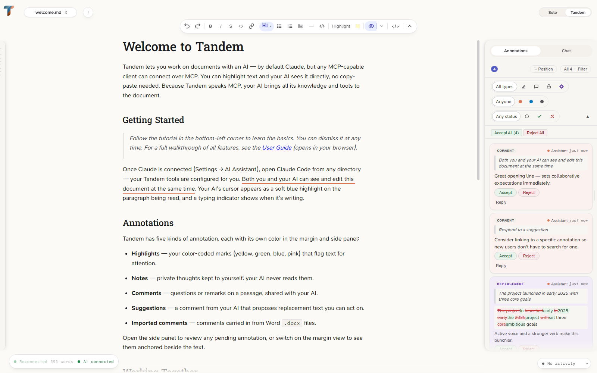
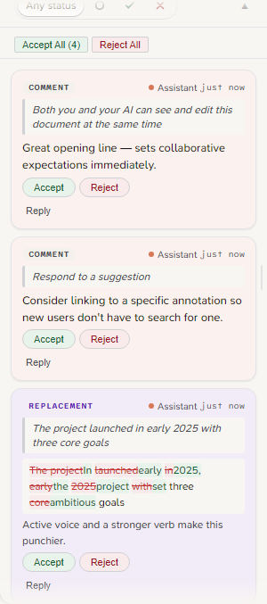

<p align="center">
  <picture>
    <source media="(prefers-color-scheme: dark)" srcset="docs/assets/logotype-dark.png">
    
  </picture>
</p>

<p align="center">
  <a href="https://www.npmjs.com/package/tandem-editor"></a>
  <a href="LICENSE"></a>
  <a href="https://github.com/bloknayrb/tandem/releases/latest"></a>
</p>

**An editor where you and an AI work on the same document at the same time.**

## Why I built this

At work I kept asking Claude to draft a report for me. I'd have it write into a scratch file in my Obsidian vault, and that file updated instantly. That much was great. But if I wanted a paragraph changed, or wanted to ask why a sentence was there at all, I was back to copying text into the chat window and pasting the answer out again. It was a one-way street. And Claude couldn't open a note for me either; I had to go find it myself.

So I built Tandem. I tell Claude to pull something up in Tandem, and then I just keep talking to it there: in the chat beside the document, or by commenting on a specific paragraph, or by highlighting a sentence and asking about *that* (it knows what I'm pointing at). It works the other way too. I can open any file in Tandem and Claude is already attached to it, with no session to start and nothing to paste in. If I want it to see the rest of that folder as well, Tandem offers to relaunch it there.

It started with reports, but it isn't really about reports. If you're copying text back and forth between a chat window and the document you're writing, that's what this is for.

One thing you need, though: an AI client running on your own computer, plus the subscription behind it. [Claude Code](https://claude.com/claude-code) is the default, and a Claude Pro or Max subscription includes it. Clients connect over [MCP](https://modelcontextprotocol.io), an open standard for letting an AI reach tools and files, so you can use others too. [Install](#install) below covers the setup, which is a wizard rather than a config file. Without a client connected, Tandem is still a local editor (open, edit, save) and nothing more.

<p align="center">
  
</p>

*Your document on the left, the AI's comments and suggested rewrites as cards on the right. Accept, reject, or reply to ask for something different.*

## Who Tandem is for

- You're drafting something long (an essay, a report, a proposal, a design doc) and you want a second reader for tone and structure.
- You're reviewing what someone else wrote (a thesis chapter, a contract, a spec) and you want a faster pass.
- The AI wrote a draft and you have to decide what to keep.

I built Tandem for one person working on their own documents. Those three are examples rather than a boundary; the workflow is the same whatever you're writing. The interface is English-only for now.

## Install

**[Download the installer for your platform →](https://github.com/bloknayrb/tandem/releases/latest)** Windows, macOS, and Linux. The desktop app bundles the editor, its server, and its own updates. Double-click a `.md`, `.markdown`, `.txt`, `.html`, or `.docx` file and it opens in Tandem.

Then connect your AI. Tandem opens a setup wizard the first time you run it. If [Claude Code](https://claude.com/claude-code) isn't installed it can install it for you in one click on all three platforms, and it writes the connection settings itself. You can reopen the wizard any time from **Settings → AI Assistant**. Two things before you start. **A Claude Pro or Max subscription includes Claude Code** (pay-as-you-go API billing works too). And **the Claude you use at claude.ai in a browser can't connect**, because a web page has no way to reach a file on your disk. The subscription alone doesn't do it: you need Claude Code, or Claude Desktop, installed locally as well.

Prefer a different AI? Any MCP-capable client can connect to the same endpoint. [docs/integrations.md](docs/integrations.md) covers what's supported and what's untested, and [Cowork](#cowork) covers connecting Claude Desktop on Windows.

<details>
<summary><b>System requirements</b></summary>

Windows 10 version 22H2 or Windows 11; macOS 12 (Monterey) or later; Linux with glibc 2.31 or later (Ubuntu 20.04+, Debian 11+, Fedora 34+). On Windows the first launch may show a "Windows protected your PC" warning, which lasts until the installer's signing certificate accumulates SmartScreen reputation. [The troubleshooting entry](docs/troubleshooting.md#windows-smartscreen-warning) has how to dismiss it.

</details>

<details>
<summary><b>Install from npm instead</b></summary>

`npm install -g tandem-editor` (you'll need Node.js 22.12 or newer), then run `tandem`. It starts the server and prints a `http://127.0.0.1:3479` URL that opens the editor in your browser, where the first-run wizard connects Claude. For a scripted setup with no prompts, run `tandem setup --apply` once first. This is mostly useful if you already have Node.js; otherwise I'd just use the desktop app.

</details>

<details>
<summary><b>Real-time updates for hand-started sessions</b></summary>

**How Claude starts matters.** Tandem talks to Claude over two independent connections: one lets Claude read and edit your document, the other tells it the moment you comment or send a chat message. Sessions Tandem launches for you, including the desktop app's **Relaunch Claude** button, get both and need no setup from you. A session you start yourself by typing `claude` begins with only the first. On its first successful read-mode `tandem_status`, Tandem's bundled skill tells it to attempt the second with the built-in Monitor, where that tool is available.

The simplest route needs no installation at all: **the built-in Monitor watch starts automatically on first Tandem use.** The bundled skill reads the live wake-stream address from that first successful `tandem_status` and makes one persistent attempt for the session. If the attempt got skipped, asking Claude to watch is a recovery step rather than normal setup. It does need a Claude Code that offers a built-in Monitor tool. That's enabled per account rather than per version, so upgrading won't add it, and on Windows it also needs Git Bash. The plugin monitor shares that same per-account gate, so it can't help when that gate is off. But the plugin monitor does not require Git Bash on Windows and can fall back to PowerShell, so it may help when Git Bash is the missing precondition. The third option below, the channel shim, avoids both requirements.

The second route is to install the Tandem plugin, which also needs no flag. See [Real-time updates](#real-time-updates) below. It starts watching the first time Claude uses Tandem's skill in a session, so ask for Tandem by name ("let's work on this in Tandem") rather than expecting it to be listening before you've mentioned it. Start `claude` from a terminal window if you install it: the plugin's monitor uses whatever program path that shell has, and a Claude Code started from a desktop icon may not have one it can use.

The third is the channel shim, which has to be registered once and then switched on for each session:

```bash
tandem setup --apply --with-channel-shim                              # once
claude --dangerously-load-development-channels server:tandem-channel  # every session
```

Choose one setup route where possible. A plugin-backed session whose Claude Code also offers the built-in Monitor may start both automatically when it first uses Tandem's skill. Those wakes carry no message content, host rate limiting can hide the overlap, and the inbox de-duplicates what Claude reads. If wakes visibly double, ask Claude to stop its built-in watch with `TaskStop`.

Without any of them nothing breaks and nothing is lost: your messages and comments are saved, and Claude sees them the next time it checks its inbox. But it won't react on its own, which reads as Claude ignoring you. If that's what you're seeing, [this troubleshooting entry](docs/troubleshooting.md#i-sent-a-chat-message-or-left-a-comment-and-nothing-happened) walks through it, and **Settings → About → Copy Diagnostics** (or `tandem doctor`, on npm installs) reports whether anything is listening. There's more detail in [Real-time updates](#real-time-updates).

</details>

## How you work with Tandem

1. Open a document in Tandem.
2. Start your AI client, which is Claude Code in the default setup. Once you've been through [Install](#install), Tandem and Claude find each other on their own; you don't reconnect them each time.
3. Type a question in the chat panel, or highlight text in the document to point the AI at a passage. It sees what you highlight as you highlight it.
4. The AI's suggestions show up as cards beside the document. You decide what to accept.
5. Save when you're finished.

[docs/workflows.md](docs/workflows.md) has examples of what this looks like day to day.

## What you get

- Multiple documents open in tabs, with `.md`, `.markdown`, `.txt`, `.html`, and `.docx` support (Word files are editable, and the original is only written when you explicitly save).
- Word round-trip: edit a `.docx` and save it back as a real Word file, with the comments you sent your AI written back as native Word comments. Tandem snapshots a file before its first write, so you can restore the original from inside the app.
- A scratchpad (`Ctrl+N`) for drafts you don't want to save to disk.
- A command palette (`Ctrl+Shift+P`) with fuzzy search, ranked by how well each result matches.
- Find and replace, including across all open tabs.
- An outline panel for navigating long documents.
- Paste that keeps its structure: Markdown tables and images arrive as real tables and images, and a URL pasted over selected text becomes a link.
- Suggestions shown as word-level diffs, so you can see exactly which words change.
- Optional smart typography (curly quotes, em dashes) and a spellcheck toggle, in Settings (`Ctrl+,`).
- Light and dark themes.
- Keyboard navigation through pending suggestions: `Alt+]` and `Alt+[` to move between them, `Ctrl+Enter` to accept, `Ctrl+Shift+Enter` to reject.

<details>
<summary><b>More screenshots</b></summary>

<p align="center">
  
</p>

*Annotations from the AI. Comments and suggestions appear as cards. For a replacement you see your current text and the proposed wording together, so you can accept the change, reject it, or reply to ask for something different.*

<p align="center">
  
</p>

*The chat panel. Ask a question about the document and the AI answers in place. It can read the file directly, so there's nothing to copy and paste.*

<p align="center">
  
</p>

*Several documents open in tabs, with the formatting toolbar above the text. Highlight a passage and the AI sees the selection as you make it. The Solo / Tandem toggle on the right decides whether you're working alongside the AI or on your own; [Privacy and trust](#privacy-and-trust) covers what Solo holds back.*

<p align="center">
  
</p>

*The optional margin view. Instead of stacking in a side panel, each card sits level with the passage it's about, so you can see what's being discussed without clicking anything.*

</details>

## Privacy and trust

- Tandem runs on your computer and keeps your documents on your disk. I don't run any server that holds your files.
- When you ask the AI to do something, the text you share with it goes to whichever AI service you're using. Connect Claude and that text goes to Anthropic under their terms. Tandem doesn't relay or copy your document anywhere else.
- Tandem has a private notes feature. Notes you mark private are stripped out of every response the AI sees ([ADR-027](docs/decisions.md)).
- **Solo mode holds your work back from the AI.** The Solo / Tandem toggle in the title bar (`Ctrl+Shift+M`) isn't just a notification setting. While you're in Solo, the comments and replies *you* write are withheld from what the AI is told and from what it can look up: its inbox, its reads of the annotation list, and the live updates pushed to it. Each held item shows an amber **Held** pill, the status bar keeps a running count, and switching back to Tandem releases the set together. The hold is enforced where the AI *reads*, not just where things are *displayed*, and that includes the annotation export, which reports how many items it withheld rather than quietly including them. What Solo doesn't cover: it holds comments and replies, not the document text itself, which the AI can still read. [The user guide](docs/user-guide.md#solo--tandem-mode) has the full boundary.
- Tandem collects no telemetry and no analytics by default. No usage data, and **crash reporting is off unless you turn it on**. It activates only if you set `TANDEM_SENTRY_DSN` to a [Sentry](https://sentry.io) or self-hosted [GlitchTip](https://glitchtip.com) endpoint of your own. Leave it unset, which is the default, and no crash data ever leaves your machine. Reports that do get sent are scrubbed of home-directory paths, API keys, and document payloads; [docs/security.md](docs/security.md) has the details.
- When paid licensing arrives at v1.0, running the app will validate a signed license file on your own machine, with no network call. Update checks will stay network-only, carry no analytics, and the update service will log only what it needs to authorize the download. Once you activate a paid license it runs indefinitely, because the run check only verifies the signature. The one-year window governs which updates you're offered, not whether the app keeps working.

[docs/security.md](docs/security.md) has the full security model.

## Where Tandem is headed

Tandem is close to v1.0, and I keep shipping. [CHANGELOG.md](CHANGELOG.md) records what landed in each release and [docs/roadmap.md](docs/roadmap.md) has the full plan. Today the supported integration is Claude (Claude Code or Claude Desktop) over MCP, set up by the in-app wizard. Local models (Ollama, LM Studio) are committed for v1.0. They're built and shipping in the app already, but switched off until then, so you won't see a Models tab in this release ([#1123](https://github.com/bloknayrb/tandem/issues/1123)). Same one-time license. Cloud API-key providers (OpenAI, Gemini) follow in v1.1. What's left is turnkey setup on macOS and Linux, and switching on the licensing that's already built in. Pricing is under [License](#license) below.

## Documentation and help

**Something not working?** Run the built-in diagnostics first, since they check the setup problems behind most first-launch failures. In the desktop app: **Settings → About → Copy Diagnostics**. On an npm install: `tandem doctor`. (The desktop app doesn't install the `tandem` command, so use the button rather than the CLI.) Then see [docs/troubleshooting.md](docs/troubleshooting.md).

|                                                                                                                                                                          |                                                                        |
| ------------------------------------------------------------------------------------------------------------------------------------------------------------------------ | ---------------------------------------------------------------------- |
| [User guide](docs/user-guide.md)                                                                                                                                         | a longer walkthrough of the editor                                     |
| [Workflows](docs/workflows.md)                                                                                                                                           | daily usage patterns                                                   |
| [Troubleshooting](docs/troubleshooting.md)                                                                                                                               | when something goes wrong                                              |
| [Data locations](docs/data-locations.md)                                                                                                                                 | where Tandem stores data, and clean uninstall                          |
| [Integrations](docs/integrations.md)                                                                                                                                     | which AI clients connect, and how                                      |
| [Security](docs/security.md)                                                                                                                                             | the full security model                                                |
| [Licensing](docs/licensing-explained.md)                                                                                                                                 | how licensing works at v1.0, plain English first                       |
| [Configuration](docs/configuration.md) · [CLI](docs/cli.md)                                                                                                              | advanced setup and command reference                                   |
| [Positioning](docs/positioning.md) · [Decisions](docs/decisions.md) · [Roadmap](docs/roadmap.md) · [Architecture](docs/architecture.md) · [MCP tools](docs/mcp-tools.md) | why Tandem exists, ADRs, what's next, diagrams, the MCP tool reference |
| [CHANGELOG](CHANGELOG.md)                                                                                                                                                | release notes                                                          |

## License

Tandem is free during the public beta. At v1.0 it moves to a one-time paid license, and beta users are grandfathered with a free one. The code is under the Business Source License 1.1 (BUSL-1.1); [LICENSE](LICENSE) has the terms.

**Claiming the beta license:** Tandem has no telemetry, no analytics, and no signup, so there's no list of beta users to work from. I can only grandfather people who tell me they're here. If you've been using the beta, email <support@tandem.ink> with roughly when you first installed it, and I'll send you a free license before enforcement turns on. Activate it as soon as it arrives (Settings → License) rather than filing it away: the pre-v1.0 build tells you licensing isn't enforced yet, which is true, and is exactly why an unactivated key is easy to lose.

## Feedback

Tandem is still early, and I'd rather hear what's wrong with it than not hear. If something breaks, or the setup doesn't make sense, or the feature you expected isn't there, [open an issue](https://github.com/bloknayrb/tandem/issues) or email <support@tandem.ink>. I read all of it.

---

## Cowork

[Cowork](https://www.anthropic.com/news/claude-code-on-the-web) is Claude Desktop's local agent mode, where Claude runs in an isolated VM on your machine. Tandem connects to it through Claude's **plugin system**, but you don't add a marketplace or run any `/plugin` commands yourself.

- **How to enable (Windows desktop app):** open the integration wizard (Settings → AI Assistant, or "Set up" next to Cowork) and click **Enable Cowork**, or toggle it on in Settings → Network. Tandem writes the plugin entry into every Cowork workspace it detects and adds a Windows firewall rule so the VM can reach the Tandem server on this computer. That firewall step needs admin once; without it the VM can't connect.
- **Why it's automated instead of a manual marketplace install:** inside the VM the plugin has to point at `host.docker.internal:3479` and carry a per-machine secret auth token. A published marketplace plugin can't carry that token, so Tandem provisions the workspace entries directly. (The published `tandem@tandem-editor` marketplace plugin is for Claude Code running *on the host*, over `127.0.0.1`. See below.)
- **Verify:** in a Cowork session, ask Claude to open or list your documents, and Tandem's tools should appear. If they don't, re-run Enable.
- **Real-time updates:** live annotation and chat push needs the Tandem desktop app plus one of the push transports (see [Real-time updates](#real-time-updates)); the Cowork connection itself is request and response. The self-armed watch is **not** one of the options here, because its wake stream refuses non-loopback peers and a session inside a Cowork VM can't reach it.
- **macOS / Linux:** not yet, tracked in #316 / #317.

For Claude Code on the host, you can add the published plugin from the marketplace instead of using the wizard:

```bash
claude plugin marketplace add bloknayrb/tandem
claude plugin install tandem@tandem-editor
```

This activates the MCP tools, the bundled skill, and, on Claude Code 2.1.212 or newer, a monitor that delivers real-time events with no extra flag. [Real-time updates](#real-time-updates) covers how that compares to the other two.

<details>
<summary><h2>For developers and contributors</h2></summary>

Building Tandem, running it from source, the git hooks, and the checks to run before a pull request are all in **[CONTRIBUTING.md](CONTRIBUTING.md)**. The MCP integration policy (ADR-038), the client compatibility table, and the MCP tools by capability area are in **[docs/integrations.md](docs/integrations.md)**.

Three layers: the editor (Tiptap inside a Tauri desktop app or a browser), the Tandem server (Hocuspocus on port 3478 for collaborative edits and an MCP HTTP server on port 3479 for AI tool calls), and the AI client (Claude Code, or any other MCP-capable client). The full file map and data flows are in [docs/architecture.md](docs/architecture.md). Tandem is built on [Tiptap](https://tiptap.dev) and [ProseMirror](https://prosemirror.net) for the editor, [Yjs](https://yjs.dev) and [Hocuspocus](https://github.com/ueberdosis/hocuspocus) for CRDT sync, [Tauri 2](https://v2.tauri.app) for the desktop shell, and [Svelte 5](https://svelte.dev) for the UI.

### Real-time updates

Real-time delivery gets events (annotation actions, chat messages) to the AI the moment they happen, so it doesn't have to wait until it next polls. There are three setup routes, and they aren't layers you configure together. When the plugin and the built-in Monitor are both available, though, first skill use can start both automatically, which is a safe but potentially wasteful overlap described below.

None of them is needed for a session Tandem launches for you. Those get woken directly by Tandem over the session's own input and use none of the three; everything below is about sessions you start by hand.

**A self-armed watch** needs nothing installed and no flag. On first Tandem use, the bundled skill reads the wake-stream address from the first successful `tandem_status` and makes one persistent built-in Monitor attempt. It lasts for that session and disappears with it, which is also the point: nothing is left configured on your machine. Asking Claude to watch is the recovery path if the automatic attempt got skipped. Two limits. It needs a Claude Code that offers a built-in Monitor tool, and the wake stream is **loopback-only**, so it doesn't reach a session running anywhere but this machine, Cowork included.

**The plugin monitor** needs no flag either, and once installed it applies to every session. But it starts watching only when Claude first uses Tandem's skill in that session, not the moment the session opens. In practice that means asking for Tandem by name; a Claude that has never been told about Tandem isn't listening yet. That's deliberate. It used to start in every session including ones with nothing to do with Tandem, so when it couldn't run it reported a failure in all of them. Two more conditions: it needs **Claude Code 2.1.212 or newer** (on older versions the install still succeeds and the monitor simply never runs, with nothing to tell you so), and you should start `claude` from a terminal, because the monitor runs with whatever program path that session was given and a desktop-icon launch may not include Node. If it reports `exit 127`, that's this.

**The channel shim** is the transport Tandem has tested against longest ([ADR-028](docs/decisions.md)). It is **not registered by default**. That changed in the release this note ships with, because a shim whose session never enables the flag connects, delivers nothing, and makes Tandem believe something is listening. Registering it isn't enough on its own either; the session has to be started with the flag as well:

```bash
tandem setup --apply --with-channel-shim                   # once
claude --dangerously-load-development-channels server:tandem-channel   # every session
```

The flag is Claude Code's marker for unstable APIs. It works only in an interactive session, and it's required rather than optional: `tandem-channel` is a plain MCP server, and Claude Code's channel allowlist covers only plugins, so there's no list Tandem could join that would remove the need for it. If you already have it configured, your configuration is untouched and keeps working; the change is to what a *new* setup writes. To remove it, re-run `tandem setup --apply` without the flag.

Choose one setup route where possible. A plugin-backed session may still start its packaged monitor and built-in watch automatically. Wakes carry no message content, the inbox de-duplicates what Claude reads, and host rate limiting can hide the overlap. If wakes visibly double, ask Claude to stop its built-in watch with `TaskStop`.

Solo mode suppresses annotation events on all three by design; chat still comes through. If you're testing real-time delivery and only chat arrives, check the mode toggle before you debug the transport.

Without any of them, the AI uses `tandem_checkInbox` to pull the same events on demand. You can also ask Claude to poll periodically with `/loop 30s check tandem inbox and respond to any new messages`.

</details>
