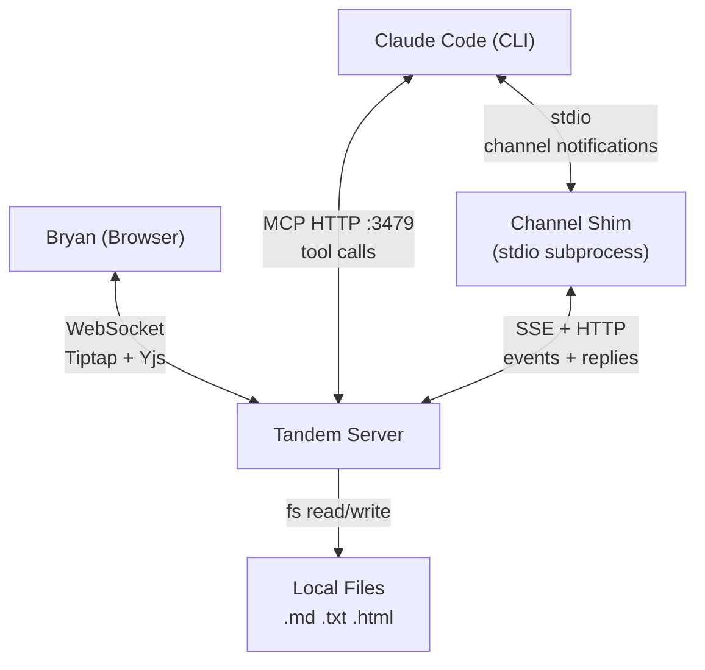

# Architecture

## System Context



Tandem is a single Node.js process that serves three roles simultaneously:
1. **MCP server** (HTTP on port 3479) -- Claude Code connects here for tool discovery and execution via Streamable HTTP transport
2. **Hocuspocus WebSocket server** (port 3478) -- Browser connects here for real-time Yjs sync
3. **Channel event source** (SSE on port 3479) -- The channel shim connects here to receive real-time push events

A separate **channel shim** process (`dist/channel/index.js`) bridges the Tandem server and Claude Code's Channels API. Claude Code spawns it as a stdio subprocess. The shim connects to the server's SSE endpoint and forwards events as `notifications/claude/channel` to Claude Code, enabling push-based communication instead of polling.

Both the MCP server and browser share the same `Y.Doc` instance. Edits from either side propagate to the other in real-time.

## Container Diagram

```mermaid
graph LR
    subgraph Browser
        DocTabs["DocumentTabs<br/>(React)"]
        Tiptap["Tiptap Editor<br/>(React)"]
        AnnExt["AnnotationExtension<br/>(ProseMirror Plugin)"]
        AwExt["AwarenessExtension<br/>(ProseMirror Plugin)"]
        SidePanel["Side Panel<br/>(React)"]
        StatusBar["Status Bar<br/>(React)"]
    end

    subgraph "Tandem Server (Node.js)"
        HP["Hocuspocus<br/>WebSocket :3478"]
        MCP["MCP Server<br/>HTTP :3479"]
        API["REST API<br/>/api/open, /api/upload"]
        ChannelAPI["Channel API<br/>/api/events, /api/channel-*"]
        EventQueue["Event Queue<br/>(Y.Map observers)"]
        FO["file-opener.ts<br/>(shared open logic)"]
        YDoc["Y.Doc per room<br/>(one per open document)"]
        FileIO["File I/O<br/>markdown, txt, docx"]
    end

    subgraph "Channel Shim (subprocess)"
        Bridge["event-bridge.ts<br/>(SSE → notifications)"]
        Reply["tandem_reply tool"]
    end

    subgraph "Claude Code"
        Tools["MCP Tool Calls"]
        Channel["Channel Notifications"]
    end

    Tiptap <-->|@hocuspocus/provider| HP
    HP <--> YDoc
    MCP -->|tandem_open| FO
    API -->|/api/open, /api/upload| FO
    FO <--> YDoc
    FO <--> FileIO
    Tools <-->|HTTP| MCP
    DocTabs -->|fetch| API
    AnnExt -.->|observes| YDoc
    AwExt -.->|observes| YDoc
    SidePanel -.->|observes| YDoc
    StatusBar -.->|observes| YDoc
    YDoc -.->|change events| EventQueue
    EventQueue -->|SSE| ChannelAPI
    ChannelAPI -->|SSE stream| Bridge
    Bridge -->|notifications/claude/channel| Channel
    Reply -->|POST /api/channel-reply| ChannelAPI
    ChannelAPI -->|awareness POST → Y.Doc| StatusBar
```

**Note:** Y.Map key strings (`'annotations'`, `'awareness'`, `'userAwareness'`, `'chat'`, `'documentMeta'`) are defined as named constants in `src/shared/constants.ts` (e.g., `Y_MAP_ANNOTATIONS`). All source code uses these constants — never raw strings.

## Data Flows

### Claude Edits the Document

```
Claude calls tandem_edit(from, to, "new text")
    → MCP server receives tool call
    → resolveToElement() maps flat text offset to Y.XmlElement + local offset
    → Y.Doc.transact() mutates the XmlFragment
    → Yjs generates update
    → Hocuspocus broadcasts update via WebSocket
    → Browser's @hocuspocus/provider receives update
    → Tiptap's Collaboration extension applies the change
    → User sees the edit appear live
```

### User Highlights Text for Claude

```
User selects text and clicks "Highlight" in toolbar
    → Tiptap creates annotation in Y.Map('annotations')
    → Yjs syncs Y.Map update to server via Hocuspocus
    → Claude calls tandem_getAnnotations({ author: "user" })
    → MCP server reads from Y.Map('annotations')
    → Claude sees the highlight with range, color, and note
```

### Claude's Presence

```
Claude calls tandem_setStatus("Reviewing cost figures...", { focusParagraph: 3 })
    → MCP server writes to Y.Map('awareness') key 'claude'
    → Yjs syncs to browser
    → AwarenessExtension observes change
    → Status bar shows "Claude -- Reviewing cost figures..."
    → Paragraph 3 gets soft blue tint with animated gutter bar
```

### User Activity Detection

```
User types in the editor
    → AwarenessExtension Plugin 2 fires on doc change
    → Writes { isTyping: true, cursor: pos } to Y.Map('userAwareness')
      (debounced: 200ms batch for the write, 3s to clear isTyping)
    → Yjs syncs to server
    → Claude calls tandem_getActivity()
    → Returns { active: true, isTyping: true, cursor: 142 }
```

### Claude Opens Multiple Documents

```
Claude calls tandem_open("report.md")
    → docIdFromPath("report.md") → "report-a1b2c3"
    → Y.Doc created for Hocuspocus room "report-a1b2c3"
    → activeDocId = "report-a1b2c3"
    → broadcastOpenDocs() writes doc list to Y.Map('documentMeta')
    → Browser receives list, creates tab + provider for room "report-a1b2c3"

Claude calls tandem_open("invoice.docx")
    → docIdFromPath("invoice.docx") → "invoice-d4e5f6"
    → New Y.Doc for room "invoice-d4e5f6"
    → activeDocId switches to "invoice-d4e5f6"
    → Browser receives updated list, adds second tab
    → DocumentTabs renders both tabs, second tab active

Claude calls tandem_highlight({ from: 10, to: 20, color: "red", documentId: "report-a1b2c3" })
    → Targets report.md even though invoice.docx is the active document
```

### Browser Opens a File (HTTP API)

```
User clicks "+" in DocumentTabs or drops a file on the editor
    → FileOpenDialog sends POST /api/open { filePath } or POST /api/upload { fileName, content }
    → Express route calls openFileByPath() or openFileFromContent() in file-opener.ts
    → Same logic as tandem_open: format detection, session restore, adapter load
    → addDoc() registers in openDocs, broadcastOpenDocs() writes to Y.Map
    → Browser's useYjsSync observes Y.Map change, creates new tab
    → For uploads: synthetic upload:// path, readOnly=true, no disk save
```

### E2E Test Architecture

```
Playwright (test runner)
    → Chromium browser: navigates to http://localhost:5173
    → McpTestClient (SDK Client + StreamableHTTPClientTransport)
        → Connects to http://localhost:3479/mcp
        → Calls tandem_open, tandem_comment, etc. to set up state
    → Browser assertions: locator queries for [data-testid], .ProseMirror content
    → Cleanup: tandem_close all docs, rm temp fixture dir
```

## Chat Data Flow

Chat is **session-scoped**, stored on the `__tandem_ctrl__` Y.Doc (not per-document). The `documentId` field on each message captures which document was active when the message was sent, providing context without fragmenting the conversation.

### Storage

`Y.Map('chat')` on the `__tandem_ctrl__` Y.Doc holds all chat messages keyed by message ID. Each message has `id`, `author` (user/claude), `text`, `timestamp`, and optionally `documentId` and `replyTo`.

### User → Claude

```
User types message in ChatPanel
    → ChatPanel writes message to Y.Map('chat') on __tandem_ctrl__ Y.Doc
    → Yjs syncs update via Hocuspocus WebSocket
    → Server receives update on __tandem_ctrl__ room
    → Claude calls tandem_checkInbox
    → New chat messages returned in chatMessages array
```

### Claude → User

```
Claude calls tandem_reply({ text: "...", replyTo: "msg_..." })
    → MCP server writes message to Y.Map('chat') on __tandem_ctrl__ Y.Doc
    → Yjs syncs update via Hocuspocus WebSocket
    → Browser's @hocuspocus/provider on __tandem_ctrl__ receives update
    → ChatPanel observes Y.Map change and renders the new message
```

### Session Persistence

Chat state persists across server restarts via the same `saveCtrlSession` / `restoreCtrlSession` lifecycle used for the control channel. The `__tandem_ctrl__` Y.Doc (including `Y.Map('chat')`) is saved to `%LOCALAPPDATA%\tandem\sessions\` and restored on next startup.

## Channel Push (Real-Time Events)

The channel replaces polling for user actions. Instead of Claude calling `tandem_checkInbox` repeatedly, the channel shim pushes events to Claude Code as they happen.

### Event Flow

```
User accepts annotation in browser
    → Browser writes { ...ann, status: "accepted" } to Y.Map('annotations')
    → Hocuspocus syncs update to server Y.Doc (origin = Connection object)
    → Y.Map observer in event queue fires (origin !== 'mcp', so not filtered)
    → pushEvent() adds TandemEvent to circular buffer + notifies SSE subscribers
    → SSE endpoint writes event frame to connected channel shim
    → Channel shim parses SSE, calls mcp.notification({ method: "notifications/claude/channel" })
    → Claude Code receives <channel source="tandem-channel" event_type="annotation_accepted">
    → Shim posts awareness update to /api/channel-awareness
    → Browser StatusBar shows "Claude -- processing: annotation:accepted"
```

### Origin Tagging (Echo Prevention)

All MCP-initiated Y.Map writes use `doc.transact(() => { ... }, 'mcp')`. The event queue observers check `txn.origin === MCP_ORIGIN` and skip events from MCP-tagged transactions. This prevents Claude from seeing its own tool calls echoed back as channel notifications.

### Event Types

| Event Type | Trigger | Payload |
|---|---|---|
| `annotation:created` | User creates highlight/comment/question | `annotationId`, `annotationType`, `content`, `textSnippet` |
| `annotation:accepted` | User accepts Claude's annotation | `annotationId`, `textSnippet` |
| `annotation:dismissed` | User dismisses Claude's annotation | `annotationId`, `textSnippet` |
| `chat:message` | User sends chat message | `messageId`, `text`, `replyTo`, `anchor` |
| `selection:changed` | User selects text | `from`, `to`, `selectedText` |
| `document:opened` | New document opened in browser | `fileName`, `format` |
| `document:closed` | Document closed | `fileName` |
| `document:switched` | User switches tabs | `fileName` |

### Channel Shim Architecture

The shim is a separate Node.js process (`src/channel/index.ts`) spawned by Claude Code as a stdio subprocess. It uses the low-level MCP `Server` class (not `McpServer`) as required by the Channels API. It declares `claude/channel` and `claude/channel/permission` capabilities.

Components:
- **`index.ts`** — MCP server setup, `tandem_reply` tool, permission relay handler
- **`event-bridge.ts`** — SSE client with reconnection (5 retries, 2s delay), debounced awareness posts (500ms)

The shim coexists with the HTTP MCP server — Claude Code connects to both simultaneously (HTTP for 26 document tools, stdio for channel push + reply).

### Permission Relay

When Claude Code asks for tool approval, it sends `notifications/claude/channel/permission_request` to the shim. The shim forwards the request to `POST /api/channel-permission` on the Tandem server. The browser can display permission prompts and submit verdicts via `POST /api/channel-permission-verdict`.

---

## Shared State: Y.Doc

Each open document has its own Y.Doc (one per Hocuspocus room). Each Y.Doc contains:

| Structure | Type | Purpose |
|-----------|------|---------|
| `Y.XmlFragment('default')` | Document content | Paragraphs, headings as Y.XmlElement nodes with Y.XmlText children |
| `Y.Map('annotations')` | Annotation metadata | Highlights, comments, suggestions keyed by annotation ID |
| `Y.Map('awareness')` | Claude's presence | Status text, focus paragraph, active flag |
| `Y.Map('userAwareness')` | User's presence | Selection range, typing state, cursor position |
| `Y.Map('documentMeta')` | Document metadata | `openDocuments` array, `activeDocumentId`, readOnly flag, format |

### Y.Doc Identity and Multi-Document Rooms

Each open document gets its own Hocuspocus room. The room name is a stable document ID generated by `docIdFromPath(filePath)` -- a basename slug + path hash (e.g., `report-a1b2c3`). Both MCP tools and the browser reference the same Y.Doc per room:

1. `tandem_open` generates a `documentId` and calls `getOrCreateDocument(documentId)` to get or create a Y.Doc
2. When the browser connects to that room, Hocuspocus fires `onLoadDocument`
3. If a pre-existing MCP doc exists, its state is merged into the Hocuspocus doc via `Y.encodeStateAsUpdate` / `Y.applyUpdate`
4. The Hocuspocus doc replaces the map entry -- both sides now reference the same instance

A bootstrap room (`__tandem_ctrl__`) provides the coordination channel for the browser to discover which documents are open. The server writes the `openDocuments` list to `Y.Map('documentMeta')` on the active document whenever docs are opened, closed, or switched.

This is documented in [ADR decisions](decisions.md) and [lessons learned](lessons-learned.md).

## Coordinate Systems

Three coordinate systems, unified in dedicated position modules:

1. **Flat text offsets** (server) — includes heading prefixes (`## `) and `\n` separators
2. **ProseMirror positions** (client) — structural node boundaries, no prefixes
3. **Yjs RelativePositions** (CRDT-anchored) — survive concurrent edits

All conversions go through `src/server/positions.ts` (server) and `src/client/positions.ts` (client). Shared types live in `src/shared/positions/`.

### Example

Given a document with one heading and one paragraph:

```markdown
## Title
Some text here
```

**Flat text offsets** (what MCP tools use):
```
## Title\nSome text here
0123456789...
```
- `## ` = offsets 0-2 (heading prefix)
- `Title` = offsets 3-7
- `\n` = offset 8
- `Some text here` = offsets 9-22

**ProseMirror positions** (internal to browser):
```
[heading: [Title]]  [paragraph: [Some text here]]
0  1-----5  6       7  8-----------------21  22
```
- Position 0: before heading node
- Position 1: start of heading text
- Position 5: end of "Title"
- Position 6: after heading node
- Position 7: before paragraph node
- Position 8: start of "Some text here"

**Key differences:**
- Flat offsets include heading prefixes (`## `) -- PM doesn't
- Flat offsets use `\n` between elements -- PM uses structural node boundaries (+1 per open/close tag)
- Flat offset 3 ("T" in Title) = PM position 1

### Server position module (`src/server/positions.ts`)

- `validateRange(doc, from, to)` — validates a flat offset range against the document, returns `RangeValidation`
- `anchoredRange(doc, from, to)` — creates both flat range + Yjs RelativePosition range in one call
- `resolveToElement(doc, offset)` — maps flat offset to Y.XmlElement + local offset (replaces the old `resolveOffset`)
- `refreshRange(doc, annotation)` — resolves relRange → flat offsets on read; lazily attaches relRange to annotations that lack it
- `flatOffsetToRelPos(doc, offset, assoc)` — flat offset → serialized RelativePosition JSON
- `relPosToFlatOffset(doc, relPosJson)` — serialized RelativePosition → flat offset (or null if deleted)

### Client position module (`src/client/positions.ts`)

- `annotationToPmRange(view, annotation)` — resolves annotation to ProseMirror `from`/`to` with a `method` diagnostic (`'rel'` | `'flat'`)
- `pmSelectionToFlat(view)` — current PM selection → flat offset range
- `flatOffsetToPmPos(view, offset)` / `pmPosToFlatOffset(view, pos)` — individual position conversion

### Yjs RelativePosition (CRDT-anchored ranges)

Flat offsets go stale when the document is edited — an annotation at offset 10 stays at offset 10 even if text was inserted before it. **Yjs RelativePosition** solves this by encoding positions as references to CRDT Item IDs, which automatically track through concurrent edits.

Annotations store an optional `relRange` field alongside the flat `range`:

```typescript
interface Annotation {
  range: { from: number; to: number };      // flat offsets (fallback)
  relRange?: { fromRel: unknown; toRel: unknown }; // CRDT-anchored (preferred)
}
```

**Creation:** `anchoredRange()` computes both flat range and `relRange` in one call. The `assoc` parameter controls boundary behavior: `0` for range start (stick right — annotation grows on insert at boundary), `-1` for range end (stick left — annotation doesn't grow).

**Reading:** `refreshRange()` resolves `relRange` back to flat offsets, correcting any drift. It also lazily attaches `relRange` to annotations that lack it (user-created or legacy). All server-side read paths (`tandem_getAnnotations`, `tandem_exportAnnotations`, `tandem_checkInbox`) call `refreshRange` before returning data.

**Client rendering:** `annotationToPmRange()` prefers relRange resolution (bypassing flat-offset-to-PM conversion and its heading-prefix math). Falls back to `flatOffsetToPmPos()` when `relRange` is absent or can't resolve. The `method` field in the result indicates which path was used — useful for debugging annotation placement issues. When an annotation *has* `relRange` but still resolves via flat offsets, `buildDecorations()` emits a `console.warn` to surface the CRDT degradation in the browser devtools.

## Security

- Server binds to `127.0.0.1` only -- not accessible from network
- WebSocket origin validation rejects non-localhost connections (prevents DNS rebinding)
- UNC paths rejected (prevents NTLM credential hash leakage via SMB)
- Symlinks resolved before path validation
- File size limit: 50MB
- Atomic file saves: write to temp file, then rename
- Max 4 concurrent WebSocket connections, 10MB max payload

## Design Decisions

See [docs/decisions.md](decisions.md) for the full list of Architecture Decision Records (ADR-001 through ADR-018), covering:

- Tiptap over ProseMirror direct
- Hocuspocus for Yjs WebSocket
- MCP over REST for Claude integration
- .docx review-only by default
- Node-anchored ranges for overlays
- console.error for server logs
- Y.Map for annotations
- Shared MCP response helpers
- Two-pass Y.Doc loading for correct inline mark ordering
- docIdFromPath for multi-document room names
- Optional documentId on all MCP tools
