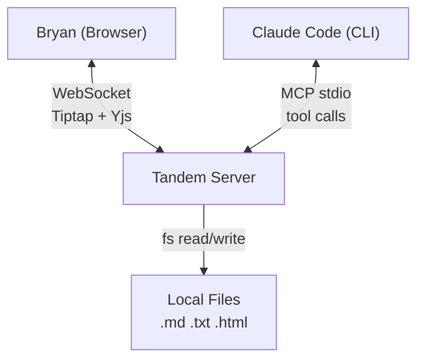
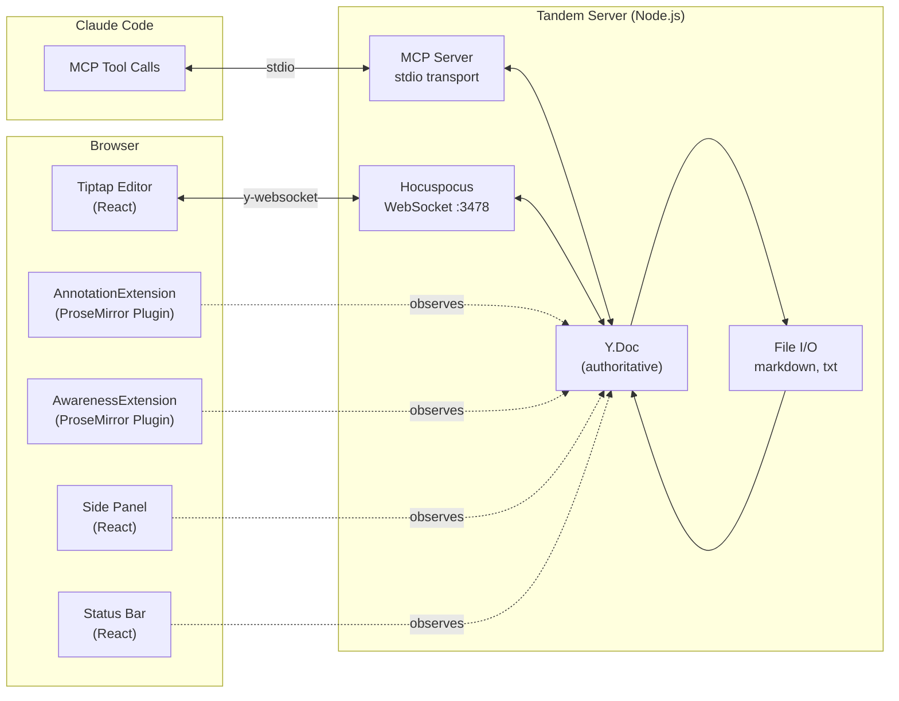

# Architecture

## System Context



Tandem is a single Node.js process that serves two roles simultaneously:
1. **MCP server** (stdio) -- Claude Code connects here for tool discovery and execution
2. **Hocuspocus WebSocket server** (port 3478) -- Browser connects here for real-time Yjs sync

Both sides share the same `Y.Doc` instance. Edits from either side propagate to the other in real-time.

## Container Diagram



## Data Flows

### Claude Edits the Document

```
Claude calls tandem_edit(from, to, "new text")
    → MCP server receives tool call
    → resolveOffset() maps flat text offset to Y.XmlElement position
    → Y.Doc.transact() mutates the XmlFragment
    → Yjs generates update
    → Hocuspocus broadcasts update via WebSocket
    → Browser's y-websocket receives update
    → Tiptap's Collaboration extension applies the change
    → User sees the edit appear live
```

### User Highlights Text for Claude

```
User selects text and clicks "Highlight" in toolbar
    → Tiptap creates annotation in Y.Map('annotations')
    → Yjs syncs Y.Map update to server via Hocuspocus
    → Claude calls tandem_getAnnotations({ author: "user" })
    → MCP server reads from Y.Map('annotations')
    → Claude sees the highlight with range, color, and note
```

### Claude's Presence

```
Claude calls tandem_setStatus("Reviewing cost figures...", { focusParagraph: 3 })
    → MCP server writes to Y.Map('awareness') key 'claude'
    → Yjs syncs to browser
    → AwarenessExtension observes change
    → Status bar shows "Claude -- Reviewing cost figures..."
    → Paragraph 3 gets soft blue tint with animated gutter bar
```

### User Activity Detection

```
User types in the editor
    → AwarenessExtension Plugin 2 fires on doc change
    → Writes { isTyping: true, cursor: pos } to Y.Map('userAwareness')
      (debounced: 200ms batch for the write, 3s to clear isTyping)
    → Yjs syncs to server
    → Claude calls tandem_getActivity()
    → Returns { active: true, isTyping: true, cursor: 142 }
```

## Shared State: Y.Doc

The Y.Doc is the single source of truth. It contains three data structures:

| Structure | Type | Purpose |
|-----------|------|---------|
| `Y.XmlFragment('default')` | Document content | Paragraphs, headings as Y.XmlElement nodes with Y.XmlText children |
| `Y.Map('annotations')` | Annotation metadata | Highlights, comments, suggestions keyed by annotation ID |
| `Y.Map('awareness')` | Claude's presence | Status text, focus paragraph, active flag |
| `Y.Map('userAwareness')` | User's presence | Selection range, typing state, cursor position |

### Y.Doc Identity Problem (Solved)

Both MCP tools and Hocuspocus need to access the same Y.Doc. The solution:

1. MCP tools call `getOrCreateDocument('default')` which returns a Y.Doc from a shared map
2. When the browser connects, Hocuspocus fires `onLoadDocument`
3. If a pre-existing MCP doc exists, its state is merged into the Hocuspocus doc via `Y.encodeStateAsUpdate` / `Y.applyUpdate`
4. The Hocuspocus doc replaces the map entry -- both sides now reference the same instance

This is documented in [ADR decisions](decisions.md) and [lessons learned](lessons-learned.md).

## Coordinate Systems

MCP tools use **flat text offsets**. The browser uses **ProseMirror positions**. These are different.

### Example

Given a document with one heading and one paragraph:

```markdown
## Title
Some text here
```

**Flat text offsets** (what MCP tools use):
```
## Title\nSome text here
0123456789...
```
- `## ` = offsets 0-2 (heading prefix)
- `Title` = offsets 3-7
- `\n` = offset 8
- `Some text here` = offsets 9-22

**ProseMirror positions** (internal to browser):
```
[heading: [Title]]  [paragraph: [Some text here]]
0  1-----5  6       7  8-----------------21  22
```
- Position 0: before heading node
- Position 1: start of heading text
- Position 5: end of "Title"
- Position 6: after heading node
- Position 7: before paragraph node
- Position 8: start of "Some text here"

**Key differences:**
- Flat offsets include heading prefixes (`## `) -- PM doesn't
- Flat offsets use `\n` between elements -- PM uses structural node boundaries (+1 per open/close tag)
- Flat offset 3 ("T" in Title) = PM position 1

The `flatOffsetToPmPos` function (in `annotation.ts`) and `pmPosToFlatOffset` function (in `awareness.ts`) handle this conversion. MCP tool users never need to think about PM positions.

## Security

- Server binds to `127.0.0.1` only -- not accessible from network
- WebSocket origin validation rejects non-localhost connections (prevents DNS rebinding)
- UNC paths rejected (prevents NTLM credential hash leakage via SMB)
- Symlinks resolved before path validation
- File size limit: 50MB
- Atomic file saves: write to temp file, then rename
- Max 4 concurrent WebSocket connections, 10MB max payload

## Design Decisions

See [docs/decisions.md](decisions.md) for the full list of Architecture Decision Records (ADR-001 through ADR-008), covering:

- Tiptap over ProseMirror direct
- Hocuspocus for Yjs WebSocket
- MCP over REST for Claude integration
- .docx review-only by default
- Node-anchored ranges for overlays
- console.error for server logs
- Y.Map for annotations
- Shared MCP response helpers
