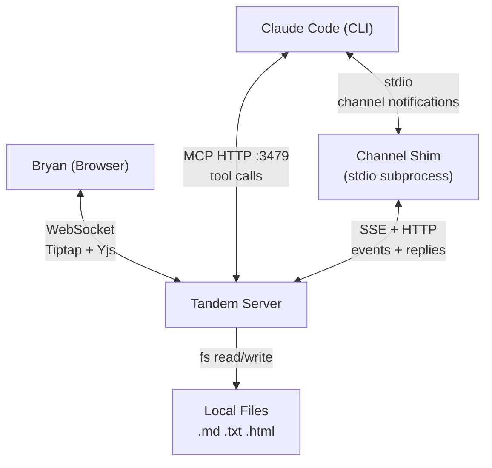
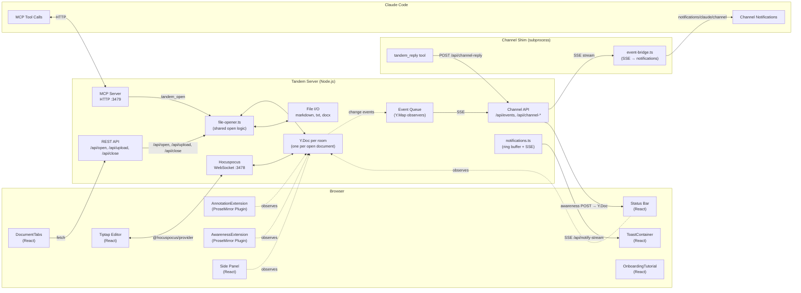
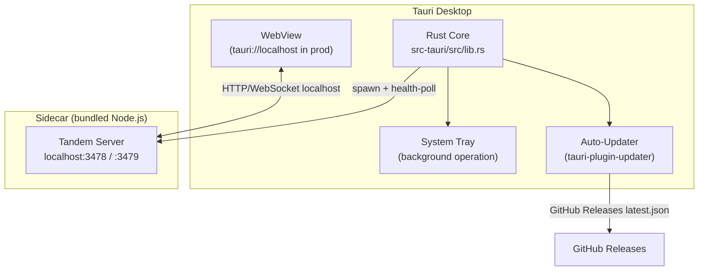

# Architecture

## System Context



Tandem is a single Node.js process that serves three roles simultaneously:
1. **MCP server** (HTTP on port 3479) -- Claude Code connects here for tool discovery and execution via Streamable HTTP transport
2. **Hocuspocus WebSocket server** (port 3478) -- Browser connects here for real-time Yjs sync
3. **Channel event source** (SSE on port 3479) -- The channel shim connects here to receive real-time push events
4. **Static file server** (HTTP on port 3479) -- Serves the Vite-built client from `dist/client/` when present (global install mode)

When installed globally (`npm install -g tandem-editor`), the `tandem` CLI starts the server and opens the browser. The `tandem setup` command writes MCP config to Claude Code and/or Claude Desktop. In development, `npm run dev:standalone` runs the server alongside a Vite dev server for hot-reloading.

A separate **channel shim** process (`dist/channel/index.js`) bridges the Tandem server and Claude Code's Channels API. Claude Code spawns it as a stdio subprocess. The shim connects to the server's SSE endpoint and forwards events as `notifications/claude/channel` to Claude Code, enabling push-based communication instead of polling.

Both the MCP server and browser share the same `Y.Doc` instance. Edits from either side propagate to the other in real-time.

## Container Diagram



**Note:** Y.Map key strings (`'annotations'`, `'awareness'`, `'userAwareness'`, `'chat'`, `'documentMeta'`) are defined as named constants in `src/shared/constants.ts` (e.g., `Y_MAP_ANNOTATIONS`). All source code uses these constants — never raw strings.

## Data Flows

### Claude Edits the Document

```
Claude calls tandem_edit(from, to, "new text")
    → MCP server receives tool call
    → resolveToElement() maps flat text offset to Y.XmlElement + local offset
    → Y.Doc.transact() mutates the XmlFragment
    → Yjs generates update
    → Hocuspocus broadcasts update via WebSocket
    → Browser's @hocuspocus/provider receives update
    → Tiptap's Collaboration extension applies the change
    → User sees the edit appear live
```

### User Highlights Text for Claude

```
User selects text and clicks "Highlight" in toolbar
    → Tiptap creates annotation in Y.Map('annotations')
    → Yjs syncs Y.Map update to server via Hocuspocus
    → Claude calls tandem_getAnnotations({ author: "user" })
    → MCP server reads from Y.Map('annotations')
    → Claude sees the highlight with range, color, and note
```

### Claude's Presence

```
Claude calls tandem_setStatus("Reviewing cost figures...", { focusParagraph: 3 })
    → MCP server writes to Y.Map('awareness') key 'claude'
    → Yjs syncs to browser
    → AwarenessExtension observes change
    → Status bar shows "Claude -- Reviewing cost figures..."
    → Paragraph 3 gets soft blue tint with animated gutter bar
```

### User Activity Detection

```
User types in the editor
    → AwarenessExtension Plugin 2 fires on doc change
    → Writes { isTyping: true, cursor: pos } to Y.Map('userAwareness')
      (debounced: 200ms batch for the write, 3s to clear isTyping)
    → Yjs syncs to server
    → Claude calls tandem_getActivity()
    → Returns { active: true, isTyping: true, cursor: 142 }
```

### Claude Opens Multiple Documents

```
Claude calls tandem_open("report.md")
    → docIdFromPath("report.md") → "report-a1b2c3"
    → Y.Doc created for Hocuspocus room "report-a1b2c3"
    → activeDocId = "report-a1b2c3"
    → broadcastOpenDocs() writes doc list to Y.Map('documentMeta')
    → Browser receives list, creates tab + provider for room "report-a1b2c3"

Claude calls tandem_open("invoice.docx")
    → docIdFromPath("invoice.docx") → "invoice-d4e5f6"
    → New Y.Doc for room "invoice-d4e5f6"
    → activeDocId switches to "invoice-d4e5f6"
    → Browser receives updated list, adds second tab
    → DocumentTabs renders both tabs, second tab active

Claude calls tandem_highlight({ from: 10, to: 20, color: "red", documentId: "report-a1b2c3" })
    → Targets report.md even though invoice.docx is the active document
```

### Browser Opens a File (HTTP API)

```
User clicks "+" in DocumentTabs or drops a file on the editor
    → FileOpenDialog sends POST /api/open { filePath } or POST /api/upload { fileName, content }
    → Express route calls openFileByPath() or openFileFromContent() in file-opener.ts
    → Same logic as tandem_open: format detection, session restore, adapter load
    → addDoc() registers in openDocs, broadcastOpenDocs() writes to Y.Map
    → Browser's useYjsSync observes Y.Map change, creates new tab
    → For uploads: synthetic upload:// path, readOnly=true, no disk save
```

### Opening a .docx with Word Comments

```
tandem_open("report.docx")
    → file-opener.ts detects .docx format
    → docx adapter converts HTML → Y.Doc (mammoth.js in worker thread)
    → docx-comments.ts extracts <w:comment> elements via JSZip
    → For each comment: resolves w:commentRangeStart/End to flat text offsets
    → anchoredRange() creates CRDT-anchored positions
    → Annotations created with author: "import", type based on comment content
    → Browser renders imported comments in SidePanel with "Imported" filter
```

### E2E Test Architecture

```
Playwright (test runner)
    → Chromium browser: navigates to http://localhost:5173
    → McpTestClient (SDK Client + StreamableHTTPClientTransport)
        → Connects to http://localhost:3479/mcp
        → Calls tandem_open, tandem_comment, etc. to set up state
    → Browser assertions: locator queries for [data-testid], .ProseMirror content
    → Cleanup: tandem_close all docs, rm temp fixture dir
```

## Chat Data Flow

Chat is **session-scoped**, stored on the `__tandem_ctrl__` Y.Doc (not per-document). The `documentId` field on each message captures which document was active when the message was sent, providing context without fragmenting the conversation.

### Storage

`Y.Map('chat')` on the `__tandem_ctrl__` Y.Doc holds all chat messages keyed by message ID. Each message has `id`, `author` (user/claude), `text`, `timestamp`, and optionally `documentId` and `replyTo`.

### User → Claude

```
User types message in ChatPanel
    → ChatPanel writes message to Y.Map('chat') on __tandem_ctrl__ Y.Doc
    → Yjs syncs update via Hocuspocus WebSocket
    → Server receives update on __tandem_ctrl__ room
    → Claude calls tandem_checkInbox
    → New chat messages returned in chatMessages array
```

### Claude → User

```
Claude calls tandem_reply({ text: "...", replyTo: "msg_..." })
    → MCP server writes message to Y.Map('chat') on __tandem_ctrl__ Y.Doc
    → Yjs syncs update via Hocuspocus WebSocket
    → Browser's @hocuspocus/provider on __tandem_ctrl__ receives update
    → ChatPanel observes Y.Map change and renders the new message
```

### Session Persistence

Chat state persists across server restarts via the same `saveCtrlSession` / `restoreCtrlSession` lifecycle used for the control channel. The `__tandem_ctrl__` Y.Doc (including `Y.Map('chat')`) is saved to `%LOCALAPPDATA%\tandem\sessions\` and restored on next startup.

### Session Auto-Restore on Startup

On server startup, `listSessionFilePaths()` scans the session directory and `restoreOpenDocuments()` reopens all previously-open files via `openFileByPath()`. `restoreCtrlSession()` returns the previous active document ID so the correct tab is selected. If a session's source file no longer exists (ENOENT), the stale session is cleaned up. After restore, the version check opens `CHANGELOG.md` on upgrade, or the `sample/welcome.md` fallback opens if zero documents are open. Both run **before** Hocuspocus and MCP start to prevent CRDT merge races with stale browser tabs.

## Channel Push (Real-Time Events)

The channel replaces polling for user actions. Instead of Claude calling `tandem_checkInbox` repeatedly, the channel shim pushes events to Claude Code as they happen.

### Activation

The channel shim is configured by `tandem setup`, but Claude Code must be started with the `--dangerously-load-development-channels` flag to activate real-time push:

```bash
claude --dangerously-load-development-channels server:tandem-channel
```

**Requirements:** Claude Code v2.1.80+, `claude.ai` login (not API key — channels require OAuth authentication). The `--dangerously-load-development-channels` flag both activates and loads the channel — no separate `--channels` flag is needed. This flag is required because `tandem-channel` is not yet on the official channel allowlist; it is safe to use with known, trusted channel servers like Tandem. Without it, Claude Code does not start the channel shim — Claude falls back to `tandem_checkInbox` polling.

### Event Flow

```
User accepts annotation in browser
    → Browser writes { ...ann, status: "accepted" } to Y.Map('annotations')
    → Hocuspocus syncs update to server Y.Doc (origin = Connection object)
    → Y.Map observer in event queue fires (origin !== 'mcp', so not filtered)
    → pushEvent() adds TandemEvent to circular buffer + notifies SSE subscribers
    → SSE endpoint writes event frame to connected channel shim
    → Channel shim parses SSE, calls mcp.notification({ method: "notifications/claude/channel" })
    → Claude Code receives <channel source="tandem-channel" event_type="annotation_accepted">
    → Shim posts awareness update to /api/channel-awareness
    → Browser StatusBar shows "Claude -- processing: annotation:accepted"
```

### Origin Tagging (Echo Prevention)

All MCP-initiated Y.Map writes use `doc.transact(() => { ... }, 'mcp')`. The event queue observers check `txn.origin === MCP_ORIGIN` and skip events from MCP-tagged transactions. This prevents Claude from seeing its own tool calls echoed back as channel notifications.

### Event Types

| Event Type | Trigger | Payload |
|---|---|---|
| `annotation:created` | User creates highlight/comment/question | `annotationId`, `annotationType`, `content`, `textSnippet` |
| `annotation:accepted` | User accepts Claude's annotation | `annotationId`, `textSnippet` |
| `annotation:dismissed` | User dismisses Claude's annotation | `annotationId`, `textSnippet` |
| `chat:message` | User sends chat message | `messageId`, `text`, `replyTo`, `anchor` |
| `selection:changed` | User selects text (debounced 1.5s, cleared selections dropped) | `from`, `to`, `selectedText` |
| `document:opened` | New document opened in browser | `fileName`, `format` |
| `document:closed` | Document closed | `fileName` |
| `document:switched` | User switches tabs | `fileName` |

### Channel Shim Architecture

The shim is a separate Node.js process (`src/channel/index.ts`) spawned by Claude Code as a stdio subprocess. It uses the low-level MCP `Server` class (not `McpServer`) as required by the Channels API. It declares `claude/channel` and `claude/channel/permission` capabilities.

Components:
- **`index.ts`** — MCP server setup, `tandem_reply` tool, permission relay handler
- **`event-bridge.ts`** — SSE client with reconnection (5 retries, 2s delay), debounced awareness posts (500ms), selection event debouncing (1.5s) with cleared-selection filtering

The shim coexists with the HTTP MCP server — Claude Code connects to both simultaneously (HTTP for 29 document tools, stdio for channel push + reply).

### Permission Relay

When Claude Code asks for tool approval, it sends `notifications/claude/channel/permission_request` to the shim. The shim forwards the request to `POST /api/channel-permission` on the Tandem server. The browser can display permission prompts and submit verdicts via `POST /api/channel-permission-verdict`.

---

## Shared State: Y.Doc

Each open document has its own Y.Doc (one per Hocuspocus room). Each Y.Doc contains:

| Structure | Type | Purpose |
|-----------|------|---------|
| `Y.XmlFragment('default')` | Document content | Paragraphs, headings as Y.XmlElement nodes with Y.XmlText children |
| `Y.Map('annotations')` | Annotation metadata | Highlights, comments, flags keyed by annotation ID |
| `Y.Map('awareness')` | Claude's presence | Status text, focus paragraph, active flag |
| `Y.Map('userAwareness')` | User's presence | Selection range, typing state, cursor position |
| `Y.Map('documentMeta')` | Document metadata | `openDocuments` array, `activeDocumentId`, readOnly flag, format |

### Y.Doc Identity and Multi-Document Rooms

Each open document gets its own Hocuspocus room. The room name is a stable document ID generated by `docIdFromPath(filePath)` -- a basename slug + path hash (e.g., `report-a1b2c3`). Both MCP tools and the browser reference the same Y.Doc per room:

1. `tandem_open` generates a `documentId` and calls `getOrCreateDocument(documentId)` to get or create a Y.Doc
2. When the browser connects to that room, Hocuspocus fires `onLoadDocument`
3. If a pre-existing MCP doc exists, its state is merged into the Hocuspocus doc via `Y.encodeStateAsUpdate` / `Y.applyUpdate`
4. The Hocuspocus doc replaces the map entry -- both sides now reference the same instance

A bootstrap room (`__tandem_ctrl__`) provides the coordination channel for the browser to discover which documents are open. The server writes the `openDocuments` list to `Y.Map('documentMeta')` on the active document whenever docs are opened, closed, or switched.

This is documented in [ADR decisions](decisions.md) and [lessons learned](lessons-learned.md).

### Y.Map Observer Ownership

Each Y.Map has observers attached by different subsystems. Understanding who owns which observer is critical for debugging "data exists but UI doesn't update" issues.

| Y.Map Key | Observer Owner | Location | Purpose |
|---|---|---|---|
| `annotations` | Server event queue | `src/server/events/queue.ts` → `attachObservers()` | Emit channel events (annotation:created/accepted/dismissed) |
| `annotations` | Client React hook | `src/client/hooks/useYjsSync.ts` → `setupTabObservers()` | Drive sidebar annotation list via `setAnnotations()` |
| `annotations` | Client ProseMirror | `src/client/editor/extensions/annotation.ts` → `buildDecorations()` | Render inline highlights/underlines |
| `awareness` | Client React hook | `useYjsSync.ts` → `setupTabObservers()` | Drive "Claude -- typing" status indicator |
| `userAwareness` | Server event queue | `queue.ts` → `attachObservers()` | Emit selection:changed events to channel |
| `documentMeta` | Client React hook | `useYjsSync.ts` → `handleDocumentListRef` | Sync tab list from server broadcasts (CTRL_ROOM) |
| `documentMeta` (per-doc) | Client React hook | `useYjsSync.ts` → `setupTabObservers()` | Sync readOnly flag per tab |

**Force-reload (`force: true`)** clears all Y.Maps and repopulates content in a single `doc.transact()` (see `clearAndReload` in `file-opener.ts`). The Y.Doc instance, Hocuspocus room, and client connections survive. Client-side observers survive because they reference the same Y.Doc/Y.Map instances. Server event queue observers are defensively re-attached via `attachObservers()` (idempotent -- detaches existing first).

## Coordinate Systems

Three coordinate systems, unified in dedicated position modules:

1. **Flat text offsets** (server) — includes heading prefixes (`## `) and `\n` separators
2. **ProseMirror positions** (client) — structural node boundaries, no prefixes
3. **Yjs RelativePositions** (CRDT-anchored) — survive concurrent edits

All conversions go through `src/server/positions.ts` (server) and `src/client/positions.ts` (client). Shared types live in `src/shared/positions/`.

### Example

Given a document with one heading and one paragraph:

```markdown
## Title
Some text here
```

**Flat text offsets** (what MCP tools use):
```
## Title\nSome text here
0123456789...
```
- `## ` = offsets 0-2 (heading prefix)
- `Title` = offsets 3-7
- `\n` = offset 8
- `Some text here` = offsets 9-22

**ProseMirror positions** (internal to browser):
```
[heading: [Title]]  [paragraph: [Some text here]]
0  1-----5  6       7  8-----------------21  22
```
- Position 0: before heading node
- Position 1: start of heading text
- Position 5: end of "Title"
- Position 6: after heading node
- Position 7: before paragraph node
- Position 8: start of "Some text here"

**Key differences:**
- Flat offsets include heading prefixes (`## `) -- PM doesn't
- Flat offsets use `\n` between elements -- PM uses structural node boundaries (+1 per open/close tag)
- Flat offset 3 ("T" in Title) = PM position 1

### Server position module (`src/server/positions.ts`)

- `validateRange(doc, from, to)` — validates a flat offset range against the document, returns `RangeValidation`
- `anchoredRange(doc, from, to)` — creates both flat range + Yjs RelativePosition range in one call
- `resolveToElement(doc, offset)` — maps flat offset to Y.XmlElement + local offset (replaces the old `resolveOffset`)
- `refreshRange(doc, annotation)` — resolves relRange → flat offsets on read; lazily attaches relRange to annotations that lack it
- `flatOffsetToRelPos(doc, offset, assoc)` — flat offset → serialized RelativePosition JSON
- `relPosToFlatOffset(doc, relPosJson)` — serialized RelativePosition → flat offset (or null if deleted)

### Client position module (`src/client/positions.ts`)

- `annotationToPmRange(view, annotation)` — resolves annotation to ProseMirror `from`/`to` with a `method` diagnostic (`'rel'` | `'flat'`)
- `pmSelectionToFlat(view)` — current PM selection → flat offset range
- `flatOffsetToPmPos(view, offset)` / `pmPosToFlatOffset(view, pos)` — individual position conversion

### Yjs RelativePosition (CRDT-anchored ranges)

Flat offsets go stale when the document is edited — an annotation at offset 10 stays at offset 10 even if text was inserted before it. **Yjs RelativePosition** solves this by encoding positions as references to CRDT Item IDs, which automatically track through concurrent edits.

Annotations store an optional `relRange` field alongside the flat `range`:

```typescript
interface Annotation {
  range: { from: number; to: number };      // flat offsets (fallback)
  relRange?: { fromRel: unknown; toRel: unknown }; // CRDT-anchored (preferred)
}
```

**Creation:** `anchoredRange()` computes both flat range and `relRange` in one call. The `assoc` parameter controls boundary behavior: `0` for range start (stick right — annotation grows on insert at boundary), `-1` for range end (stick left — annotation doesn't grow).

**Reading:** `refreshRange()` resolves `relRange` back to flat offsets, correcting any drift. It also lazily attaches `relRange` to annotations that lack it (user-created or legacy). All server-side read paths (`tandem_getAnnotations`, `tandem_exportAnnotations`, `tandem_checkInbox`) call `refreshRange` before returning data.

**Client rendering:** `annotationToPmRange()` prefers relRange resolution (bypassing flat-offset-to-PM conversion and its heading-prefix math). Falls back to `flatOffsetToPmPos()` when `relRange` is absent or can't resolve. The `method` field in the result indicates which path was used — useful for debugging annotation placement issues. When an annotation *has* `relRange` but still resolves via flat offsets, `buildDecorations()` emits a `console.warn` to surface the CRDT degradation in the browser devtools.

## Toast Notification Pipeline

Toast notifications are ephemeral, browser-only messages (annotation range failures, save errors). They use a dedicated SSE endpoint separate from the channel event stream because they don't need CRDT persistence or delivery to Claude.

```
Server detects error (e.g., annotation range resolution failure)
    → pushNotification({ type: 'error', title: '...', message: '...' })
    → Ring buffer stores notification (max 50, no persistence)
    → SSE subscriber receives data frame on GET /api/notify-stream
    → Browser's useNotifications hook parses the event
    → ToastContainer renders toast with type-appropriate styling
    → Auto-dismiss after timeout (error 8s, warning 6s, info 4s)
    → Duplicate messages within the window get a count badge instead of new toasts
```

This is intentionally separate from `GET /api/events` (channel push) which delivers Y.Map changes to Claude Code via the channel shim. The two SSE endpoints serve different consumers (browser vs. channel shim) with different data models.

## Tab Overflow and Reorder

When many documents are open, the tab bar overflows horizontally. Arrow buttons appear at the edges to scroll through tabs. Tabs support HTML5 drag-and-drop reorder and Alt+Left/Right keyboard reorder.

```
User drags tab to new position
    → HTML5 DragEvent fires on DocumentTabs
    → useTabOrder hook recomputes tab order array
    → Tab bar re-renders with new order
    → Order persists for the session (not saved to disk)

User presses Alt+Right on active tab
    → useTabOrder hook swaps tab with its right neighbor
    → Tab bar re-renders
```

The `useTabOrder` hook manages the tab ordering state. Tab overflow scroll uses `scrollIntoView` to keep the active tab visible when switching.

## Onboarding Tutorial

First-time users see a 3-step tutorial on `sample/welcome.md`:

```
Server opens sample/welcome.md (first run, no restored sessions)
    → injectTutorialAnnotations() creates 3 pre-placed annotations:
        1. Highlight on "Welcome" heading
        2. Comment on a paragraph
        3. Comment with replacement text
    → Injection is idempotent (checks for existing IDs)

Browser renders OnboardingTutorial floating card (bottom-left)
    → Step 1: "Review an annotation" — detected when user accepts/dismisses any annotation
    → Step 2: "Ask Claude a question" — detected when user creates an annotation
    → Step 3: "Try editing" — detected when editor receives focus for typing
    → useTutorial hook tracks completion via annotation status observers + editor events
    → Progress persisted to localStorage (try-catch guarded)
    → Card disappears after all 3 steps complete
```

## Security

- Server binds to `127.0.0.1` only -- not accessible from network
- WebSocket origin validation rejects non-localhost connections (prevents DNS rebinding)
- UNC paths rejected (prevents NTLM credential hash leakage via SMB)
- Symlinks resolved before path validation
- File size limit: 50MB
- Atomic file saves: write to temp file, then rename
- Max 4 concurrent WebSocket connections, 10MB max payload

---

## Tauri Desktop Layer

The Tauri app wraps the existing web stack — it does not replace or modify it. In dev mode the WebView loads from `http://localhost:5173` (Vite); in production builds it loads from `tauri://localhost` (bundled `dist/client/`). The Node.js server continues to run on `:3478`/`:3479` in both modes; the WebView talks to it the same way a browser would.



### Sidecar Lifecycle

On launch, the Rust core:

1. Copies `sample/` files to the writable app-data dir (first run only — skips if destination exists)
2. Checks whether the server is already healthy (`GET /health`) — skips spawn in dev mode if `npm run dev:standalone` is already running
3. Spawns `node-sidecar` (bundled Node.js binary named with target triple) with `dist/server/index.js` as the entry point and `TANDEM_DATA_DIR` set to the platform app-data dir
4. Polls `GET http://localhost:3479/health` every 200ms with a 15s timeout
5. On crash, retries up to `MAX_RESTARTS = 3` times with exponential backoff (1s, 2s, 4s)
6. On all retries exhausted: shows an error dialog and exits
7. On clean exit (`RunEvent::Exit`): kills the sidecar process to avoid orphan processes

The sidecar child handle is stored in `SidecarState` (a `Mutex<Option<CommandChild>>`) in Tauri managed state. Stdout/stderr from the sidecar are forwarded to the Tauri log system for diagnostics.

### MCP Auto-Setup

After the health check passes, the Rust core POSTs to `POST /api/setup` with:

```json
{ "nodeBinary": "<path to node-sidecar binary>", "channelPath": "<path to dist/channel/index.js>" }
```

This triggers the same setup logic as `tandem setup` — auto-detecting Claude Code and Claude Desktop installations and writing MCP config entries. It runs on every launch (idempotent), so MCP config stays correct after reinstalls or path changes. In dev mode, `nodeBinary` is `"node"` (from PATH) and `channelPath` points to the repo-relative `dist/channel/index.js`.

If no Claude installation is detected, a non-blocking dialog appears suggesting the user download Claude.

### System Tray

The window hides (rather than closes) when the user clicks the OS close button — the server keeps running in the background. The tray menu provides the actual exit path:

| Item | Action |
|------|--------|
| Open Editor | Show + focus the main window |
| Setup Claude | Re-run MCP config (with result dialog) |
| Check for Updates | Manual update check |
| About Tandem | Version dialog |
| Quit | Kill sidecar, then exit |

Left-clicking the tray icon shows the main window. On Linux, `libappindicator3-dev` is required; if unavailable the app continues without a tray icon (not a hard failure).

### Auto-Updater

Updates are checked against the GitHub Releases `latest.json` endpoint. Checks run:
- Once on launch (after health check)
- Periodically every 8 hours (background task)
- On demand via the tray "Check for Updates" item

Updates are Ed25519-signed. The public key lives in `tauri.conf.json` (`plugins.updater.pubkey`); the private key is stored as a GitHub Actions secret (`TAURI_SIGNING_PRIVATE_KEY`). `bundle.createUpdaterArtifacts: true` in `tauri.conf.json` tells CI to generate `.sig` files alongside installer artifacts.

Install flow:

```
Update available dialog (Ok/Cancel)
    → User confirms
    → download_and_install()
    → kill_sidecar() — releases ports :3478/:3479
    → Poll /health until server stops responding (5s deadline)
    → app.restart() — Tauri launches the new version
```

The sidecar kill before restart is required to prevent a port conflict when the new process starts up.

### Origin Handling

Production WebView requests use the `tauri://localhost` origin (Windows: `https://tauri.localhost`). The Tandem server's CORS and DNS-rebinding middleware accept this origin alongside `http://localhost:*` and `http://127.0.0.1:*`. This is handled in `createMcpExpressApp` and `apiMiddleware`.

### Windows Path Prefix

Tauri's `resource_dir()` and `app_data_dir()` return `\\?\`-prefixed extended-length paths on Windows. Node.js cannot resolve these. `strip_win_prefix()` in `lib.rs` strips the prefix before passing paths to the sidecar or the setup endpoint.

### Capabilities

Tauri v2 uses a capabilities model to grant permissions:

- `capabilities/default.json` -- core window permissions, shell (sidecar), fs, dialog
- `capabilities/desktop.json` -- desktop-only plugins: single-instance, window-state, updater

`single-instance` must be the **first** plugin registered in `lib.rs` — later registration breaks instance detection. When a second instance is launched, it brings the existing window to the front (future: pass file path arguments to open the file in the running instance).

## Design Decisions

See [docs/decisions.md](decisions.md) for the full list of Architecture Decision Records (ADR-001 through ADR-022), covering:

- Tiptap over ProseMirror direct
- Hocuspocus for Yjs WebSocket
- MCP over REST for Claude integration
- .docx review-only by default
- Node-anchored ranges for overlays
- console.error for server logs
- Y.Map for annotations
- Shared MCP response helpers
- Two-pass Y.Doc loading for correct inline mark ordering
- docIdFromPath for multi-document room names
- Optional documentId on all MCP tools

## File Map

Detailed file-level listing for navigating the codebase. For architectural context and data flows, see the sections above.

### Server (`src/server/`)

- `index.ts` -- Entry point, starts MCP HTTP on :3479 and Hocuspocus WebSocket on :3478 (stdio fallback via `TANDEM_TRANSPORT=stdio`)
- `positions.ts` -- Unified position/coordinate module: `validateRange`, `anchoredRange`, `resolveToElement`, `refreshRange`, `flatOffsetToRelPos`/`relPosToFlatOffset`
- `notifications.ts` -- Toast notification system: ring buffer of `NotificationPayload` objects, `pushNotification()` + `subscribe()`/`unsubscribe()` for SSE consumers
- `open-browser.ts` -- Cross-platform browser launcher (`execFile`-based, no shell injection risk). Best-effort — errors logged, never thrown.
- `mcp/` -- MCP tool definitions (document, annotations, navigation, awareness), `file-opener.ts` (shared file-open logic for MCP + HTTP API), `document-service.ts` (shared document lifecycle helpers: `closeDocumentById`), `server.ts` (MCP transport + Express composition + static file serving from `dist/client/`), `api-routes.ts` (REST API: `/api/open`, `/api/upload`, `/api/close`, `GET /api/notify-stream`), `channel-routes.ts` (channel endpoints: `/api/channel-*`, `/api/events`, `/api/launch-claude`), `launcher.ts` (Claude Code spawner), `docx-apply.ts` (MCP tool definitions for `tandem_applyChanges` and `tandem_restoreBackup`)
- `events/` -- Channel event infrastructure: `types.ts` (TandemEvent definitions), `queue.ts` (Y.Map observers + circular buffer), `sse.ts` (SSE endpoint handler)
- `yjs/` -- Y.Doc management, the authoritative document state
- `file-watcher.ts` -- File change detection: `fs.watch` wrapper with 500ms debounce, self-write suppression (`suppressNextChange`), per-path watcher lifecycle (`watchFile`/`unwatchFile`/`unwatchAll`)
- `file-io/` -- FormatAdapter interface + registry (`getAdapter`), format converters (markdown, docx, docx-html, docx-comments), `atomicWrite` helper
- `file-io/docx-walker.ts` -- Shared offset-tracking walker for document.xml (used by comment extraction and suggestion apply)
- `file-io/docx-apply.ts` -- Core logic for applying suggestions as tracked changes via JSZip XML manipulation
- `platform.ts` -- Cross-platform helpers: `SESSION_DIR`, `LAST_SEEN_VERSION_FILE`, `freePort()`, `waitForPort()` (TCP port availability polling)
- `version-check.ts` -- `checkVersionChange()`: compares running version to stored last-seen version, returns `"first-install" | "upgraded" | "current"`
- `session/` -- Session persistence to %LOCALAPPDATA%\tandem\sessions\; `listSessionFilePaths()` for startup auto-restore

### CLI (`src/cli/`)

- `index.ts` -- CLI entrypoint for the `tandem` global command. Handles `--help`, `--version`, `setup`, and default start. Top-level error handler with reinstall guidance.
- `setup.ts` -- `tandem setup` command. Auto-detects Claude Code (`~/.claude/`) and Claude Desktop (platform-specific paths). Writes MCP config atomically (EXDEV fallback for Windows cross-drive). Exports `buildMcpEntries`, `detectTargets`, `applyConfig`.
- `start.ts` -- `tandem start` (default command). Spawns `node dist/server/index.js` with `TANDEM_OPEN_BROWSER=1`, forwards signals, pre-validates server entry point exists.

### Channel Shim (`src/channel/`)

- `index.ts` -- Standalone stdio MCP server spawned by Claude Code as a channel subprocess. Low-level `Server` class (not `McpServer`). Declares `claude/channel` + `claude/channel/permission` capabilities. Exposes `tandem_reply` tool.
- `event-bridge.ts` -- SSE client that connects to `GET /api/events` on the Tandem server, parses events, pushes `notifications/claude/channel` to Claude Code, and posts awareness updates back.

### Client (`src/client/`)

- `positions.ts` -- Unified client position module: `annotationToPmRange` (with `method` diagnostic), `pmSelectionToFlat`, `flatOffsetToPmPos`/`pmPosToFlatOffset`
- Tiptap editor with collaboration extensions, connects to Hocuspocus via WebSocket (@hocuspocus/provider)
- `App.tsx` -- Layout + UI state only; `useYjsSync` hook (`src/client/hooks/`) manages `OpenTab` objects (one per open document), each with its own Y.Doc + provider
- `DocListEntry` and `OpenTab` types live in `src/client/types.ts`
- `DocumentTabs` -- Tab bar + "+" button (FileOpenDialog); tab switching passes different ydoc/provider to Editor (key-based remount). Overflow tabs scroll horizontally with arrow buttons. Tabs support HTML5 drag-and-drop reorder and Alt+Left/Right keyboard reorder. Long filenames are ellipsized with a tooltip showing the full name. `useTabOrder` hook manages persistent tab ordering.
- `ToastContainer` (`src/client/components/`) -- Renders toast notifications from `GET /api/notify-stream` SSE endpoint. Type-differentiated auto-dismiss (error 8s, warning 6s, info 4s), dedup with count badge, max 5 visible. `useNotifications` hook manages EventSource connection.
- `OnboardingTutorial` (`src/client/components/`) -- Floating card at bottom-left, 3-step progression (review → ask → edit). `useTutorial` hook detects step completion via annotation status, user annotation creation, and editor focus. localStorage persistence, suppressed after completion.
- `ApplyChangesButton` (`src/client/components/`) -- Browser button for applying tracked changes to `.docx` files
- `FileOpenDialog` (`src/client/components/`) -- Path input and drag-and-drop upload for opening files without Claude
- `HelpModal` (`src/client/components/`) -- Keyboard shortcuts reference, toggled by `?` (suppressed in text inputs)
- `AnnotationExtension` -- Renders highlights, comments, and flags as ProseMirror Decorations from Y.Map('annotations')
- `AwarenessExtension` -- Renders Claude's focus paragraph + broadcasts user selection to Y.Map('userAwareness')
- `SidePanel` -- Annotation filtering (type/author/status, including "Imported" filter for Word comments), bulk accept/dismiss (with confirmation, respects active filters), keyboard review mode (Tab/Y/N/Z), 10-second undo window on accept/dismiss, inline annotation editing (pencil button on pending annotations)
- `ChatPanel` + `SidePanel` are both always mounted (CSS display toggle, not conditional rendering) so local state (filters, scroll position) persists across panel switches
- `ChatPanel` -- Shows Claude typing indicator (animated dots + status text) when `claudeActive` is true
- `StatusBar` -- Connection status (three-state: connected/connecting/disconnected with reconnect attempt count + elapsed time) and Claude activity indicator. Prolonged disconnect (>30s) shows a dismissible banner that auto-clears on reconnect. The Solo/Tandem mode toggle lives in the Toolbar (not StatusBar); client broadcasts `mode` via `Y_MAP_MODE` key to `Y_MAP_USER_AWARENESS` on `CTRL_ROOM`.
- `ReviewSummary` -- Overlay shown when all pending annotations are resolved

### Tauri Desktop (`src-tauri/`)

- `Cargo.toml` -- Rust dependencies: tauri v2, tauri-plugin-shell, tauri-plugin-fs, tauri-plugin-dialog, tauri-plugin-single-instance, tauri-plugin-window-state, tauri-plugin-process, tauri-plugin-updater, tauri-plugin-log, reqwest, tokio, serde_json
- `tauri.conf.json` -- App config: identifier (`com.tandem.editor`), window dimensions (1200×800, min 800×600), `bundle.externalBin` (node-sidecar), `bundle.resources` (dist/server/, dist/channel/, dist/client/, sample/), CSP, updater endpoint (GitHub Releases `latest.json`), `bundle.createUpdaterArtifacts: true`
- `capabilities/default.json` -- Core permissions: window events, shell sidecar, fs read/write, dialog
- `capabilities/desktop.json` -- Desktop-only permissions: single-instance, window-state save/restore, updater
- `src/lib.rs` -- All Tauri logic: plugin registration (single-instance **first**), sidecar lifecycle (spawn, health-poll, exponential backoff, kill on exit), `run_setup()` (POST /api/setup), system tray build + event handlers, window hide-on-close, auto-updater (launch + periodic 8h), `strip_win_prefix()` for Windows `\\?\` paths, `copy_sample_files()` (first-run copy to app-data dir)
- `src/main.rs` -- Entry point, delegates to `lib::run()`

### Shared (`src/shared/`)

- `types.ts` -- TypeScript interfaces shared between server and client (includes `editedAt` on Annotation, `ConnectionStatus` enum, `NotificationPayload`)
- `constants.ts` -- Colors, annotation types, defaults, ports, `SUPPORTED_EXTENSIONS`
- `offsets.ts` -- Flat-text format contract: `headingPrefixLength`, `FLAT_SEPARATOR`
- `positions/` -- Shared position types: `RangeValidation`, `AnchoredRangeResult`, `PmRangeResult`, `ElementPosition`
