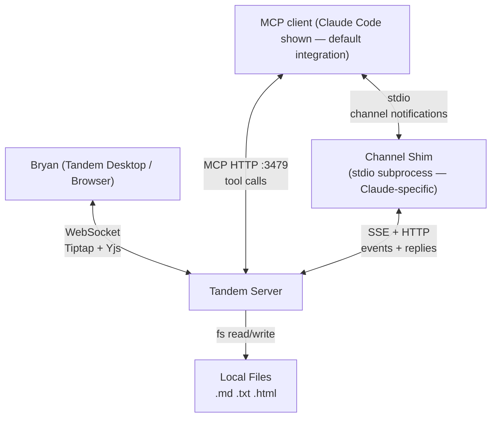
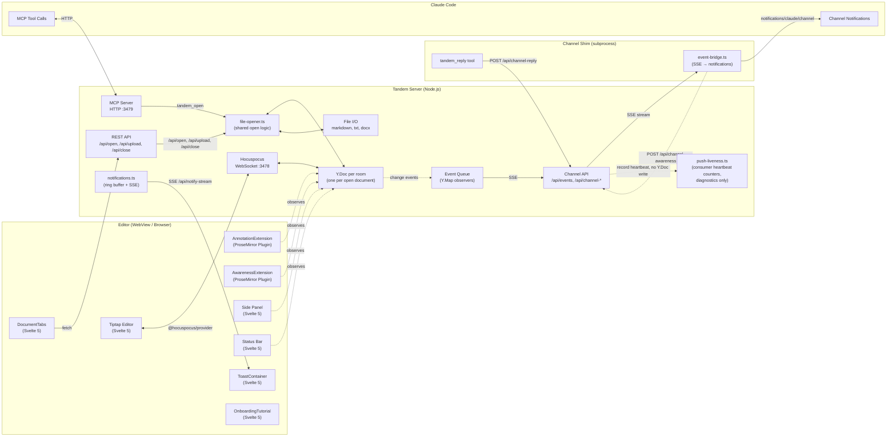
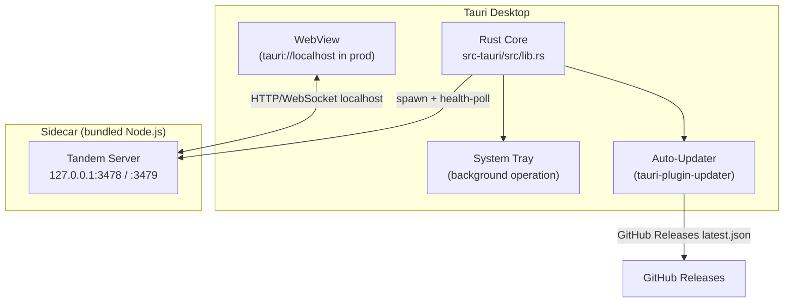

# Architecture

## Integration Compatibility

> Tandem's integration contract is **MCP**. The default integration is **Claude** (Claude Code + Claude Desktop) — it's what we recommend, what we test against, and it ships with the channel push, cowork, plugin monitor, and auto-launcher features. Any MCP-capable client can connect to the same MCP HTTP endpoint and use the same MCP tools, but the Claude-specific transports don't apply. Other clients are **best-effort, MCP-contract-compatible, not validated** today. See [ADR-038](decisions.md#adr-038-mcp-first-integration-policy-claude-as-default-integration).

Four terms — **MCP contract**, **default integration**, **Claude-specific extras**, and **best-effort, not validated** — are used throughout this document with the precise meanings defined in [ADR-038's term glossary](decisions.md#adr-038-mcp-first-integration-policy-claude-as-default-integration) (the single source of truth).

Sections below labeled "Claude-default" describe features in the **Claude-specific extras** column. Generic MCP plumbing (the HTTP server, the SSE stream, the MCP tools) works for any MCP-capable client.

## System Context


```mermaid
graph TB
    User["Bryan (Tandem Desktop / Browser)"]
    Claude["MCP client (Claude Code shown — default integration)"]
    Tandem["Tandem Server"]
    Shim["Channel Shim<br/>(stdio subprocess — Claude-specific)"]

    User <-->|WebSocket<br/>Tiptap + Yjs| Tandem
    Claude <-->|MCP HTTP :3479<br/>tool calls| Tandem
    Claude <-->|stdio<br/>channel notifications| Shim
    Shim <-->|SSE + HTTP<br/>events + replies| Tandem
    Tandem -->|fs read/write| Files["Local Files<br/>.md .txt .html"]
```

Tandem is a single Node.js process that serves three roles simultaneously:
1. **MCP server** (HTTP on port 3479) — any MCP client connects here for tool discovery and execution via Streamable HTTP transport. Claude Code is the default and best-tested client.
2. **Hocuspocus WebSocket server** (port 3478) — Editor connects here for real-time Yjs sync.
3. **Channel event source** (SSE on port 3479) — The channel shim connects here to receive real-time push events. Other MCP clients can subscribe to `/api/events` directly.
4. **Static file server** (HTTP on port 3479) — Serves the Vite-built client from `dist/client/` when present (global install mode).

When installed globally (`npm install -g tandem-editor`), the `tandem` CLI starts the server and serves the editor, printing the `http://127.0.0.1:3479` URL to open in a browser (it opens no window itself). Bare `tandem setup` prints wizard-driven setup guidance and writes nothing; `tandem setup --apply` writes MCP config to Claude Code and/or Claude Desktop (the auto-config-removal change that made bare setup a no-op printer shipped in v0.14.0 — #477 PR 3c-ii, ADR-038 §2b). In development, `npm run dev:standalone` starts the backend and the Vite dev server, and waits for the backend to become healthy. It does **not** start the monitor: an always-on consumer with no Claude behind it holds `subscribers >= 1` for the whole session, and `subscribers === 0` is the only sound negative the server has — so a standing fake consumer suppresses every feature keyed on it, for exactly the people building those features. Run `npx tsx src/monitor/index.ts` by hand when testing push delivery.

A separate **channel shim** process (`dist/channel/index.js`) bridges the Tandem server and Claude Code's Channels API. **Claude-default — this is one of the six Claude-specific extras per ADR-038.** Claude Code spawns it as a stdio subprocess. The shim connects to the server's SSE endpoint and forwards events as `notifications/claude/channel` to Claude Code, enabling push-based communication instead of polling. Other MCP clients subscribe to `/api/events` directly without going through this shim.

Both the MCP server and editor share the same `Y.Doc` instance. Edits from either side propagate to the other in real-time.

## Container Diagram


```mermaid
graph LR
    subgraph "Editor (WebView / Browser)"
        DocTabs["DocumentTabs<br/>(Svelte 5)"]
        Tiptap["Tiptap Editor<br/>(Svelte 5)"]
        AnnExt["AnnotationExtension<br/>(ProseMirror Plugin)"]
        AwExt["AwarenessExtension<br/>(ProseMirror Plugin)"]
        SidePanel["Side Panel<br/>(Svelte 5)"]
        StatusBar["Status Bar<br/>(Svelte 5)"]
        Toasts["ToastContainer<br/>(Svelte 5)"]
        Tutorial["OnboardingTutorial<br/>(Svelte 5)"]
    end

    subgraph "Tandem Server (Node.js)"
        HP["Hocuspocus<br/>WebSocket :3478"]
        MCP["MCP Server<br/>HTTP :3479"]
        API["REST API<br/>/api/open, /api/upload, /api/close"]
        ChannelAPI["Channel API<br/>/api/events, /api/channel-*"]
        EventQueue["Event Queue<br/>(Y.Map observers)"]
        Notify["notifications.ts<br/>(ring buffer + SSE)"]
        FO["file-opener.ts<br/>(shared open logic)"]
        YDoc["Y.Doc per room<br/>(one per open document)"]
        PushLiveness["push-liveness.ts<br/>(consumer heartbeat counters,<br/>diagnostics only)"]
        FileIO["File I/O<br/>markdown, txt, docx"]
    end

    subgraph "Channel Shim (subprocess)"
        Bridge["event-bridge.ts<br/>(SSE → notifications)"]
        Reply["tandem_reply tool"]
    end

    subgraph "Claude Code"
        Tools["MCP Tool Calls"]
        Channel["Channel Notifications"]
    end

    Tiptap <-->|"@hocuspocus/provider"| HP
    HP <--> YDoc
    MCP -->|tandem_open| FO
    API -->|/api/open, /api/upload, /api/close| FO
    FO <--> YDoc
    FO <--> FileIO
    Tools <-->|HTTP| MCP
    DocTabs -->|fetch| API
    AnnExt -.->|observes| YDoc
    AwExt -.->|observes| YDoc
    SidePanel -.->|observes| YDoc
    StatusBar -.->|observes| YDoc
    YDoc -.->|change events| EventQueue
    EventQueue -->|SSE| ChannelAPI
    ChannelAPI -->|SSE stream| Bridge
    Bridge -->|notifications/claude/channel| Channel
    Reply -->|POST /api/channel-reply| ChannelAPI
    Bridge -.->|POST /api/channel-awareness| ChannelAPI
    ChannelAPI -.->|record heartbeat, no Y.Doc write| PushLiveness
    Notify -->|SSE /api/notify-stream| Toasts
```

**Note:** Y.Map key strings (`'annotations'`, `'awareness'`, `'userAwareness'`, `'chat'`, `'documentMeta'`) are defined as named constants in `src/shared/constants.ts` (e.g., `Y_MAP_ANNOTATIONS`). All source code uses these constants — never raw strings.

## Data Flows

### Claude Edits the Document

```
Claude calls tandem_edit(from, to, "new text")
    → MCP server receives tool call
    → resolveToElement() maps flat text offset to Y.XmlElement + local offset
    → Y.Doc.transact() mutates the XmlFragment
    → Yjs generates update
    → Hocuspocus broadcasts update via WebSocket
    → Browser's @hocuspocus/provider receives update
    → Tiptap's Collaboration extension applies the change
    → User sees the edit appear live
```

### User Highlights Text for Claude

```
User selects text and clicks "Highlight" in toolbar
    → Tiptap creates annotation in Y.Map('annotations')
    → Yjs syncs Y.Map update to server via Hocuspocus
    → Claude calls tandem_getAnnotations({ author: "user" })
    → MCP server reads from Y.Map('annotations')
    → Claude sees the highlight with range, color, and note
```

### Claude's Presence

```
Claude calls tandem_status({ text: "Reviewing cost figures...", focusParagraph: 3 })
    → MCP server writes to Y.Map('awareness') key 'claude'
    → Yjs syncs to browser
    → AwarenessExtension observes change
    → Status bar shows "Claude -- Reviewing cost figures..."
    → Paragraph 3 gets soft blue tint with animated gutter bar
```

### User Activity Detection

```
User types in the editor
    → AwarenessExtension Plugin 2 fires on doc change
    → Writes { isTyping: true, cursor: pos } to Y.Map('userAwareness')
      (debounced: 200ms batch for the write, 3s to clear isTyping)
    → Yjs syncs to server
    → Claude calls tandem_getActivity()
    → Returns { active: true, isTyping: true, cursor: 142 }
```

### Claude Opens Multiple Documents

```
Claude calls tandem_open("report.md")
    → docIdFromPath("report.md") → "report-a1b2c3"
    → Y.Doc created for Hocuspocus room "report-a1b2c3"
    → registry.openDocument(...) tracks it, makes it active, and publishes
      the doc list to Y.Map('documentMeta') in ONE broadcast (ADR-033)
    → Browser receives list, creates tab + provider for room "report-a1b2c3"

Claude calls tandem_open("invoice.docx")
    → docIdFromPath("invoice.docx") → "invoice-d4e5f6"
    → New Y.Doc for room "invoice-d4e5f6"
    → activeDocId switches to "invoice-d4e5f6"
    → Browser receives updated list, adds second tab
    → DocumentTabs renders both tabs, second tab active

Claude calls tandem_comment({ from: 10, to: 20, text: "Review this section", documentId: "report-a1b2c3" })
    → Targets report.md even though invoice.docx is the active document
```

### Browser Opens a File (HTTP API)

```
User clicks "+" in DocumentTabs or drops a file on the editor
    → FileOpenDialog sends POST /api/open { filePath } or POST /api/upload { fileName, content }
    → Express route calls openFromDisk() or openFromUpload() — the ADR-034 named
      entry points in documents/open.ts, which forward to file-opener.ts
    → Same logic as tandem_open: format detection, session restore, adapter load
    → registry.openDocumentWhenReady(...) tracks + activates, wires the doc
      meta / baseline / annotation store, THEN publishes to Y.Map
    → Browser's useYjsSync observes Y.Map change, creates new tab
    → For uploads: synthetic upload:// path, readOnly=true, no disk save
```

### Opening a .docx with Word Comments

```
tandem_open("report.docx")
    → file-opener.ts detects .docx format
    → docx adapter converts HTML → Y.Doc (mammoth.js in worker thread)
    → docx-comments.ts extracts <w:comment> elements via JSZip
    → For each comment: resolves w:commentRangeStart/End to flat text offsets
    → anchoredRange() creates CRDT-anchored positions
    → Annotations created with author: "import", type based on comment content
    → Browser renders imported comments in SidePanel with "Imported" filter
```

### E2E Test Architecture

```
Playwright (test runner)
    → Chromium browser: navigates to http://127.0.0.1:5173
    → McpTestClient (SDK Client + StreamableHTTPClientTransport)
        → Connects to http://127.0.0.1:3479/mcp
        → Calls tandem_open, tandem_comment, etc. to set up state
    → Browser assertions: locator queries for [data-testid], .ProseMirror content
    → Cleanup: tandem_close all docs, rm temp fixture dir
```

## Chat Data Flow

Chat is **session-scoped**, stored on the `__tandem_ctrl__` Y.Doc (not per-document). The `documentId` field on each message captures which document was active when the message was sent, providing context without fragmenting the conversation.

### Storage

`Y.Map('chat')` on the `__tandem_ctrl__` Y.Doc holds all chat messages keyed by message ID. Each message has `id`, `author` (user/claude), `text`, `timestamp`, and optionally `documentId` and `replyTo`.

**Streaming sidecar (#1340):** while a Claude reply is being token-streamed, its full text-so-far lives in one `Y.Text` per message in `Y.Map('chatStream')` (`Y_MAP_CHAT_STREAM`), keyed by message id — `updateClaudeChatMessage` diff-splices O(delta) appends into it instead of re-`set`ting the whole message value per flush (which was O(n²) on the wire). While the sidecar entry exists it is authoritative over the row's `text` (the client composes in `useChatState.refresh`); `finalizeClaudeChatMessage` folds the text back into the plain chat row and deletes the entry. Durable snapshots never carry a live sidecar entry: `persistCtrlSnapshot` folds on the snapshot clone, and `restoreCtrlDoc` sweeps (fold-or-delete) anything a restored snapshot carried. Both folds drop an entry that is not a non-empty `Y.Text` with a live chat row rather than writing it over the row. Nothing structural forces the terminal `finalize` call, so `foldChatStream` — the one path that enumerates live entries regardless of producer activity — reconciles the `chat-stream-staleness.ts` ledger on every persist and restore and warns once (stderr) for an entry still live after 10 minutes.

### User → Claude

```
User types message in ChatPanel
    → ChatPanel writes message to Y.Map('chat') on __tandem_ctrl__ Y.Doc
    → Yjs syncs update via Hocuspocus WebSocket
    → Server receives update on __tandem_ctrl__ room
    → Claude calls tandem_checkInbox
    → New chat messages returned in chatMessages array
```

### Claude → User

```
Claude calls tandem_reply({ text: "...", replyTo: "msg_..." })
    → MCP server writes message to Y.Map('chat') on __tandem_ctrl__ Y.Doc
    → Yjs syncs update via Hocuspocus WebSocket
    → Browser's @hocuspocus/provider on __tandem_ctrl__ receives update
    → ChatPanel observes Y.Map change and renders the new message
```

### Session Persistence

Chat state persists across server restarts via the same `saveCtrlSession` / `restoreCtrlSession` lifecycle used for the control channel. The `__tandem_ctrl__` Y.Doc (including `Y.Map('chat')`) is saved to `%LOCALAPPDATA%\tandem\sessions\` and restored on next startup.

### Session Auto-Restore on Startup

On server startup, `listSessionFilePaths()` scans the session directory and `restoreOpenDocuments()` reopens all previously-open files via `openFileByPath()`. `restoreCtrlSession()` returns the previous active document ID so the correct tab is selected. If a session's source file no longer exists (ENOENT), the stale session is cleaned up. After restore, the version check opens `CHANGELOG.md` on upgrade, or the `sample/welcome.md` fallback opens if zero documents are open. Both run **before** Hocuspocus and MCP start to prevent CRDT merge races with stale browser tabs.

### OS File-Association Open

When the Tauri desktop app is launched via the OS file-association handler (double-clicking a `.md` / `.markdown` / `.txt` / `.html` / `.docx` file in Finder, Explorer, or a Linux file manager), the file path reaches the editor via three platform-specific routes:

```
Cold start, Windows / Linux:
  OS double-click  ──▶  tandem.exe <path>  ──▶  open_candidate.rs:
                                                    extract_file_arg
                                              ──▶  spawn sidecar with
                                                    TANDEM_OPEN_FILE=<path>
                                              ──▶  Node startup-file.ts:
                                                    maybeOpenStartupFile()
                                              ──▶  openFileByPath()  [BEFORE bind]
                                              ──▶  HTTP / Hocuspocus bind
                                              ──▶  browser opens, sees the doc

Cold start, macOS:
  OS double-click  ──▶  Tandem.app launched  ──▶  setup() spawns sidecar
                                              ──▶  Apple Event kAEOpenDocuments
                                                    fires as RunEvent::Opened
                                              ──▶  lib.rs:handle_opened_urls
                                                    → classify_opened_url
                                                    (scheme/host/convert/
                                                     ADS/UNC/ext/is_file)
                                              ──▶  queues path in PendingOpens
                                              ──▶  wait_for_health() returns Ok
                                              ──▶  drain_pending_opens()
                                                    POSTs /api/open
                                              ──▶  SIDECAR_HEALTHY ← true

Warm start, Windows / Linux:
  OS double-click  ──▶  tandem.exe <path>  ──▶  tauri-plugin-single-instance
                                                    fires callback in the
                                                    running app
                                              ──▶  extract_file_arg(&args)
                                              ──▶  show_main_window() + spawn
                                                    POST /api/open

Warm start, macOS:
  OS double-click  ──▶  LaunchServices reactivates app
                                              ──▶  RunEvent::Opened
                                              ──▶  lib.rs:handle_opened_urls
                                                    → classify_opened_url
                                                    (scheme/host/convert/
                                                     ADS/UNC/ext/is_file)
                                              ──▶  SIDECAR_HEALTHY=true path:
                                                    POST /api/open directly
```

File associations are declared in `src-tauri/tauri.conf.json#bundle.fileAssociations`. Tauri's bundler writes the Windows NSIS registry keys (`HKCR\.<ext>\OpenWithProgids` + ProgID class), the macOS `Info.plist` `CFBundleDocumentTypes`, and the Linux `.desktop` `MimeType=` entries. Registering an extension makes Tandem *eligible* — the OS user opts in to "always open with Tandem" via Settings or "Open With → Always".

Known limitation: macOS cold-start may briefly show `welcome.md` before the requested file becomes active, because Apple Events arrive after `setup()` schedules the sidecar spawn. This window is typically 100–300 ms.

Both OS entry points share one path validator, `validate_open_candidate` (extension against `SUPPORTED_FILE_ASSOC_EXTS` + `is_file()`), so the extension and regular-file checks cannot diverge per platform (#1344). Since #1415 it and the rest of that cluster live in `src-tauri/src/open_candidate.rs` rather than `lib.rs`, and return a **`ScreenedOpenPath`** newtype whose tuple field is private to that module — so `PendingOpens`, `promote_healthy_and_drain`, `try_queue_or_post`, `post_drained_paths` and `cold_start_file` carry a type only the screener can mint. The module boundary *is* the mechanism: `lib.rs` is ~6,900 lines in one module, so a newtype declared there would be constructible on every one of them. Until that fix those two checks existed only inline in `extract_file_arg`, so the macOS `RunEvent::Opened` surface performed neither: a double-clicked `.pdf`, a folder, or a stale path reached `/api/open`, was refused server-side, and produced nothing but a `log::warn!` while the user sat on `welcome.md`.

`validate_open_candidate` owns **every** path-shaped check — the Windows NTFS alternate-data-stream colon scan, UNC rejection, the extension allowlist, and `is_file()` — and the first two run *before* `is_file()` deliberately: `is_file()` on `\\host\share\…` performs the SMB handshake, so a gate placed after it would leak an NTLM hash from the shell process on a path the server was always going to refuse. The ADS scan lives in the validator rather than in `extract_file_arg` for the same reason the extension check does: `classify_opened_url` is unconditionally compiled, so a future Windows or Linux Opened / deep-link handler would otherwise inherit the extension and `is_file()` checks with no ADS scan.

Sharing the validator also made the extension list a **shared contract**, so it must match the server's `SUPPORTED_EXTENSIONS` exactly — pinned by `tests/build/file-association-alignment.test.ts`, which asserts set equality rather than a subset. The first version of the shared validator omitted `.htm`, which the server accepts, and that silently made a `.htm` refusable via "Open With" or a Dock drop while the same file dropped on the *window* still opened (`useTauriFileDrop.svelte.ts` validates against the server list). A per-surface difference in what counts as an openable file is not a policy anyone chose; it is what an inline check drifting from a constant looks like. Note this is separate from what the OS *advertises*: `tauri.conf.json#bundle.fileAssociations` stays deliberately narrower (no `.htm`), and that asymmetry is a product choice.

**Rejections have exactly one delivery surface: the `STARTUP_REJECTION` buffer.** Every entry point that refuses a candidate — or, since #1416, accepts one and then fails to open it **over `/api/open`** — calls `surface_startup_rejection`, which buffers the stable, path-free reason code and *then* emits a **payload-free** `startup-file-rejected` event. The failure half adds one code, `open-failed`, covering a non-2xx from `/api/open`, a transport failure, and an open that arrived after the app stopped trying to start the server; the give-up is a latch (`SIDECAR_GAVE_UP`, set under the `PendingOpens` mutex and cleared by any new start attempt), never a deletion of the pending-open queue, because the retry path exists to deliver that queue. **The `/api/open` qualifier is load-bearing, not hedging: it covers the warm-start, drain and Apple-Event routes only.** The argv cold start never posts — it hands the path to the sidecar as `TANDEM_OPEN_FILE`, and `startup-file.ts#maybeOpenStartupFile` catches an `openFileByPath` throw, `console.error`s and returns false, so a 60 MB `.md` double-clicked on Windows or Linux still lands the user on `welcome.md` with the reason in the sidecar log alone. That door is a known gap, not a covered one. The client (`utils/startup-rejection.ts`, wired from `App.svelte`) treats that event purely as a nudge — "something is buffered, don't wait for the next init" — and both it and the init-time drain read through `get_startup_rejection`, which **takes**. So a nudge nobody hears costs one dropped event, not a lost toast, and a doubled nudge cannot double-toast.

The client's two paths are **ordered**, not raced: the init drain is chained onto the listener's resolution. Their completion order is otherwise unguaranteed, and the drain runs once per WebView load rather than on an interval — so a rejection landing after the drain resolved but before the listener was wired would be buffered with nobody left to read it. A macOS batch is likewise collapsed to a single code by `RejectionBatch` before it reaches the buffer, because per-URL surfacing raced the client's async drain: the same five-file drop could produce one toast or two, naming different reasons.

An earlier design gated the buffer on a `REJECTION_POLLED` flag, on the theory that a completed drain proves the listener is wired. It does not, and the decisive case needs no race: **the flag is process-global and the listener is not**, so a WebView reload left the flag set and the listener gone, and every rejection after the first reload took the emit-only path and was dropped permanently. (The two client chains are also independent, so a completed drain never implied a wired listener either — but that window is sub-millisecond and is not what the argument rests on.) Buffer-then-nudge needs no readiness signal at all, which is why it replaced the flag. The design itself lives only in PR #1414's history, not in issue #1344.

### Start-at-login (#1236, ADR-046)

Opt-in, off by default, desktop app only. When enabled, `tauri-plugin-autostart` writes an OS registration whose command line carries `--tandem-autostart`. That flag is the only thing distinguishing a login launch from a user-initiated one, and it changes two behaviors:

```
Login launch:
  OS login  ──▶  Tandem --tandem-autostart
                     ──▶  setup(): resolve_autostart_launch() = true
                     ──▶  LAUNCHER_DEFERRED ← true      [before anything can show]
                     ──▶  window stays hidden           [visible:false + no show call]
                     ──▶  spawn sidecar with TANDEM_DEFER_LAUNCHER=1
                     ──▶  Node: resolveInitialLauncherReason()
                            = "deferred-autostart"  ──▶  supervisor NOT started
                     ──▶  tray built; should_start_hidden(true, tray_available)
                            decides the final visibility

  user clicks tray  ──▶  show_main_window()
                     ──▶  note_user_presence(): LAUNCHER_DEFERRED.swap(false)
                     ──▶  GET /api/launcher/nonce  ──▶  POST /api/launcher/start
                     ──▶  startLauncherSupervisor()  ──▶  Claude Code spawns

Normal launch:
  user opens app  ──▶  setup(): show_main_window() as the FIRST statement
                     ──▶  LAUNCHER_DEFERRED stays false
                     ──▶  sidecar spawns without TANDEM_DEFER_LAUNCHER
                     ──▶  supervisor starts inline, as before
```

Three details are load-bearing:

- **The normal-launch show is the first statement in `setup()`**, ahead of the log plugin, `build_http_client().expect(...)`, the sidecar spawn, and tray construction — so no fallible startup work can strand a user behind an invisible window. The autostart branch is the only one that waits, because it needs `tray_available`.
- **`LAUNCHER_DEFERRED` is re-read on every sidecar spawn attempt**, unlike `TANDEM_OPEN_FILE` which is pinned to `attempt == 0`. `restart_sidecar` re-enters `start_sidecar` from scratch, so a value captured at boot would re-defer forever after any crash-restart.
- **`StateFlags::VISIBLE` is masked out of `tauri-plugin-window-state`.** Its `restore_state` calls `show()` *and* `set_focus()` when the cached state says visible, which would override the hidden-boot decision and steal focus at login.

## Channel Push (Real-Time Events)

> **One of four push paths, and no longer the default one.** The others are the supervisor's stdin wake for auto-launched sessions (#1266, below), the plugin monitor, and the self-armed `ws` watch ([ADR-049](decisions.md#adr-049-the-self-armed-wake--ws-transport-no-arbitration-payload-free-frames)). Since Track E the channel shim is registered only on explicit request. Nothing in this section is a claim about what a default install runs — it describes the transport, not the population using it.

The channel **supplements** polling for user actions: the shim pushes events to Claude Code as they happen, so Claude learns about a comment sooner than its next poll. It does not replace `tandem_checkInbox`, and nothing in the server treats a push as delivered.

That distinction is load-bearing. The server can observe that it handed an event to a subscribed consumer; it cannot observe that any model received it — an attached channel shim whose host never negotiated the channel accepts the frame and discards it, indistinguishably from a live one. So `checkInbox` never suppresses an item on the strength of a push (it stamps an advisory `alreadyPushed` hint instead), and `skills/tandem/SKILL.md` instructs the model to poll at a steady cadence regardless of channel state. Treating push as authoritative is what silently dropped user comments for every install without a working channel — do not re-derive it.

### Auto-launched sessions do not use the channel (#1266)

The channel is the push transport for **manually started** Claude Code sessions. Sessions started by the auto-launcher get their turns from the supervisor instead, because the channel does not deliver under the flags the launcher uses.

Measured 2026-08-04 against a real `claude` binary (`docs/spikes/channel-push-stream-json.md`): under `-p --input-format stream-json` a channel notification reaches the shim but never becomes a turn. The shim loads and subscribes (`/health` `push.subscribers` rises while the child runs) and the frame is visible on a raw `/api/events` read, so Tandem → shim works; the shim → Claude hop does not. An aliveness control — a second turn written by hand onto the same idle session, answered normally — rules out a dead process. This corrects a claim in [ADR-028](decisions.md#adr-028-plugin-monitor-url-and-auth-resolution--userconfig-over-hardcoded-default)'s 2026-07-19 update that auto-launched sessions "already receive channel push", which had been inferred rather than measured.

`src/server/launcher/supervisor.ts` therefore subscribes to `src/server/events/queue.ts` in-process and writes a user turn onto the child's stdin. Four properties are load-bearing:

- **It registers as an `"external"` subscriber.** The launched Claude is a consumer outside this process, so the WS-A2 Solo gate (`shouldForwardExternally`) must hold for it exactly as for the SSE consumers. `"internal"` would bypass that gate and push Solo-held annotations at a model. Pinned by `tests/server/event-queue.test.ts`.
- **The wake turn carries no event payload** — only "call `tandem_checkInbox`". A turn written on stdin is indistinguishable from the user speaking, so this path must not become a second content channel racing the pull path; `mode.ts#hideFromAI` stays authoritative over what the AI actually sees.
- **Only `annotation:*` and `chat:message` wake.** A channel notification is cheap to ignore, but a turn compels a response, so `document:*` lifecycle is excluded — otherwise tab switching would conscript the session.
- **Wakes coalesce while a turn is in flight**, keyed on the CLI's `result` envelope, with a 10-minute latch-breaker so a missed `result` cannot wedge wakes permanently.

The bootstrap turn is likewise written **on spawn**, not on the CLI's `init` line: under these flags the CLI emits nothing until it has received a turn, so waiting for `init` deadlocks both sides.

### Activation

The channel shim is registered **only on explicit request** — `tandem setup --apply --with-channel-shim`. There is deliberately **no wizard checkbox** — the CLI flag is the only opt-in, and three places claimed otherwise until 2026-08-09; the wizard's apply route calls `shouldRegisterChannelShim` with no override and so can only ever write the HTTP entry. It does not *remove* an existing shim either, because its `remove` list comes from the user's confirmed diff. It was default-on for the Claude Code target from #985 until Track E (see [Why `tandem-channel` Is Opt-In](#why-tandem-channel-is-opt-in) for why that default was doing harm). On the desktop bundle the wizard's apply path uses the channel-shim path injected into the sidecar via `TANDEM_CHANNEL_DIST` on spawn (resolved from the resource dir by `src-tauri/src/sidecar.rs`), since the server's own package-root derivation resolves outside the bundle.

**Registration is not activation.** Registering the shim gets the subprocess spawned; whether Claude Code then *honors* the channel is decided separately, inside Claude Code, and is never reported back. Activation requires a **hand-started interactive session** launched with the dev-channels flag:

```bash
claude --dangerously-load-development-channels server:tandem-channel
```

**Auto-launched sessions do not use this path at all** and never did — the launcher spawns with `-p`, where the flag is not parsed, and #1266 measured that no turn results even when the shim receives the frame. They are woken by the supervisor writing a turn onto the child's stdin (see [Auto-Launcher](#auto-launcher) above). The launcher stopped emitting the flag in 2026-08; `src/shared/launcher/contract.ts` records why.

**Requirements:** Claude Code v2.1.80+, `claude.ai` login (not API key — channels require OAuth authentication). The dev-channels flag both activates and loads the channel — no separate `--channels` flag is needed, and passing one would not help: a `server:` entry is rejected at the gate regardless of any allowlist (see below). Without activation, Claude learns about user actions only when it polls `tandem_checkInbox` — later, but never lost.

**The activation gate**, read statically from Claude Code 2.1.223 on one account. Each step must pass:

| Step | Rejects when |
|---|---|
| Capability | the session declares no `claude/channel` capability |
| Protocol era | the negotiated protocol predates channels |
| Provider | the auth provider is not `firstParty` (API-key and third-party logins fail here) |
| Feature availability | the remotely-served feature flag is off for the account |
| Org policy | policy blocks channels |
| Session registration | the channel was never registered for the session |
| Entry kind | **`plugin:` entries** must match a marketplace, then appear on the allowlist. **`server:` entries are rejected unconditionally unless `dev`** — and `dev` is set only on the interactive onboarding path |

Two consequences follow, and both are load-bearing. `tandem-channel` is a `server:` entry, so **there is no allowlist listing it could ever obtain** — the allowlist is keyed on `plugin@marketplace`. And because the availability step is a remotely-served, per-account, disk-cached payload, this table describes one account at one moment, not a permanent fact.

### Event Flow

```
User accepts annotation in browser
    → Browser writes { ...ann, status: "accepted" } to Y.Map('annotations')
    → Hocuspocus syncs update to server Y.Doc (origin = Connection object)
    → Y.Map observer in event queue fires (origin !== 'mcp', so not filtered)
    → pushEvent() adds TandemEvent to circular buffer + notifies SSE subscribers
    → SSE endpoint writes event frame to connected channel shim
    → Channel shim parses SSE, calls mcp.notification({ method: "notifications/claude/channel" })
    → Claude Code receives <channel source="tandem-channel" event_type="annotation_accepted">
    → Shim posts a heartbeat to /api/channel-awareness (diagnostics only —
      recorded for /health + `tandem doctor`, never shown as Claude's status)
```

### Origin Tagging (Echo Prevention)

All MCP-initiated Y.Map writes use `doc.transact(() => { ... }, 'mcp')`. The event queue observers check `txn.origin === MCP_ORIGIN` and skip events from MCP-tagged transactions. This prevents Claude from seeing its own tool calls echoed back as channel notifications.

### Event Types

| Event Type | Trigger | Payload |
|---|---|---|
| `annotation:created` | User creates highlight/comment/question | `annotationId`, `annotationType`, `content`, `textSnippet` |
| `annotation:accepted` | User accepts Claude's annotation | `annotationId`, `textSnippet` |
| `annotation:dismissed` | User dismisses Claude's annotation | `annotationId`, `textSnippet` |
| `chat:message` | User sends chat message | `messageId`, `text`, `replyTo`, `anchor`, `selection?` |
| `document:opened` | New document opened in browser | `fileName`, `format` |
| `document:closed` | Document closed | `fileName` |
| `document:switched` | User switches tabs | `fileName` |
| `annotation:reply` | Reply added to an annotation thread | `annotationId`, `replyId`, `text` |
| `annotation:edited` | Annotation body text edited | `annotationId`, `content` |

### Channel Shim Architecture

The shim is a separate Node.js process (`src/channel/index.ts`) spawned by Claude Code as a stdio subprocess. It uses the low-level MCP `Server` class (not `McpServer`) as required by the Channels API. It declares `claude/channel` and `claude/channel/permission` capabilities.

Components:
- **`index.ts`** — MCP server setup, `tandem_reply` tool, permission relay handler
- **`event-bridge.ts`** — a thin adapter over `src/shared/sse-consumer.ts`, which owns the SSE client and its reconnection policy (exponential 2/4/8/16s, capped at 30s). Awareness posts are debounced here; there is **no** selection debouncing on this path at all — selections are buffered server-side in `events/queue.ts` and there is no selection event type on the wire.
- **`run.ts`** — the runtime the CLI imports; `tandem_reply` HTTP calls and outbound timeouts

The shim coexists with the HTTP MCP server — Claude Code connects to both simultaneously. This is not a split of the tool surface: every Tandem tool is registered on the HTTP server, `tandem_reply` included. The shim exists to carry channel push, and it re-exposes `tandem_reply` so a reply can be sent on the same transport that delivered the event.

### Permission Relay

When Claude Code asks for tool approval, it sends `notifications/claude/channel/permission_request` to the shim. The shim forwards the request to `POST /api/channel-permission` on the Tandem server.

**The return leg does not exist — this relay is a stub, not a working feature.** Nothing in `src/client/` reads `pendingPermissions`, so no prompt is ever displayed; `permission_request` is registered as an MCP *notification* handler, and notifications cannot be answered; and `POST /api/channel-permission-verdict` deletes the pending entry and logs the verdict, which therefore never reaches Claude Code. The code says as much in place (*"SSE push to browser is a follow-up"*) — the capability was declared ahead of an implementation that never landed. It is described as shipped API in `docs/mcp-tools.md`, which is wrong and tracked for correction. This matters beyond the feature itself: it was rationale (1) for keeping the channel canonical, and [ADR-047](decisions.md#adr-047-claude-code-push-transport-activation) §3 voids it on these grounds.

## Plugin Monitor

> **Activates on Claude Code 2.1.212+; the channel shim remains the canonical push transport by decision (2026-07-19) — canonical, not default: since Track E `tandem setup` registers no push transport unless asked.** The plugin monitor was found inactive on Claude Code 2.1.143 (the historical Spike B NO-GO — `docs/spikes/plugin-monitor-viability-spike.md`, whose probes also ran in `-p` print mode, where monitors never activate by design). It activates on 2.1.212+ interactive sessions with a persistent install (v0.18.0 acceptance run; the `--plugin-dir` half of the 2026-07-17 re-test was UNREPRODUCED as of 2026-08-06 and was **reproduced on 2026-08-09** (2.1.226, interactive; `docs/spikes/plugin-monitor-tty-activation.md`) — see the ADR-028 correction and `docs/spikes/plugin-delivery.md`), and it ships installable via `npx -y tandem-editor@<version> monitor` (the manifest previously ran `node ${CLAUDE_PLUGIN_ROOT}/dist/monitor/index.js`, but `dist/` is gitignored so a github-marketplace clone carried no monitor binary; npm ships `dist`, so npx delivers it). It is an independent push path needing no `--dangerously-...` flag. **Since #1354 it arms on `on-skill-invoke`, not at session start** — two entries, `on-skill-invoke:tandem:tandem` and `on-skill-invoke:tandem`, because the published skill name is qualified iff the dispatched copy came from the plugin and Tandem ships that skill twice (see `plugin-monitor-tty-activation.md` F6–F8). A session that never dispatches the skill therefore has no monitor, which is the deliberate trade for it no longer failing `exit 127` in sessions unrelated to Tandem. The channel shim remains the canonical transport by decision (2026-07-19 — Tandem is not going monitor-canonical and not deprecating the channel), but "canonical" is no longer the same as "default": since Track E `tandem setup` registers **no** push transport unless asked, so a plain setup gets neither the shim nor the monitor and relies on the self-armed watch or polling. Any two active in one session double-deliver. Deleting `experimental.monitors` was proposed and **declined** on 2026-08-08, and the review gate was **closed permanently on 2026-08-09** (#1349) when the delivery condition it was waiting on was measured the other way: on 2.1.226 a manifest monitor arms in an interactive session and every stdout line becomes a model turn (`docs/spikes/plugin-monitor-tty-activation.md`). See the dated updates in [ADR-028](decisions.md#adr-028-plugin-monitor-url-and-auth-resolution--userconfig-over-hardcoded-default). The design below describes the monitor's role.

The plugin monitor (`src/monitor/index.ts`) is a shipped, installable alternative to the channel shim (in-tree since #1201; reachable by end users once a release republishes `tandem-editor` with the `monitor` subcommand) for receiving real-time events from Tandem. It is installed as a Claude Code plugin rather than spawned as a stdio subprocess.

### Role

`main()` connects to `GET /api/events` (the same SSE endpoint used by the channel shim) and writes one **payload-free wake line** per event to stdout — the event type plus an instruction to call `tandem_checkInbox`, never the content. Claude Code routes each stdout line to the user as a plugin notification — no polling, no `--dangerously-load-development-channels` flag required.

**Payload-free is a contract, not an implementation detail** ([ADR-049](decisions.md) decision 2, extended to this path in #1354). Until #1354 the line was `formatEventContent(event)`, which carries the annotation body, a verbatim document slice, chat text, selected text, the filename and `[doc: <documentId>]` — and a stdout line here becomes an *unsolicited* model turn, so that was content pushed at a model that had not asked for it. The three reasons it is now a wake, ascending: a line with no content cannot leak content (the sharp case is a `.docx` import, where "Send to Claude" promotes Word comment bodies onto this emit branch); a model that answers from the payload never calls `tandem_checkInbox`, so the item is never marked surfaced and is re-reported; and wakes are lossy under load, so answering from one means answering from a view the model cannot discover is partial (measured on the self-armed `ws` watch — `monitor-self-arm-probe.md` — and transferred here because the loss is in the stdout→notification half the two paths share, including the same host-side rate limiter; a burst has not been run on this path).

The monitor still consumes the **full** stream rather than `?filter=wake`, because `flushAwareness` needs `event.documentId` to attribute the "Claude is working" indicator to a document and a wake frame carries none. The payload stays inside the monitor process. Dropping per-document awareness here is the one remaining step to making it a `?filter=wake` consumer outright.

**The flagless property has a precondition.** Monitors are spawned `spawn(cmd, [], { shell: true })`, and `shell: true` on POSIX is a *non-login* `/bin/sh -c` — no profile is sourced, so the monitor inherits whatever PATH Claude Code itself started with. A terminal launch works; a GUI launch often has no Node and the monitor dies `exit 127` — now only in sessions that dispatched the Tandem skill, since #1354 replaced `when: "always"` with `on-skill-invoke`, but still every time it is armed. There is no manifest-level fix: the monitor command is one static string for every platform, and `sh -lc '…'` has no equivalent under the `cmd.exe` that `shell: true` resolves to on Windows. See `docs/spikes/plugin-delivery.md`.

### Startup

`main()` warms the mode cache with a blocking `getCachedMode()` call before entering the reconnect loop. On a true cold start (no successful fetch ever), this call falls back to the documented cold-start default `TANDEM_MODE_DEFAULT` (`"tandem"`). The mode cache is otherwise **stale-preserving** (#822): once a real mode has been observed, no subsequent failure — including a later warm-up failure — ever changes it. If the Tandem server is not yet running, the startup warm-up uses the cold-start default and the reconnect loop begins immediately.

### Event Loop

`connectAndStream` opens SSE with `Last-Event-ID` for resume, decodes frames, and processes each one:

1. JSON parse errors are logged (event ID + frame tail) and skipped without advancing `lastEventId` — bad frames are re-delivered on reconnect.
2. Schema validation errors are logged separately and also skip `lastEventId`.
3. Valid events become a single payload-free wake line on stdout (see Role above). `formatEventContent()` is no longer on this path.

### Mode Check: Stale-Preserving Policy

**The server is authoritative for Solo suppression** (WS-A2 Phase 7): `shouldForwardExternally` in `src/server/events/queue.ts` withholds non-chat events from external subscribers unless mode reads `"tandem"`, at both delivery points (the `pushEvent` fan-out and `replaySince`). It tests for `"tandem"` rather than "not Solo" so an **indeterminate** mode (the CTRL_ROOM mode key absent after a lost or corrupt session) fails CLOSED; the same rule governs the pre-buffer `isUserPrivacyHeld` hold. Note this is strictly *stricter* than `hideFromAI` on the pull surfaces, which in indeterminate withholds only records carrying the persisted `heldInSolo` marker — the push gate forgoes only the notification, so over-withholding costs nothing and the pull path still delivers on the next `checkInbox`. The consumer-side gate described below is a **compatibility layer**, not the enforcement mechanism — it exists because the monitor and channel shim are version-pinned per release in `.claude-plugin/plugin.json` while the desktop server updates on the Tauri updater's own track, so a new consumer can run against an older, un-gated server. Against a current server the consumer gate catches nothing extra in Solo, but it is **not inert**: because its mode cache is stale-preserving, it keeps dropping events after a Solo→Tandem release until a successful `/api/mode` refresh lands (unbounded if those keep failing), and the drops are permanent because `lastEventId` advances past them. The release wake is exempted by id for exactly that reason. The stale-preserving policy below is unchanged and still accurate.

The mode cache (`getCachedMode()` warm-up + `getModeSync()` / `refreshMode()` hot path) is **stale-preserving** (#822). The user directive is that Solo/Tandem mode must NOT change unless the user explicitly changes it, so a transient `/api/mode` failure must never flip the mode:

| Path | Function | On error |
|------|----------|----------|
| Startup warm-up | `getCachedMode()` | Returns the last successfully-fetched mode; falls back to the cold-start default `TANDEM_MODE_DEFAULT` (`"tandem"`) ONLY when no fetch has ever succeeded |
| Hot path (per-event) | `getModeSync()` + fire-and-forget `refreshMode()` | Leaves `cachedMode` unchanged (stale-preserved) |

**Rationale:** Flipping the mode on a hiccup — to either a "solo" or a "tandem" default — would change the user's collaboration mode without the user asking. The only legitimate mode change is the server reporting a new value (the user toggled Solo/Tandem). `cachedModeAt === 0` is the cold-start sentinel: it is the one and only state in which a failure may fall back to the hardcoded default; after the first success `cachedModeAt` is non-zero forever, so failures can never revert a known mode.

**Cold-start default convergence:** both the server-side `/api/mode` handler and the monitor/channel-side `getCachedMode()` now default to the same value, `TANDEM_MODE_DEFAULT` (`"tandem"`). The server applies it via `TandemModeSchema.catch(TANDEM_MODE_DEFAULT)` for missing/malformed durable state; the consumer applies it only on a genuine cold-start fetch failure. Tests in `tests/monitor/integration.test.ts` fence the shared default; `tests/monitor/mode-cache.test.ts` covers both the cold-start default paths (non-JSON, unrecognized value, missing field, non-string) and the stale-preserving guarantee (an observed mode survives a later failure).

### Retry Semantics

Reconnect uses exponential backoff: 2s / 4s / 8s / 16s / 30s (cap). The retry counter resets **only after `STABLE_CONNECTION_MS` (60s) of continuous uptime** — resetting per event would let a server that crashes after each event reconnect forever, never exhausting the cap.

On exhaustion (`CHANNEL_MAX_RETRIES`), the monitor:
1. POSTs `/api/channel-error` with `MONITOR_CONNECT_FAILED`.
2. Writes a user-facing line to stdout: "Tandem monitor disconnected — restart Tandem to restore real-time events."
3. Calls `process.exit(1)`.

### Awareness Lifecycle

Each incoming event schedules a debounced (500ms) POST to `/api/channel-awareness` (`active: true, status: "processing: <type>"`), followed by an auto-clear POST 3s later (`active: false, status: "idle"`).

This is a **push-consumer heartbeat, not Claude's presence** — it fires on event receipt by the shim/monitor, which happens whether or not a model is attached. The server records it in `events/push-liveness.ts` for diagnostics (`/health`'s loopback-only `push` field, surfaced by `tandem doctor`) and does not write it to any document. It is the only positive evidence that the server→consumer leg of the push path works, and it is **not** evidence of delivery to a model: an inert channel shim receives every event and discards it. The `StatusBar` renders Claude's status from `ClaudeAwareness`, which only `tandem_status` and typing-presence write.

On SIGINT/SIGTERM, `finalClearAwareness()` drains any in-flight awareness POSTs and then sends a final `active: false` clear for the last-known `documentId`. If no awareness was ever scheduled (no event carried a `documentId`), the shutdown POST is skipped — sending `{documentId: null}` is ambiguous and the server may reject it. `shutdownMonitor` exits 0 on a clean clear and 1 if the clear returned non-OK or threw. VITEST guards (`process.env.VITEST !== "true"`) prevent signal-listener accumulation across test files.

### Fetch Timeouts

The plugin monitor and channel shim both bound their outbound HTTP calls so a half-open Tandem server cannot wedge the push bridge silently. The shared timeout helper lives in `src/shared/fetch-with-timeout.ts`. Its callers are `src/shared/sse-consumer.ts` — which both the monitor and the channel shim delegate to — and `src/channel/run.ts`.

1. **`fetchWithTimeout(url, init, ms)`** — delegates through `authFetch`, applies `AbortSignal.timeout(ms)`, and composes it with any caller-provided abort signal. Used for all request-response routes.
2. **Split handshake + inactivity watchdog** — used for the streaming `/api/events` route. A local `AbortController` bounds the handshake; once the response headers arrive the controller's timer is cleared, and a separate inactivity watchdog cancels the body stream if no bytes arrive for `SSE_INACTIVITY_TIMEOUT_MS`. See [lesson #42](./lessons-learned.md#42-abortsignal-passed-to-fetch-governs-the-response-body-too).
3. **SSE frame buffer cap** — the channel shim caps unframed SSE data at 1 MB so a malformed upstream cannot grow memory without a `\n\n` frame boundary.

| Route | Mechanism | Budget |
|-------|-----------|--------|
| SSE handshake (`/api/events`) | Local `AbortController` | 10s (handshake only) |
| SSE body (`/api/events`) | Inactivity watchdog | 60s per-read |
| SSE parse buffer (`/api/events`) | Frame buffer cap | 1 MB |
| Mode check (`/api/mode`) | `AbortSignal.timeout` | 2s |
| Awareness POST (`/api/channel-awareness`) | `AbortSignal.timeout` | 5s |
| Error report (`/api/channel-error`) | `AbortSignal.timeout` | 3s |
| Reply POST (`/api/channel-reply`) | `AbortSignal.timeout` | 5s |
| Permission relay (`/api/channel-permission`) | `AbortSignal.timeout` | 5s |

`tandem_reply` deliberately re-throws `AbortError` / `TimeoutError` while parsing the response body. If the server returns headers but never finishes JSON, Claude receives a structured `isError: true` response such as `/api/channel-reply timed out after 5000ms` instead of a fake-success "Non-JSON response" payload.

### Why `tandem-channel` Is Opt-In

**This section's heading and body contradicted each other from 2026-07 until 2026-08-07** — the heading said "Now Opt-In" while the body said "registered by default", two lines apart. The body was the accurate half at the time, and the contradiction is plausibly why the consequence below went unnoticed for a month. Both halves are now true, because the default actually changed.

Two independent reasons the shim is not registered unless asked for:

1. **Double delivery.** Running the plugin monitor alongside the channel shim subscribes `/api/events` twice, producing duplicate notifications for every event.
2. **An inert consumer is worse than none (Track E, 2026-08-07).** `runChannel` calls `startEventBridge` unconditionally, without asking whether the host negotiated `claude/channel` — and the SDK has no case for `notifications/claude/channel` in `assertNotificationCapability`, so delivery to a host that ignores the notification never throws and the stream never tears down. A shim registered by default therefore sat **attached and non-delivering** for every user who had run setup, holding the subscriber slot forever. Since `subscribers === 0` is the only *sound* negative Tandem has — a positive count never proves delivery, a zero does prove its absence — that permanently-attached consumer suppressed every signal keyed on the count, including the notice built to warn exactly the users it was silently failing.

So: on a Claude Desktop target only the HTTP `tandem` MCP entry is written, and on Claude Code the shim is written **only** on explicit request — `tandem setup --apply --with-channel-shim`. `shouldRegisterChannelShim` is the single source of truth, and there is deliberately **no wizard checkbox**: the wizard's apply route calls it with no override, so the CLI flag is the only opt-in. (Three places claimed a checkbox until 2026-08-09.) The wizard does not *remove* an existing shim either — its `remove` list comes from the user's confirmed diff — so an entry you opted into survives a wizard apply.

**Existing installs keep their entry, deliberately.** This changes the default for setups run from here on; it does not reach back. A boot-time prune was written and then dropped, and the reason is worth keeping: an entry written by the old default is **byte-identical** to one written by `--with-channel-shim`, because the same code produced both. Nothing on disk distinguishes a legacy artifact from a deliberate opt-in, so a prune cannot delete the first without sometimes deleting the second — and for a hand-launched interactive session the shim plus `--dangerously-load-development-channels` is still the only channel mechanism that exists. Silently removing that from a user who is relying on it is a worse failure than leaving an inert consumer attached for the users who are not. Re-running `tandem setup --apply` without the flag removes the entry, and that is the honest way to get it gone.

The two paths that actually deliver are unaffected: launcher-spawned sessions are woken by the supervisor writing to the child's stdin (#1266), and hand-launched sessions can arm their own watch ([ADR-049](decisions.md#adr-049-the-self-armed-wake--ws-transport-no-arbitration-payload-free-frames)).

---

## Shared State: Y.Doc

Each open document has its own Y.Doc (one per Hocuspocus room). Each Y.Doc contains:

| Structure | Type | Purpose |
|-----------|------|---------|
| `Y.XmlFragment('default')` | Document content | Paragraphs, headings as Y.XmlElement nodes with Y.XmlText children |
| `Y.Map('annotations')` | Annotation metadata | Highlights, comments, notes keyed by annotation ID |
| `Y.Map('awareness')` | Claude's presence | Status text, focus paragraph, active flag |
| `Y.Map('userAwareness')` | User's presence | Selection range, typing state, cursor position |
| `Y.Map('documentMeta')` | Document metadata | `openDocuments` array, `activeDocumentId`, `activeDocumentEpoch` (monotonic activation counter), readOnly flag, format |

### Y.Doc Identity and Multi-Document Rooms

Each open document gets its own Hocuspocus room. The room name is a stable document ID generated by `docIdFromPath(filePath)` -- a basename slug + path hash (e.g., `report-a1b2c3`). Both MCP tools and the browser reference the same Y.Doc per room:

1. `tandem_open` generates a `documentId` and calls `getOrCreateDocument(documentId)` to get or create a Y.Doc
2. When the browser connects to that room, Hocuspocus fires `onLoadDocument`
3. If a pre-existing MCP doc exists, its state is merged into the Hocuspocus doc via `Y.encodeStateAsUpdate` / `Y.applyUpdate`
4. The Hocuspocus doc replaces the map entry -- both sides now reference the same instance

A bootstrap room (`__tandem_ctrl__`) provides the coordination channel for the browser to discover which documents are open. The server writes the `openDocuments` list to `Y.Map('documentMeta')` on the active document whenever docs are opened, closed, or switched.

This is documented in [ADR decisions](decisions.md) and [lessons learned](lessons-learned.md).

### Y.Map Observer Ownership

Each Y.Map has observers attached by different subsystems. Understanding who owns which observer is critical for debugging "data exists but UI doesn't update" issues.

| Y.Map Key | Observer Owner | Location | Purpose |
|---|---|---|---|
| `annotations` | Server event queue | `events/observers/annotations.ts`, attached via `observers/factory.ts` → `queue.ts` `attachObservers()` | Emit channel events (annotation:created/accepted/dismissed) |
| `annotations` | Client Svelte hook | `src/client/hooks/yjsSync.svelte.ts` → `setupTabObservers()` | Drive sidebar annotation list via `setAnnotations()` |
| `annotations` | Client ProseMirror | `src/client/editor/extensions/annotation.ts` → `buildDecorations()` | Render inline highlights/underlines |
| `awareness` | Client Svelte hook | `yjsSync.svelte.ts` → `setupTabObservers()` | Drive "Claude -- typing" status indicator |
| `userAwareness` | Server event queue | `events/observers/awareness.ts`, via `observers/factory.ts` | Buffer selection for chat messages |
| `chat` (CTRL_ROOM) | Server event queue | `events/observers/ctrl-chat.ts`, attached via `attachCtrlObservers()` | Emit `chat:message` |
| `chatStream` (CTRL_ROOM) | Client Svelte hook | `useChatState.svelte.ts` `$effect` — **deep** observe (`observeDeep`), since nested `Y.Text` edits don't fire a plain `observe` | Live-compose in-flight streamed reply text (#1340). **No server-side observer** — server write-only. |
| `documentMeta` (CTRL_ROOM) | Server event queue | `events/observers/ctrl-meta.ts`, via `attachCtrlObservers()` | Emit `document:opened` / `closed` / `switched` (the latter from `activeDocumentId`) |
| `annotationReplies` | Server event queue | `events/observers/replies.ts`, via `observers/factory.ts` | Emit reply events |
| `documentMeta` (CTRL_ROOM) | Client Svelte hook | `yjsSync.svelte.ts` → `handleDocumentListRef` | Sync tab list from server broadcasts (CTRL_ROOM) |
| `documentMeta` (per-doc) | Client Svelte hook | `yjsSync.svelte.ts` → `setupTabObservers()` | Sync readOnly flag per tab |
| `documentMeta` → `fidelityReport` (per-doc) | Client Svelte component | `src/client/components/FidelityReportBanner.svelte` | Render the `.docx` fidelity notice (#1145). **No server-side observer** — server write-only (open/reload/save), client read-only. |

**Force-reload (`force: true`)** clears all Y.Maps and repopulates content in a single `doc.transact()` (see `clearAndReload` in `file-opener.ts`). The Y.Doc instance, Hocuspocus room, and client connections survive. Client-side observers survive because they reference the same Y.Doc/Y.Map instances. Server event queue observers are defensively re-attached via `attachObservers()` (idempotent -- detaches existing first).

**Server restarts (generation gate).** Every server run mints a `generationId` (UUID). Clients fetch it from `GET /api/info` (loopback-only field) and pin it as the Hocuspocus auth token on every provider at construction. The server's `onAuthenticate` hook (`src/server/yjs/provider.ts`) rejects token mismatches for all rooms **including `CTRL_ROOM`** — Hocuspocus queues sync messages until auth passes, so a tab that survived a restart can never merge its disjoint-history Y.Docs back into freshly-loaded server documents. On `authenticationFailed` the client re-fetches the generation and rebuilds the ctrl provider plus all tabs with fresh Y.Docs (`scheduleRebuild` in `yjsSync.svelte.ts`). The id lives in module state (`getGenerationId()` in `document-service.ts`) and is distributed over HTTP only — deliberately never broadcast via the ctrl Y.Map, where a stale merge could clobber it. The rebuild orchestration (single-flight, microtask deferral, server-down poll loop) is extracted to `rebuild-scheduler.ts` for unit testing. In stdio mode no HTTP route serves the id, so browser clients are fully locked out of Hocuspocus — they were already non-functional there (the editor needs the :3479 API).

## Coordinate Systems

Three coordinate systems, unified in dedicated position modules:

1. **Flat text offsets** (server) — includes heading prefixes (`## `) and `\n` separators
2. **ProseMirror positions** (client) — structural node boundaries, no prefixes
3. **Yjs RelativePositions** (CRDT-anchored) — survive concurrent edits

All conversions go through `src/server/positions.ts` (server) and `src/client/positions.ts` (client). Shared types live in `src/shared/positions/`.

### Example

Given a document with one heading and one paragraph:

```markdown
## Title
Some text here
```

**Flat text offsets** (what MCP tools use):
```
## Title\nSome text here
0123456789...
```
- `## ` = offsets 0-2 (heading prefix)
- `Title` = offsets 3-7
- `\n` = offset 8
- `Some text here` = offsets 9-22

**ProseMirror positions** (internal to browser):
```
[heading: [Title]]  [paragraph: [Some text here]]
0  1-----5  6       7  8-----------------21  22
```
- Position 0: before heading node
- Position 1: start of heading text
- Position 5: end of "Title"
- Position 6: after heading node
- Position 7: before paragraph node
- Position 8: start of "Some text here"

**Key differences:**
- Flat offsets include heading prefixes (`## `) -- PM doesn't
- Flat offsets use `\n` between elements -- PM uses structural node boundaries (+1 per open/close tag)
- Flat offset 3 ("T" in Title) = PM position 1

### Server position module (`src/server/positions.ts`)

- `validateRange(doc, from, to)` — validates a flat offset range against the document, returns `RangeValidation`
- `anchoredRange(doc, from, to)` — creates both flat range + Yjs RelativePosition range in one call
- `resolveToElement(doc, offset)` — maps flat offset to Y.XmlElement + local offset (replaces the old `resolveOffset`)
- `refreshRange(doc, annotation)` — resolves relRange → flat offsets on read; lazily attaches relRange to annotations that lack it
- `flatOffsetToRelPos(doc, offset, assoc)` — flat offset → serialized RelativePosition JSON
- `relPosToFlatOffset(doc, relPosJson)` — serialized RelativePosition → flat offset (or null if deleted)

### Client position module (`src/client/positions.ts`)

- `annotationToPmRange(view, annotation)` — resolves annotation to ProseMirror `from`/`to` with a `method` diagnostic (`'rel'` | `'flat'`)
- `pmSelectionToFlat(view)` — current PM selection → flat offset range
- `flatOffsetToPmPos(view, offset)` / `pmPosToFlatOffset(view, pos)` — individual position conversion

### Yjs RelativePosition (CRDT-anchored ranges)

Flat offsets go stale when the document is edited — an annotation at offset 10 stays at offset 10 even if text was inserted before it. **Yjs RelativePosition** solves this by encoding positions as references to CRDT Item IDs, which automatically track through concurrent edits.

Annotations store an optional `relRange` field alongside the flat `range`:

```typescript
interface Annotation {
  range: { from: number; to: number };      // flat offsets (fallback)
  relRange?: { fromRel: unknown; toRel: unknown }; // CRDT-anchored (preferred)
}
```

**Creation:** `anchoredRange()` computes both flat range and `relRange` in one call. The `assoc` parameter controls boundary behavior: `0` for range start (stick right — annotation grows on insert at boundary), `-1` for range end (stick left — annotation doesn't grow).

**Reading:** `refreshRange()` resolves `relRange` back to flat offsets, correcting any drift. It also lazily attaches `relRange` to annotations that lack it (user-created or legacy). All server-side read paths (`tandem_getAnnotations`, `tandem_exportAnnotations`, `tandem_checkInbox`) call `refreshRange` before returning data.

**Client rendering:** `annotationToPmRange()` prefers relRange resolution (bypassing flat-offset-to-PM conversion and its heading-prefix math). Falls back to `flatOffsetToPmPos()` when `relRange` is absent or can't resolve. The `method` field in the result indicates which path was used — useful for debugging annotation placement issues. When an annotation *has* `relRange` but still resolves via flat offsets, `buildDecorations()` emits a `console.warn` to surface the CRDT degradation in the browser devtools.

## Toast Notification Pipeline

Toast notifications are ephemeral, browser-only messages (annotation range failures, save errors). They use a dedicated SSE endpoint separate from the channel event stream because they don't need CRDT persistence or delivery to Claude.

```
Server detects error (e.g., annotation range resolution failure)
    → pushNotification({ type: 'error', title: '...', message: '...' })
    → Ring buffer stores notification (max 50, no persistence)
    → SSE subscriber receives data frame on GET /api/notify-stream
    → Browser's useNotifications hook parses the event
    → ToastContainer renders toast with type-appropriate styling
    → Auto-dismiss after timeout (error 8s, warning 6s, info 4s)
    → Duplicate messages within the window get a count badge instead of new toasts
```

This is intentionally separate from `GET /api/events` (channel push) which delivers Y.Map changes to Claude Code via the channel shim. The two SSE endpoints serve different consumers (the browser here vs. the channel shim and the plugin monitor on `/api/events`) with different data models.

## Tab Overflow and Reorder

When many documents are open, the tab bar overflows horizontally. Arrow buttons appear at the edges to scroll through tabs. Tabs support **pointer-event** drag reorder and Alt+Left/Right keyboard reorder.

Reorder is deliberately **not** HTML5 drag-and-drop: the Tauri WebView runs with `dragDropEnabled: true` and swallows `dragstart`/`dragover`/`drop` before they reach the page, so the desktop app — the primary distribution — could never see them. `pointerdown` / `pointermove` / `pointerup` with `setPointerCapture` is the only mechanism available to both distributions. (See lessons-learned #46: a Playwright `dragTo()` spec written against the old HTML5 handlers passed on a branch where reorder was broken, because Chromium's `dragTo()` synthesizes mouse events, not drag events.)

```
User presses on a tab and moves past a 5px threshold
    → the pressed tab lifts and tracks the pointer (A30 drag motion)
    → geometry snapshot taken once at threshold-crossing:
      per-tab lefts, widths, and the inter-tab gap
    → pointer x is compared against the snapshot's STATIC midpoints
      to pick a destination slot; siblings translate to open that slot
    → on release, useTabOrder recomputes the order array, and
      `animate:flip` settles the lifted tab into the gap
    → Order persists for the session (not saved to disk)

User presses Alt+Right on active tab
    → useTabOrder hook swaps tab with its right neighbor
    → Tab bar re-renders
```

The midpoints are read from the drag-start snapshot rather than from live hit-testing, because parting a sibling opens a void directly under the pointer: `document.elementFromPoint` would return the scroller, the drop target would evaluate to null, and the siblings would shimmy in and out on every pixel — with the drop itself doing nothing if the pointer came to rest inside the gap. Live hit-testing survives only as a fallback for a single "no usable geometry" flag, which also re-shows the edge wedge as the drop signal. Geometry helpers live in `src/client/tabs/tabDragMotion.ts` (pure, no DOM); duration tokens in `src/client/tabs/tabDragMotion.css`.

The `useTabOrder` hook manages the tab ordering state. Tab overflow scroll uses `scrollIntoView` to keep the active tab visible when switching.

## Onboarding Tutorial

First-time users see a 3-step tutorial on `sample/welcome.md`:

```
Server opens sample/welcome.md (first run, no restored sessions)
    → injectTutorialAnnotations() creates 3 pre-placed annotations:
        1. Highlight on "Welcome" heading
        2. Comment on a paragraph
        3. Comment with replacement text
    → Injection is idempotent (checks for existing IDs)

Browser renders OnboardingTutorial floating card (bottom-left)
    → Step 1: "Review an annotation" — detected when user accepts/dismisses any annotation
    → Step 2: "Ask Claude a question" — detected when user creates an annotation
    → Step 3: "Try editing" — detected when editor receives focus for typing
    → useTutorial hook tracks completion via annotation status observers + editor events
    → Progress persisted to localStorage (try-catch guarded)
    → Card disappears after all 3 steps complete
```

## Security

- Binds to `127.0.0.1` **by default**. A non-loopback bind is supported and gated -- see [security.md](security.md#network-posture) and `src/server/bind-check.ts`. Non-loopback callers need a Bearer token and, since #1320, may only *read* `/api`.
- WebSocket origin validation rejects non-localhost connections (prevents DNS rebinding)
- UNC paths rejected (prevents NTLM credential hash leakage via SMB) -- **and the rejection is order-dependent, which is the part that regresses silently.** The screen is worthless unless it runs *before* the `stat`/`realpath`/`readdir`/`existsSync`/`canonicalize` it protects, because on Windows those perform the SMB handshake themselves. [#1417](https://github.com/bloknayrb/tandem/issues/1417) fixed seven sites where they ran in the wrong order. A new site needs a new ordering test -- the static duplication detector cannot see ordering, and a return-value assertion passes against the broken code. See [security.md](security.md#open-findings).
- Symlinks resolved before path validation -- and, where a reparse point could be planted mid-descent, `lstat` before `readdir` rather than after (`readdirNoFollow` in `src/cli/uninstall-scrub.ts`).
- File size limit: 50MB
- Atomic file saves: write to temp file, then rename
- **No WebSocket connection cap and no WebSocket payload cap.** `src/server/yjs/provider.ts` configures Hocuspocus with `port`, `address`, `quiet` and hooks only. The one payload limit in the tree is 1 KiB on the `/api/wake` upgrade (`src/server/events/wake-socket.ts`). The bound on WS exposure is the loopback bind plus origin validation, not a quota -- do not read a quota into this list.

---

## Tauri Desktop Layer

Tandem ships primarily as a Tauri desktop app. The WebView renders the same Tiptap/Svelte 5 editor used in development; in production builds it loads from `tauri://localhost` (bundled `dist/client/`), while dev mode points to `http://127.0.0.1:5173` (Vite hot-reload, bound to loopback only). The Node.js server runs on `:3478`/`:3479` in both modes. When installed via npm instead of the desktop app, the same editor opens in the default browser — the underlying web stack is identical.


```mermaid
graph TB
    subgraph "Tauri Desktop"
        WebView["WebView\n(tauri://localhost in prod)"]
        TauriCore["Rust Core\nsrc-tauri/src/lib.rs"]
        Tray["System Tray\n(background operation)"]
        Updater["Auto-Updater\n(tauri-plugin-updater)"]
    end

    subgraph "Sidecar (bundled Node.js)"
        Server["Tandem Server\n127.0.0.1:3478 / :3479"]
    end

    WebView <-->|HTTP/WebSocket localhost| Server
    TauriCore -->|spawn + health-poll| Server
    TauriCore --> Tray
    TauriCore --> Updater
    Updater -->|GitHub Releases latest.json| GHR["GitHub Releases"]
```

### Sidecar Lifecycle

On launch, the Rust core:

1. Copies `sample/` files to the writable app-data dir (first run only — skips if destination exists)
2. In **debug builds only** (`cfg!(debug_assertions)`), checks whether a server is already healthy (`GET /health`) and skips spawn if so — supports the `cargo tauri dev` + `npm run dev:standalone` workflow. Release builds always spawn their own sidecar (the early-return was gated after a stale `tsx watch` dev session was found answering `/health` for the installed app, producing a silent "Disconnected" state with mismatched auth/session). `freePort()` in the sidecar handles any port conflict on bind.
3. Spawns `node-sidecar` (bundled Node.js binary named with target triple) with `dist/server/index.js` as the entry point and `TANDEM_DATA_DIR` set to the platform app-data dir
4. Polls `GET http://127.0.0.1:3479/health` every 200ms with a 30s timeout (`HEALTH_TIMEOUT`). It is 30s rather than 15s because it times a wait that happens *inside* the sidecar: `waitForPort` in `src/server/platform.ts` polls up to 15s for the TCP port to release before the server can bind and answer. Lowering either without the other resurrects the post-update failure described under "Install flow" below.
5. On crash, retries up to `MAX_RESTARTS = 3` times with exponential backoff (1s, 2s, 4s)
6. On all retries exhausted: shows a "Server Error" dialog offering a one-shot **Retry Server Start** (all platforms) that re-runs `start_sidecar` — the respawned sidecar's own `freePort()` is what does any killing. On **Windows only**, the dialog first says *what* is holding the port, via `describe_port_holder` (read-only `netstat -ano` + `tasklist`, resolved out of `%SystemRoot%\System32`). It distinguishes two populations, because they need different sentences: a **live listener** (nameable, and the retry will terminate it) and a **lingering TIME_WAIT connection** left by the previous run (no process to kill, PID 0, no LISTENING row — the retry works only because the state expires). Declining leaves the app running with no sidecar; Settings → Network → Restart server is the remaining recovery.
7. On clean exit (`RunEvent::Exit`): kills the sidecar process to avoid orphan processes

The sidecar child handle is stored in `SidecarState` (a `Mutex<Option<CommandChild>>`) in Tauri managed state. Stdout/stderr from the sidecar are forwarded to the Tauri log system for diagnostics.

### MCP Setup (wizard-driven)

Silent auto-configuration on startup was removed in #477 PR 3c-ii-c (ADR-038 §2b). The Rust core no longer POSTs to a setup endpoint on launch; instead it injects the resolved channel-shim path into the sidecar as `TANDEM_CHANNEL_DIST` so the channel shim still registers correctly on the desktop bundle.

First-run setup is driven by the in-app integration wizard, which auto-opens when `integrations.json` is empty (transport-agnostic — covers both the desktop bundle and the npm-browser path). The wizard persists intent via `POST /api/integrations` and applies it via `POST /api/integrations/apply`. The CLI equivalent is `tandem setup --apply` (non-interactive; honors `--force`, `--target=<kind>`, `--with-channel-shim`).

If no Claude installation is detected, the wizard's connect step surfaces a "We couldn't find Claude on this computer" empty state with an **Install Claude Code** action (#1084, replacing the former native dialog and the earlier download-link nudge). The tray "Setup AI Assistant" item focuses the window and re-opens the wizard.

### System Tray

The window hides (rather than closes) when the user clicks the OS close button — the server keeps running in the background. The tray menu provides the actual exit path:

| Item | Action |
|------|--------|
| Open Editor | Show + focus the main window |
| Setup AI Assistant | Re-run MCP config (with result dialog) |
| Check for Updates | Manual update check |
| About Tandem | Version dialog |
| Quit | Kill sidecar, then exit |

Left-clicking the tray icon shows the main window. On Linux, `libappindicator3-dev` is required; if unavailable the app continues without a tray icon (not a hard failure).

### Auto-Updater

Updates are checked against the GitHub Releases `latest.json` endpoint. Checks run:
- Once on launch (after health check)
- Periodically every 8 hours (background task)
- On demand via the tray "Check for Updates" item

Updates are Ed25519-signed. The public key lives in `tauri.conf.json` (`plugins.updater.pubkey`); the private key is stored as a GitHub Actions secret (`TAURI_SIGNING_PRIVATE_KEY`). `bundle.createUpdaterArtifacts: true` in `tauri.conf.json` tells CI to generate `.sig` files alongside installer artifacts.

Install flow:

```
Auto-check → tandem://update-available banner → "Restart to install"
  (manual/tray check instead shows a native Ok/Cancel dialog)
    → stop_sidecar_gracefully() — POST /api/shutdown, hard kill on timeout
    → Poll /health until server stops responding (POST_KILL_PORT_RELEASE_SECS = 15s)
      + on Windows, concurrently poll until the sidecar exe unlocks (15s)
    → download_and_install()
        → on download finish: write update-pending.json to the app-data dir (#1118)
        → macOS / Linux: install, then app.restart()
        → Windows: install_inner() ends in std::process::exit(0) — app.restart()
          is NEVER reached there
    → on install error: clear the marker, then show a native error dialog
```

Next boot, in `setup()` and before the sidecar spawn: read `update-pending.json`, compare its
`target_version` against `app.package_info().version`, and clear it either way. On a mismatch,
buffer a version-free reason code and emit a payload-free `pending-update-hint` nudge, which the
WebView drains into a one-shot banner carrying a "Check for updates" CTA. Evaluation deliberately
sits in `setup()` rather than after `wait_for_health()`: a half-installed update is precisely a boot
where the sidecar does *not* come up healthy, so the later position would suppress the hint on
exactly the boots it exists for. ADR-043 and #1118.

The sidecar kill before install is required to prevent a port conflict when the new process starts
up — and on Windows the NSIS installer must be able to replace `node-sidecar.exe` on disk, which a
running process locks.

Both deadlines were 5s until 2026-08-12, when a beta user's v0.21.1 → v0.22.0 update failed against this class of assumption. Note what each actually observes: the first polls `/health`, so it detects "the old server is gone", not "the OS released the port" — a socket in TIME_WAIT is invisible to it. The second polls a real file write-lock. Both are polling loops that return the moment the resource frees, so the wider ceiling costs a healthy machine nothing. The TIME_WAIT half of the problem is handled on the other side of the restart, by `waitForPort` in `src/server/platform.ts` (also widened to 15s).

### Origin Handling

Production WebView requests use the `tauri://localhost` origin on Linux (Windows: `http://tauri.localhost`). The Tandem server's CORS and DNS-rebinding middleware accept these origins alongside `http://127.0.0.1:*` only — bare `http://localhost:*` was narrowed out in PR #637 to harden against DNS-rebinding. This is handled in `createMcpExpressApp` and `apiMiddleware`.

### Windows Path Prefix

Tauri's `resource_dir()` and `app_data_dir()` return `\\?\`-prefixed extended-length paths on Windows. Node.js cannot resolve these. `strip_win_prefix()` in `lib.rs` strips the prefix before passing paths to the sidecar or the setup endpoint.

### Capabilities

Tauri v2 uses a capabilities model to grant permissions:

- `capabilities/default.json` -- core window permissions, shell (sidecar), fs, dialog
- `capabilities/desktop.json` -- desktop-only plugins: single-instance, window-state, updater

`single-instance` must be the **first** plugin registered in `lib.rs` — later registration breaks instance detection. When a second instance is launched, it brings the existing window to the front **and opens any file path passed on its command line** — `extract_file_arg` in `open_candidate.rs` feeds the shared `validate_open_candidate` (#1344, the same validator the cold-start path uses), then POSTs `/api/open` against the running sidecar.

## Design Decisions

See [docs/decisions.md](decisions.md) for the full list of Architecture Decision Records (ADR-001 through ADR-050), covering:

- Tiptap over ProseMirror direct
- Hocuspocus for Yjs WebSocket
- MCP over REST for Claude integration
- .docx handling — review-only in ADR-004, editable with write-back since #576
- Node-anchored ranges for overlays
- console.error for server logs
- Y.Map for annotations
- Shared MCP response helpers
- Two-pass Y.Doc loading for correct inline mark ordering
- docIdFromPath for multi-document room names
- Optional documentId on all MCP tools

## File Map

Detailed file-level listing for navigating the codebase. For architectural context and data flows, see the sections above.

### Server (`src/server/`)

- `index.ts` -- Entry point, starts MCP HTTP on :3479 and Hocuspocus WebSocket on :3478 (stdio fallback via `TANDEM_TRANSPORT=stdio`)
- `positions.ts` -- Unified position/coordinate module: `validateRange`, `anchoredRange`, `resolveToElement`, `refreshRange`, `flatOffsetToRelPos`/`relPosToFlatOffset`
- `notifications.ts` -- Toast notification system: ring buffer of `NotificationPayload` objects, `pushNotification()` + `subscribe()`/`unsubscribe()` for SSE consumers
- `mcp/` -- MCP tool definitions (document, annotations, navigation, awareness), `file-opener.ts` (shared file-open logic for MCP + HTTP API; `openScratchpad(content?)` for ephemeral in-memory docs via `source:"upload"` — **production callers reach the disk/upload/scratchpad entries through `documents/open.ts`, not this module directly**, and `tests/server/documents-open.test.ts` enforces that, naming the five sanctioned exceptions), `document-service.ts` (shared document lifecycle helpers: `closeDocumentById`, `broadcastStoreReadOnly()`), `server.ts` (MCP transport + Express composition + static file serving from `dist/client/`, `snapshotToolCount()` for diagnostic tool census, `findRepoFile()` for locating bundled docs), `transport-registry.ts` (live MCP sessions keyed by `Mcp-Session-Id` — one `McpServer` per session, LRU cap + idle reaper; ADR-045), `../sessions/context.ts` (`AsyncLocalStorage` carrying the calling Claude session id into tool handlers), `api-routes.ts` (REST API: `GET /api/info`, `/api/open`, `/api/upload`, `/api/close`, `POST /api/scratchpad`, `GET /api/notify-stream`), `routes/info.ts` (`makeInfoHandler()` factory for `GET /api/info` — loopback-gated fields, token mtime, `changelogPath`, `workflowsPath`), `routes/diagnostics.ts` (`makeDiagnosticsHandler()` factory for `GET /api/diagnostics` — embedded `runDoctor()` report for the About tab's Copy Diagnostics button; loopback-only, cwd-dependent checks filtered, single-flight), `routes/scratchpad.ts` (handler for `POST /api/scratchpad`), `channel-routes.ts` (channel endpoints: `/api/channel-*`, `/api/events`), `docx-apply.ts` (MCP tool definitions for `tandem_applyChanges` and `tandem_restoreBackup`)
- `events/` -- Channel event infrastructure: `types.ts` (TandemEvent definitions), `queue.ts` (Y.Map observers + circular buffer + subscriber-gated payload tracking), `sse.ts` (SSE endpoint handler), `push-liveness.ts` (consumer heartbeat counters — diagnostics only, never Claude's presence), `observers/` (per-map event derivation), `file-sync-registry.ts` (durable-annotation file-watcher binding), `wake-socket.ts` (the self-armed `ws://…/api/wake` transport — ADR-049), `delivery-state.ts` (per-item surfaced/pushed bookkeeping)
- `yjs/` -- Y.Doc management, the authoritative document state. `lifecycle.ts` is the named `HocuspocusLifecycle` seam (ADR-033) — a leaf module, so `provider.ts` can depend on it with no cycle — assembled and installed by `bootstrap/hocuspocus-lifecycle.ts` before every bind.
- `mode.ts` -- Solo/Tandem authority (CTRL_ROOM `Y_MAP_MODE`), read by `shouldForwardExternally`
- `chat-stream-staleness.ts` -- Abandoned-`chatStream`-entry tripwire (#1340): the ledger + warn-once sweep shared by `mcp/awareness.ts` (seeds) and `session/manager.ts`'s `foldChatStream` (checks). A leaf module with no project imports — `session/manager.ts` cannot import `mcp/awareness.ts` without a cycle
- `startup-file.ts` -- `maybeOpenStartupFile()`; consumes `TANDEM_OPEN_FILE` before HTTP bind
- `bind-check.ts` -- Bind-host policy: `TANDEM_BIND_HOST`, `TANDEM_LAN_IP`, wildcard handling, the token-provisioned refusal
- `documents/` -- Per-document state helpers. `registry.ts` owns `openDocs`, `activeDocId`, the activation epoch and `broadcastOpenDocs` (ADR-033); its whole mutating surface is `openDocument` / `openDocumentWhenReady` / `activateDocument` / `updateDocumentWhenReady` / `closeDocument`, each ending in exactly one `documentMeta` broadcast, with the primitives private. `registry-testing.ts` is the test-only seam onto those primitives and is banned from `src/`.
- `integrations/` -- `IntegrationConfig` schema, atomic storage, keychain, `apply.ts` (writes the MCP entries), HTTP routes, the Claude CLI installer
- `launcher/` -- Auto-launcher and `supervisor.ts` (writes wake turns on the child's stdin)
- `license/`, `local-model/` -- both ship dark; see CLAUDE.md
- `file-watcher.ts` -- File change detection: `fs.watch` wrapper with 500ms debounce, self-write suppression (`suppressNextChange`), per-path watcher lifecycle (`watchFile`/`unwatchFile`/`unwatchAll`)
- `file-io/` -- FormatAdapter interface + registry (`getAdapter`), format converters (markdown, docx, docx-html, docx-comments), `atomicWrite` helper
- `file-io/doc-backup.ts` -- Pre-overwrite snapshots of user documents (`.md`/`.txt`/`.docx`): first write per path per run copies the on-disk bytes verbatim to `{APP_DATA}/doc-backups/<path-hash>/` (format-agnostic raw-byte copy, so `.docx` snapshots are byte-identical; 3 per path, 30-day boot sweep, 500 MB cap)
- `file-io/docx-walker.ts` -- Shared offset-tracking walker for document.xml (used by comment extraction and suggestion apply)
- `file-io/docx-lost-features.ts` -- Read-only detection for the two Word families mammoth reports NOTHING about (#1142 G3): tracked changes (insertions/deletions/moves/formatting revisions) and content-bearing header/footer parts. `scanDocxLostFeatures` resolves the main document part through `_rels/.rels` (not a hardcoded `word/document.xml`) and matches OOXML **local** names (not the `w:` prefix), because both are conventions a real package can violate while mammoth imports it perfectly — a hardcoded reader returns a confident false all-clear. `structuralLossLines` / `scanFailureLines` are kept apart: only the former feeds `FidelityReport.structuralLosses`, which gates the save-time overwrite warning ("couldn't check" is not an existence claim). Counts and fixed strings only — no code path reads `w:author` (PII) or header text
- `file-io/docx-footnotes.ts` -- Read-only footnote/endnote capture for the import honesty + reconstruction layers (#1123 Tier-A #3). `parseDocxFootnotes` reads real notes from `word/footnotes.xml`/`word/endnotes.xml` (excluding Word's structural separator notes), returning footnote **bodies** keyed by OOXML id (reconstruction) + the endnote count. `footnoteLossLines` emits count-only honesty lines driven off the reconstruction partition (`reconcileFootnoteIds`, in `docx-html.ts`): a footnote that reconstructs gets at most a body-formatting-simplified line, one that won't reconstruct (orphan / mammoth-format drift) gets a structural-loss line, endnotes always get the trailing-list line. Never threads body text into the loss lines (privacy).
  - **Footnote reconstruction**: import-side, `docx-html.ts#htmlToYDoc` reconciles each captured footnote against mammoth's HTML (inline `[N]` ref **and** trailing back-linked `<li>` **and** a captured body — A∩B∩C), attaches a `footnote-ref` mark `{id, kind}` on the verbatim `[N]` (offset-neutral) and prunes the matching `<li>` (granular — endnote `<li>`s survive), then writes the surviving bodies as a whole-value replace to `Y_MAP_FOOTNOTE_BODIES` under `Y_MAP_DOCUMENT_META` (server-write-only, client/Claude-invisible, same posture as the fidelity report). Export-side, `docx-export.ts#emitFootnoteRef` emits one atomic `FootnoteReferenceRun` per marked run (cursor advances by the verbatim marker length; comment boundaries inside the glyph snap to the edge), falling back to a plain `[N]` superscript when no body is available (never a corrupt bodyless reference). Client mark: `src/client/editor/extensions/footnote-ref.ts` (registered in `buildSchemaExtensions`; the `"footnote-ref"` literal byte-matches `DOCX_INLINE_MARKS`, the delta key, and the `Mark` name).
- `file-io/docx-capture.ts` -- Structure-and-anchor-aware projection of a docx Y.Doc (`captureModel` → tree + visible text + anchored comments + footnote bodies/refs). Shared substrate for BOTH the 0d round-trip scoreboard and the 0e verifier (extracted from the test harness so "measurement" and "verification" share one definition). Read-only on its input.
- `file-io/docx-verify.ts` -- Post-write verification (#1123 Phase 0e). `verifyDocxRoundtrips(buffer, liveDoc, ctx, exportComments?)` re-imports the just-regenerated bytes into a throwaway Y.Doc and checks CONTENT retention (visible text + exported comments via the real `prepareExportComments` gate + footnote bodies) before they overwrite the user's file. Returns a scalar/enum verdict (never throws): **blocked** (won't re-open / gutted / gross text loss) aborts the save with the original untouched; **advisory** (a comment/footnote that didn't survive, soft text shortfall) writes + surfaces a louder warning via `FidelityReport.integrityWarnings` + a restore prompt; **ok** otherwise. The block is a RETURNED value so a verifier-internal error can only ever degrade to advisory (a broken verifier never denies a save). The verdict is content-free by construction (privacy); size-gated above 25 MB (rely on the snapshot).
- `file-io/docx-apply.ts` -- Core logic for applying suggestions as tracked changes via JSZip XML manipulation
- `platform.ts` -- Cross-platform helpers: `SESSION_DIR`, `LAST_SEEN_VERSION_FILE`, `freePort()`, `waitForPort()` (TCP port availability polling)
- `version-check.ts` -- `checkVersionChange()`: compares running version to stored last-seen version, returns `"first-install" | "upgraded" | "current"`
- `session/` -- Session persistence to %LOCALAPPDATA%\tandem\sessions\; `listSessionFilePaths()` for startup auto-restore
- `models/` -- Server-authoritative Models registry (`models.json`, #1123 M1a/M2). `store.ts` (atomic read/write, backup-on-malformed, canonical `serializeModelsFile`, referential-integrity on read AND write), `registry.ts` (process-singleton cache + content-hash ETag via `getModelsEtag`/`hashModelsFile` + optimistic-concurrency single-flight `persistModelsFileIfMatch`), `api-routes.ts` (`GET /api/models` loopback-full / LAN-allowlist-scrubbed with a scrubbed-file ETag; `POST /api/models` origin+loopback-gated `.strict()` If-Match write), `schema.ts` (Zod `.strict()` versioned wrapper). Read by the local-model resolver (`local-model/config-source.ts`).

- `launcher/` -- The auto-launcher that starts and supervises a Claude Code session (#477 PR 4, #1266, #1268). `supervisor.ts` subscribes to the event queue in-process and writes wake turns directly to the child's stdin, because a channel notification never becomes a turn under the launcher's `-p --input-format stream-json` flags; it registers as an **`"external"`** subscriber so the Solo gate applies. Also holds the crash-loop breaker, the trip-time CLI probe that distinguishes "missing" from "unstartable", and `api-routes.ts` for the `/api/launcher/*` surface.
- `license/` -- The licensing gate, which **ships dark** (ADR-040, #1116). `license-state.ts` re-reads `trial.json` + `license.json` on every call (no cache), `gate-flag.ts` reads the build define, and the two enforcement surfaces live in `yjs/provider.ts` (read-only document rooms) and `mcp/license-gate.ts` (`gatedTool` + the Express twin).
- `local-model/` -- The local-model collaborator loop (ADR-039, #1123), also **dark**. `ollama-client.ts` (loopback-only, validate-at-use), `tools.ts`, `loop.ts`, `prompts.ts`, `config.ts`, and `collaborator.ts` — the only server importer of the engine, whose `subscribe()` call is gated behind `BYO_MODELS_ENABLED`.
- `annotations/` -- The durable annotation store: atomic per-document JSON, the `store.lock` cross-process guard, tombstone ledgers, and GC.
- `auth/` -- `middleware.ts` (loopback bypass by socket address only, never the `Host` header; rate-limited, hash-then-`timingSafeEqual` token compare) and token file handling.
- `documents/` / `sessions/` -- Document registry and session persistence entry points.

### CLI (`src/cli/`)

- `index.ts` -- CLI entrypoint for the `tandem` global command. Dispatches `setup`, `doctor`, `rotate-token`, `activate`, `license`, `mcp-stdio`, `channel`, `monitor`, `--uninstall-scrub`, `--help`, `--version`, and bare/`start`. Top-level error handler with reinstall guidance. See [docs/cli.md](cli.md) for the user-facing reference.
- `setup.ts` -- `tandem setup` command. Bare invocation prints wizard-driven guidance; `tandem setup --apply [--force] [--target=<kind>] [--with-channel-shim]` writes MCP config non-interactively. The config-writing helpers (`buildMcpEntries`, `detectTargets`, `applyConfig`, `applyConfigWithToken`, `installSkill`) live in `src/server/integrations/apply.ts` (#477 PR 3c-ii-a).
- `start.ts` -- `tandem start` (default command). Spawns `node dist/server/index.js` with the user environment, forwards signals, pre-validates server entry point exists.
- `doctor.ts` -- The `tandem doctor` check collector, bundled into `dist/cli` rather than spawned: `scripts/` is not shipped in the npm package. Shared with `GET /api/diagnostics` and the `tandem_diagnostics` MCP tool.
- `license.ts` -- `tandem activate` and `tandem license`.
- `rotate-token.ts`, `uninstall-scrub.ts`, `mcp-stdio.ts`, `channel.ts` -- one file per remaining subcommand.
- `preflight.ts`, `node-version.ts`, `win-path-guard.ts`, `skill-content.ts` -- startup checks, the Windows path guard, and the bundled skill text.

### Plugin Monitor (`src/monitor/`)

The flagless alternative to the channel shim, run as `tandem monitor` by the plugin's `experimental.monitors[]` entry (#1201, live to users since v0.18.0).

- `index.ts` -- Standalone entry with an auto-run guard. **Not** what the CLI imports: the guard resolves true inside the bundled CLI, which would fire `main()` twice and double every event.
- `run.ts` -- The runtime the CLI's `monitor` branch imports. Subscribes to `GET /api/events` and writes payload-free wake lines to stdout for Claude Code to surface as notifications (#1354).
- Shares the Solo-mode consumer gate in `src/shared/sse-consumer.ts`, retained as a version-skew compatibility layer — see [ADR-028](decisions.md).

### Channel Shim (`src/channel/`)

- `index.ts` -- Standalone stdio MCP server spawned by Claude Code as a channel subprocess. Low-level `Server` class (not `McpServer`). Declares `claude/channel` + `claude/channel/permission` capabilities. Exposes `tandem_reply` tool.
- `event-bridge.ts` -- 33-line adapter over `src/shared/sse-consumer.ts`: connects to `GET /api/events`, parses events, pushes `notifications/claude/channel` to Claude Code, and posts awareness updates back. The reconnection policy lives in the shared consumer (exponential 2/4/8/16s, capped at 30s), not here.
- `run.ts` -- The runtime the CLI's `channel` branch imports; owns the `tandem_reply` HTTP calls and the outbound `fetchWithTimeout` usage.

### Client (`src/client/`)

- `cowork/` -- Cowork onboarding, admin-declined and settings surfaces (ADR-044)
- `shell/` -- Window chrome: `TitleBar.svelte` (Solo/Tandem toggle) and siblings
- `layout/`, `status/`, `annotations/`, `keychain/`, `tauri/` -- layout model, status surfaces, annotation UI, keychain bridge, Tauri IPC wrappers
- `positions.ts` -- Unified client position module: `annotationToPmRange` (with `method` diagnostic), `pmSelectionToFlat`, `flatOffsetToPmPos`/`pmPosToFlatOffset`
- Tiptap editor with collaboration extensions, connects to Hocuspocus via WebSocket (@hocuspocus/provider)
- `App.svelte` -- Layout + UI state only; `useYjsSync` hook (`src/client/hooks/`) manages `OpenTab` objects (one per open document), each with its own Y.Doc + provider
- `panel-layout.ts` -- Panel width constants (`PANEL_DEFAULT_WIDTH`, `PANEL_MIN_WIDTH`, `PANEL_MAX_WIDTH`) and `loadPanelWidth()`. `PanelLayout` type and `getRightWidth` were removed with the layout-mode refactor
- `DocListEntry`, `OpenTab`, and `AppInfoData` types live in `src/client/types.ts`
- `DocumentTabs` -- Tab bar + "+" button (opens `NewTabMenu` with recent files, New Scratchpad, and Browse). In the desktop app, "Browse files…" (and the Ctrl+O `open-file` shortcut / palette command) opens the native OS file picker directly via `browseNativeFile` (`src/client/utils/browse-file.ts`); the `FileOpenDialog` modal only appears in the browser distribution, which has no native picker. Tab switching passes different ydoc/provider to Editor (key-based remount). Overflow tabs scroll horizontally with arrow buttons. Tabs support pointer-event drag reorder (lift-and-part motion, see [Tab Overflow and Reorder](#tab-overflow-and-reorder)) and Alt+Left/Right keyboard reorder. Long filenames are ellipsized with a tooltip showing the full name. `useTabOrder` hook manages persistent tab ordering.
- `hooks/useAppInfo.svelte.ts` -- Fetches `/api/info` with module-level cache, timeout, and AbortController cleanup. Used by the Settings modal's ABOUT footer and View Changelog button
- `hooks/useModels.svelte.ts` -- Server-authoritative Models registry store (#1123 M2): module-level `$state` singleton loaded from `GET /api/models` (`loadFromServer`, `BYO_MODELS_ENABLED`-gated), optimistic-then-reconcile write-through (`createModels()` facade + mutators, keychain deletes gated on the `WriteOutcome`), sync snapshot (`getModelsSnapshot`), and `agentLabelSource()` — localStorage while dark / store when lit (the label dark-invariant: an empty store must not blank a v0.13.x cohort's configured-model byline). `initializeStore()` owns boot: reconcile → settle CRUD gate → load. Replaces the settings-backed `createModels`; the agent-label consumers + ProseMirror `annotation.ts` source labels from here.
- `actions/reconcile-models-registry.ts` -- One-shot localStorage→server reconcile (#1123 M2, replaces the M1a seeder). GETs the ETag, POSTs the projected registry as `{file, ifMatch}`, returns a `ReconcileOutcome` that `initializeStore` maps to the CRUD gate (settle on success/skip, stay closed on failure).
- `models/project.ts` -- Projects the client registry to the `.strict()` server wire contract (`projectEntry`/`projectModelsFile`, drops the transient `_legacyApiKey`). Shared by the store write-through and the reconcile.
- `hooks/useDragResize.svelte.ts` -- Drag-resize handler for the panel divider: pointer event listeners, layout state updates, cleanup. Explicit arm-per-kind handling for all three layout variants
- `hooks/useTandemModeBroadcast.svelte.ts` -- Solo/Tandem mode toggle: localStorage persistence of dwell-ms setting + Y.Map broadcast on `CTRL_ROOM`
- `hooks/useConnectionBanner.svelte.ts` -- Disconnect banner state: tracks prolonged disconnect (>30s), auto-clears on reconnect
- `ToastContainer` (`src/client/components/`) -- Renders toast notifications from `GET /api/notify-stream` SSE endpoint. Type-differentiated auto-dismiss (error 8s, warning 6s, info 4s), dedup with count badge, max 5 visible. `useNotifications` hook manages EventSource connection.
- `OnboardingTutorial` (`src/client/components/`) -- Floating card at bottom-left, 3-step progression (review → ask → edit). `useTutorial` hook detects step completion via annotation status, user annotation creation, and editor focus. localStorage persistence, suppressed after completion.
- `ApplyChangesButton` (`src/client/components/`) -- Browser button for applying tracked changes to `.docx` files
- `FileOpenDialog` (`src/client/components/`) -- Browser-distribution modal for opening files without Claude (HTML file-upload + recent list). In the desktop app the native picker is used directly instead (see `DocumentTabs` above)
- `HelpModal` (`src/client/components/`) -- Keyboard shortcuts reference, toggled by `?` (suppressed in text inputs)
- `components/EmptyState.svelte` -- "No document open" placeholder rendered when no tab is active
- `components/ConnectionBanner.svelte` -- Prolonged-disconnect banner (>30s); auto-clears on reconnect
- `components/PanelSlot.svelte` -- `ChatSlot`, `AnnotationSlot`, and `SlotWrapper` — deduplicated panel render sites used in App.svelte's three-column layout
- `components/AppearanceSettings.svelte` -- Theme, text size, and panel order controls (shared Settings-modal tab body)
- `components/EditorSettings.svelte` -- User name and dwell-time controls (shared Settings-modal tab body)
- `components/AccessibilitySettings.svelte` -- Accessibility preference controls (shared Settings-modal tab body)
- `AnnotationExtension` -- Renders highlights, comments, and notes as ProseMirror Decorations from Y.Map('annotations')
- `AwarenessExtension` -- Renders Claude's focus paragraph + broadcasts user selection to Y.Map('userAwareness')
- `editor/toolbar/Toolbar.svelte` -- Main toolbar (branding, Comment/Note buttons, Settings, ModeToggle) + unified selection popup (AR3): appears on text selection, textarea + "Note to self" / "Comment" submit buttons + B/I formatting + highlight swatches; no mode switching
- `editor/toolbar/HighlightColorPicker.svelte` -- Color swatch picker for highlight annotations in FormattingBar (extracted from Toolbar)
- `editor/toolbar/ModeToggle.svelte` -- Solo/Tandem mode toggle button (extracted from Toolbar)
- `editor/toolbar/ToolbarButton.svelte` -- Shared button primitive used in main toolbar
- `editor/toolbar/selection-toolbar.ts` -- Positioning logic for the floating selection popup (`computeSelectionToolbarPosition`, `attachSelectionToolbarListener`)
- `editor/toolbar/highlight-toggle.ts` -- Toggle-highlight logic: creates a new highlight or removes an existing one if the range already has that color
- `actions/clickOutside.svelte.ts` -- Svelte action: fires a handler when a mousedown occurs outside the attached element; used by FormattingToolbar heading dropdown and link input popover
- `SidePanel` -- Annotation filtering (type/author/status, including "Imported" filter for Word comments), bulk accept/dismiss (with confirmation, respects active filters), keyboard review mode (Tab/Y/N/Z), 10-second undo window on accept/dismiss, inline annotation editing (pencil button on pending annotations)
- `panels/FilterBar.svelte` -- Filter controls row: type/author/status chip groups (ChipGroup.svelte, A15) + Clear button (extracted from SidePanel)
- `panels/BulkActions.svelte` -- Bulk accept/dismiss confirmation UI (extracted from SidePanel)
- `panels/useAnnotationReview.svelte.ts` -- Review-mode state (the `.svelte.ts` suffix is load-bearing; it is a rune-based hook): reviewIndex, keyboard navigation, accept/dismiss, undo timers, bulk action handlers (extracted from SidePanel)
- `panels/AnnotationCardActions.svelte` -- Action buttons for an annotation card: accept, dismiss, edit (extracted from AnnotationCard)
- `panels/AnnotationEditForm.svelte` -- Inline edit form for pending annotations (extracted from AnnotationCard)
- `panels/ReplyThread.svelte` -- Reply thread display and reply input for an annotation (extracted from AnnotationCard)
- `ChatPanel` + `SidePanel` are both always mounted (CSS display toggle, not conditional rendering) so local state (filters, scroll position) persists across panel switches
- `ChatPanel` -- Shows Claude typing indicator (animated dots + status text) when `claudeActive` is true
- `StatusBar` -- Connection status (three-state: connected/connecting/disconnected with reconnect attempt count + elapsed time) and Claude activity indicator. Prolonged disconnect (>30s) shows a dismissible banner that auto-clears on reconnect. The Solo/Tandem mode toggle lives in the title bar (`src/client/shell/TitleBar.svelte`), not the StatusBar or the Toolbar; client broadcasts `mode` via `Y_MAP_MODE` key to `Y_MAP_USER_AWARENESS` on `CTRL_ROOM`.

### Tauri Desktop (`src-tauri/`)

- `Cargo.toml` -- Rust dependencies: tauri v2, tauri-plugin-shell, tauri-plugin-fs, tauri-plugin-dialog, tauri-plugin-single-instance, tauri-plugin-window-state, tauri-plugin-process, tauri-plugin-updater, tauri-plugin-log, tauri-plugin-prevent-default, tauri-plugin-decorum (custom window chrome — preserves Aero Snap and macOS traffic lights), tauri-plugin-autostart (the basis of start-at-login), tauri-plugin-sentry (opt-in crash reporting), tauri-plugin-devtools (optional, mutually exclusive with tauri-plugin-log), reqwest, tokio, serde_json
- `tauri.conf.json` -- App config: identifier (`com.tandem.editor`), window dimensions (1200×800, min 800×600), `bundle.externalBin` (**two**: `binaries/node-sidecar` and `binaries/tandem-reaper` — both must exist or `cargo tauri dev/build` fails its existence check), `bundle.resources` (`dist/server/`, `dist/channel/`, `dist/stdio-bridge/`, `dist/client/`, `sample/`, `skills/`, `CHANGELOG.md`, `docs/workflows.md` — `tauri_build::build()` checks this list at build time, so keep it in sync here), CSP, updater endpoint (GitHub Releases `latest.json`), `bundle.createUpdaterArtifacts: true`
- `capabilities/default.json` -- Core permissions: window events, shell sidecar, fs read/write, dialog
- `capabilities/desktop.json` -- Desktop-only permissions: single-instance, window-state save/restore, updater
- `src/lib.rs` -- The Tauri entry logic (not all of it — the sibling modules below carry a growing share, and Unit 11 of the maintainability programme is still moving clusters out, so this list is authoritative and any count you add to it will not be): plugin registration (single-instance **first**), system tray build + event handlers (tray "Setup AI Assistant" emits `open-integration-wizard`), window hide-on-close, auto-updater (launch + periodic 8h), `strip_win_prefix()` for Windows `\\?\` paths, `copy_sample_files()` (first-run copy to app-data dir)
- `src/main.rs` -- Entry point, delegates to `lib::run()`
- `src/autostart.rs` -- Start-at-login registration (ADR-046, #1236)
- `src/bounded_command.rs`, `src/single_flight.rs` -- Deadline-bounded external process spawns, and the in-flight guard that keeps a slow probe from piling up once it is off the main thread (#1371)
- `src/context_menu.rs` -- Editor context-menu specifications and their id space (Unit 11b)
- `src/cowork_commands.rs` -- The eleven Cowork Tauri invoke commands, their non-Windows stubs and the pure decision helpers (Unit 11d). Most of it is `#[cfg(target_os = "windows")]`, and its `use crate::{…}` block is gated to match, because five of the sibling modules it calls are themselves Windows-only `mod` declarations
- `src/cowork_installer.rs`, `cowork_workspace_scan.rs`, `cowork_meta.rs`, `cowork_atomic_json.rs` -- Cowork per-workspace plugin registration and the five-step path guard (ADR-044); paired with `src/client/cowork/` on the client
- `src/native_theme.rs` -- Native theme application and the app-mode decisions behind it (Unit 11c)
- `src/open_candidate.rs` -- `ScreenedOpenPath` and the shared validator for argv and macOS `RunEvent::Opened` (#1415)
- `src/pending_update.rs` -- The post-update marker and its hint surface (#1118, Unit 11a)
- `src/system_paths.rs` -- Anchored System32 program paths, so no planted `netsh.exe`/`powershell.exe` on PATH is ever spawned
- `src/firewall.rs` -- `Tandem Cowork*` firewall rule scoping (Windows)
- `src/integrations_probe.rs` -- Detects installed AI clients for the wizard
- `src/keychain.rs`, `src/token_store.rs` -- OS keychain access and auth-token storage
- `src/sentry_reporting.rs` -- Opt-in crash reporting (`TANDEM_SENTRY_DSN`)
- `src/sidecar.rs` -- The Node sidecar's process lifecycle (Unit 11e): spawn with health-poll and exponential backoff, graceful `/api/shutdown` stop then hard kill, `restart_sidecar`, the port/exe-lock waits the updater uses, `resolve_channel_dist()` / `resolve_stdio_bridge_dist()` (which inject `TANDEM_CHANNEL_DIST` / `TANDEM_STDIO_BRIDGE_DIST` so the shim and the Claude Desktop stdio entry resolve from the resource dir; replaced `run_setup()`/`/api/setup` in #477 PR 3c-ii-c), and the Windows port-holder diagnostic that names what is squatting :3478/:3479. `SIDECAR_HEALTHY` and the pending-opens queue stay in `lib.rs` -- they are read and written under the `PendingOpens` mutex, not by this module
- `src/sidecar_job.rs` -- Windows job-object containment for the sidecar
- `src/uninstall_scrub.rs` -- The scrub the NSIS uninstaller hook invokes (Cowork entries, firewall rules, start-at-login). Distinct from `src/cli/uninstall-scrub.ts`, which is the npm CLI's scrub (MCP entries + skill) and is never invoked by NSIS.
- `src/win_app_mode.rs` -- Windows app-mode detection

### stdio bridge (`src/stdio-bridge/`)

- `index.ts` -- The script the generated `tandem` MCP entry runs, bundled to `dist/stdio-bridge/` and shipped as a Tauri resource. It exists as its own tsup entry because the CLI bundle is deliberately *not* self-contained and so cannot run from a resource dir with no `node_modules`. The runtime itself stays in `src/cli/mcp-stdio.ts` so the two cannot drift. When the bundle is missing, `apply.ts` falls back to a bare `npx` entry — silently, behind a `log::warn!`.

### Shared (`src/shared/`)

- `types.ts` -- TypeScript interfaces shared between server and client (includes `editedAt` on Annotation, `ConnectionStatus` enum, `NotificationPayload`)
- `constants.ts` -- Colors, annotation types, defaults, ports, `SUPPORTED_EXTENSIONS`
- `offsets.ts` -- Flat-text format contract: `headingPrefixLength`, `FLAT_SEPARATOR`
- `positions/` -- Shared position types: `RangeValidation`, `AnchoredRangeResult`, `PmRangeResult`, `ElementPosition`

### Scripts & Config

- `scripts/ci/stdio-smoke.mjs` -- CI smoke test: spawns real HTTP server + stdio proxy, sends MCP initialize → tools/list, asserts ≥20 tools registered. Self-contained ESM with cleanup watchdogs.
- `tsup.config.ts` -- Five-entry tsup build (server, CLI, channel, monitor, stdio-bridge). Server entry injects `__MCP_SDK_VERSION__` at build time. `selfContained` config for Tauri bundles (no node_modules).

### Claude Code Automation (`.claude/`)

- `.claude/settings.json` -- Hook wiring: PreToolUse (block) and PostToolUse (warn) matchers
- `.claude/hooks/` -- 19 shell scripts plus one `.mjs` helper, enforcing Critical Rules, type-checking, formatting, test running, and the workflow nudges. Inventory and semantics: [`.claude/hooks/README.md`](../.claude/hooks/README.md)
- `.claude/agents/` -- 4 specialized reviewers (annotation-model, svelte-migration, crdt, security) plus the six `/diverge` frame generators and its critic
- `.claude/skills/` -- Six Tandem-specific project skills (changelog, dev-server, e2e, e2e-debug, release, screenshots). Other entries resolving under this path at runtime are user-level or plugin skills, not part of this repo's set.
