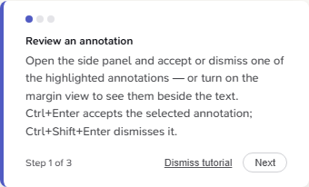
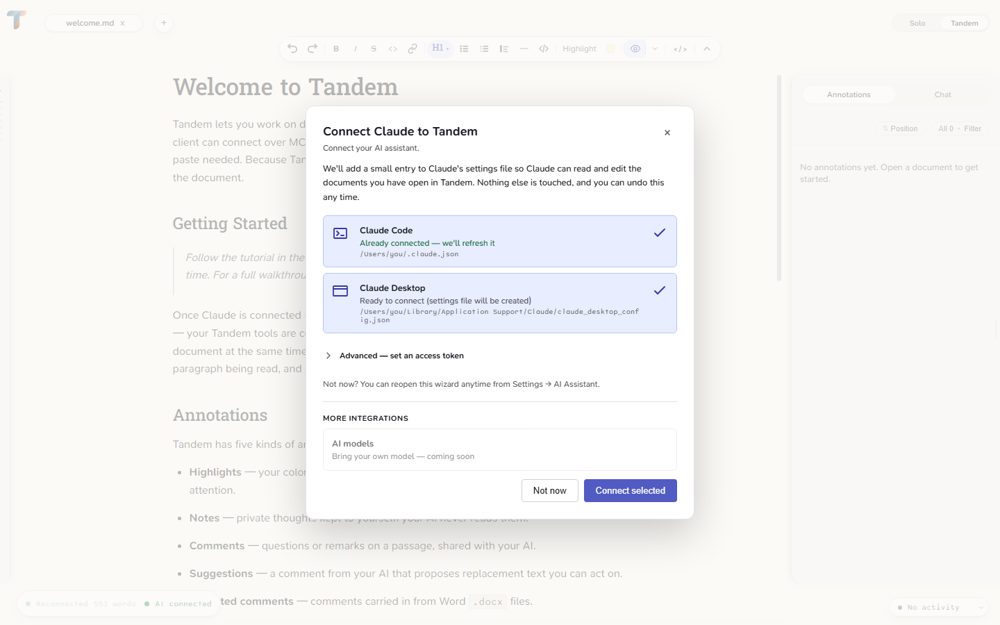
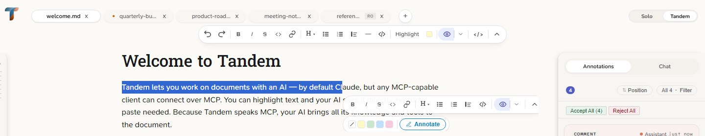
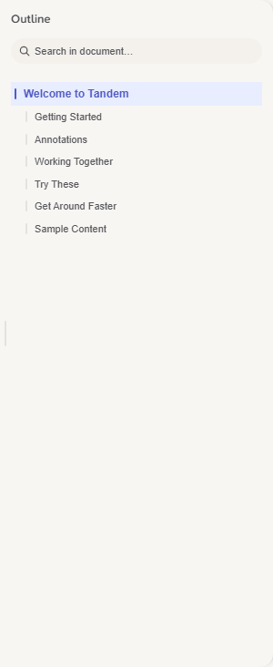
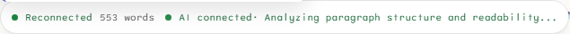
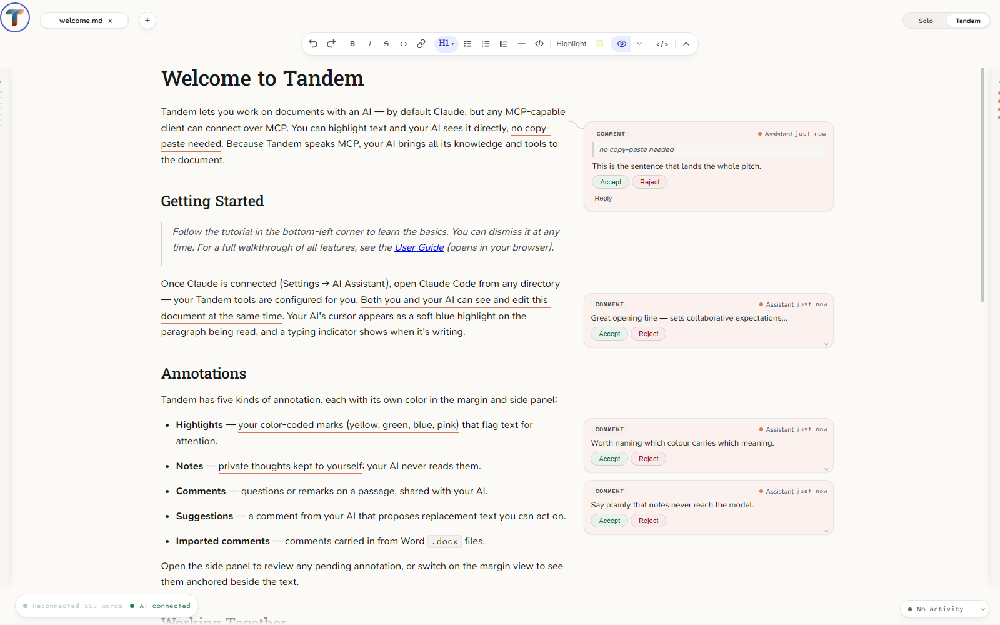
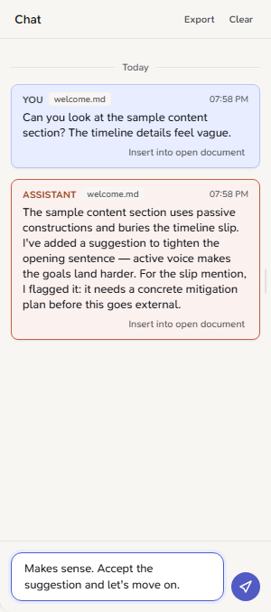
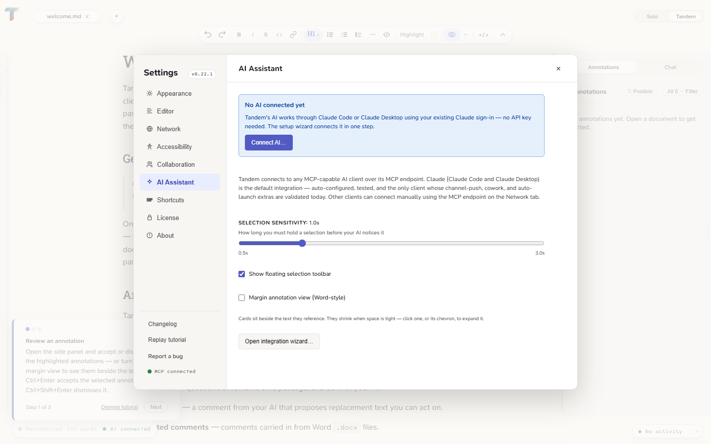

# User Guide

A complete guide to using Tandem — from first launch to advanced workflows.

> **Scope:** Examples use Claude Code as the default AI, per [ADR-038](decisions.md#adr-038-mcp-first-integration-policy-claude-as-default-integration). The editor itself is AI-client-agnostic — any MCP-capable client connecting to `http://127.0.0.1:3479/mcp` gets the same MCP tools. The Claude-specific transports (channel push, cowork, auto-launcher) don't apply to other clients.

> **Setting up an AI integration rather than learning the editor?** Skip to [Working with Claude Code](#working-with-claude-code) for the Claude default, or see [Integrations → The MCP integration policy](integrations.md#the-mcp-integration-policy) for the generic MCP path.

## Overview

Tandem lets you work on documents with an AI without the constant copy-paste. You open a document — an essay, a report, a proposal, a contract you're reviewing, or any prose — highlight the text you want to discuss, and the AI sees it directly. The AI can suggest rewrites, leave comments, and edit text alongside you in real time. Because the AI connects through MCP, it brings all its knowledge, tools, and conversation context to the document — it's not working in isolation. Each annotation is a first-class object you can accept, dismiss, edit, or discuss. The original file is never modified unless you save.

Tandem runs as a local server with two surfaces: an **editor** where you read and edit documents, and an **MCP client** (Claude Code by default) where the AI connects via MCP tools. Changes sync instantly between them through Yjs CRDT collaboration.

Tandem is available as a [desktop app](https://github.com/bloknayrb/tandem/releases/latest) (macOS, Linux, Windows) or as an [npm package](https://www.npmjs.com/package/tandem-editor) (`npm install -g tandem-editor`), which opens the same editor in your browser. The desktop app manages the server automatically; the npm install requires starting it from the terminal. Editing, annotations, chat and the integration wizard work the same in both. The desktop app adds what only a native shell can do: a system tray, native right-click menus and file dialogs, start-at-login, Cowork, in-app log access, and automatic updates. Instructions below that apply to only one of the two say so.

## First Launch

On first run, Tandem opens `sample/welcome.md` automatically. Four tutorial annotations appear in the document — a highlight, a comment, a comment with replacement text, and a private note — so you have something to interact with immediately.

A floating tutorial card appears at the bottom-left of the editor with three steps:

1. **Review an annotation** — Accept or dismiss one of the tutorial annotations from the side panel, or turn on the margin view to see them beside the text.
2. **Ask a question** — Select text, click Annotate, and send your question to your AI assistant. Or type in the Chat panel.
3. **Make an edit** — Click in the document and type something.

A "You're ready!" card follows the three steps. The tutorial dismisses after that and won't appear again (progress is saved to localStorage).

**Tip:** Start the Tandem server before Claude Code. Having the AI connected before the tutorial means you'll see real responses when you ask a question in step 2.



**On first run:** the integration wizard walks you through connecting Claude Code, in both the desktop app and the browser — there's no need to run `tandem setup` from a terminal. In the desktop app the server is already running; with the npm install, start it with `tandem` first. You can reopen the wizard any time from **Settings → AI Assistant**, or (desktop app only) the tray's "Setup AI Assistant" item.



## The Editor



### Document Area

The main editing area is a rich text editor powered by Tiptap. You can type, select, format, and edit just like any document editor. When your AI is connected, its focus paragraph gets a subtle blue highlight so you can see where it is reading.

### Tab Bar

Open documents appear as tabs along the top. Each tab shows the file name, a dot while there are unsaved changes, and an **RO** badge when the document is read-only.

- Drag tabs to reorder them, or use `Alt+Left` / `Alt+Right`
- Double-click a tab title (or press `F2`) to rename the file inline
- Click the **+** button at the end of the tab bar to open a new file

### Formatting Toolbar

Select text to reveal formatting buttons: **Bold**, **Italic**, **Headings** (H1/H2/H3), **Bullet List**, **Ordered List**, **Blockquote**, **Code**, **Link** (`Ctrl+K`), **Horizontal Rule**, and **Code Block**. Standard keyboard shortcuts also work (`Ctrl+B`, `Ctrl+I`, etc.). The toolbar wraps to a second row on narrow windows.

### Selection Popup

When text is selected, a floating popup appears with two parts:

- **Highlight swatches** — One-click highlighting in 4 colors (yellow, green, blue, pink), plus a "no highlight" swatch that clears an existing highlight.
- **Annotate** — Opens a small composer anchored to the selection. Type your text, then choose the audience:
  - **Note to self** (`Alt+Enter`) — A private note. Never sent to the AI. `Alt+Enter` always files a note, whichever button is primary.
  - **Send to your AI** (`Ctrl+Enter`) — An outbound comment. The AI sees the selected passage and your text, and can respond with annotations, chat messages, or both. The button is labelled with your configured assistant's name. `Ctrl+Enter` sends the *primary* action, which is the outbound comment by default.

The popup also includes a toggle to show or hide the formatting bar.

### Slash Menu

Type `/` at the start of a line (or after a space) to open a block-insert menu: Heading 1/2/3, Bullet list, Numbered list, Task list, Quote, Code block, Horizontal rule, and a 3×3 Table with a header row. Keep typing to filter — each command also has a short alias (`h1`, `ul`, `ol`, `todo`, `q`, `code`, `hr`, `3x3`).

Use `↑` / `↓` to move, `Enter` to insert, `Esc` to close. The `/` and whatever you typed after it are removed when the command runs. The menu only opens on text you actually type, so clicking after an existing `/` won't summon it, and it stays out of the way while the find bar, command palette, or an annotation popup is open.

### Right-Click Menus

**Desktop app only** — these are real OS menus. The browser build shows its browser's own menu in the document and nothing in the app chrome.

- **In the document:** Undo/Redo, Cut/Copy/Paste, **Paste as Raw Text** (`Ctrl+Shift+V`), and Select All. Right-clicking a link gives Open / Copy / Edit / Remove Link; right-clicking inside a table gives row and column submenus plus Merge Cells, Split Cell, and Delete Table. With text selected, three more items appear: **Ask AI about selection…**, **Comment to AI…**, and **Private Note…**. (On macOS, plain text keeps the native menu so Look Up and Services still work.)
- **On a tab:** Close, Close Tabs to the Left / Others / to the Right, Rename, Save or Save As…, View Markdown Source, Copy File Name, Copy Path, and Reveal in Finder / Show in File Explorer.
- **On an annotation card** (side panel or margin): Accept, Dismiss, Reply…, Edit…, Send to your AI, Copy text, and Remove (or Archive, for notes).

Right-clicking empty app chrome — rails, panel padding, the status bar — deliberately does nothing.

### Scroll Pill

The editor replaces the usual scrollbar with a slim pill in the right gutter. It fades in as your pointer approaches and flashes briefly whenever you scroll, so it stays out of the way while reading. Drag it to scrub through the document; it isn't a click-to-jump target, and it hides entirely when the document fits on screen. Turn it off in **Settings → Appearance → Scroll pill** to get the system scrollbar back.

### Outline Panel (left)

The left panel is the document outline: every heading in the active document, click to jump. A thin strip of tick marks beside it previews the document's shape even while the panel is collapsed. Toggle it with `Alt+Shift+Left`.



### Side Panel (right)

The right panel toggles between two views. Toggle the panel itself with `Alt+Shift+Right`.

Either rail can be resized by dragging the thin strip between it and the document. The strip is also keyboard-operable: tab to it and use the arrow keys.

**Annotations** — Lists all annotations with filtering by type, author, and status. Each card shows a preview of the annotated text, the annotation content, author badge, and timestamp. Bulk **Accept All** / **Dismiss All** buttons appear when multiple annotations are pending. When filters are active, bulk actions only affect the filtered subset.

**Chat** — Freeform messaging with your AI. See the [Chat](#chat) section for details.

### Status Bar



The floating pill at the bottom-left shows the following — it stays faint until you hover or focus it:

- **Connection state** — Green when connected, with reconnect attempt count and elapsed time during disconnects. A prominent banner appears after 30 seconds of continuous disconnect.
- **Word count** — Click to cycle through words, characters, sentences, and paragraphs.
- **Save state** — "Saving…" while a write is in flight, then "Saved HH:MM".
- **Review Only badge** — Appears when the active document is read-only (an uploaded file, or the changelog opened via View Changelog).
- **Held count** — In Solo mode, how many of your comments and replies are being withheld.
- **AI connection** — Whether your AI is reachable, and what it is doing ("Working on Cost Summary…", idle, and so on).
- **Working-folder pill** — Appears when the AI's working directory has drifted from the document you have open.

Your display name is set in **Settings → Collaboration**. The Solo / Tandem toggle (`Ctrl+Shift+M`) lives in the title bar at the top of the window, not the status bar. See [Solo / Tandem Mode](#solo--tandem-mode).

### Toast Notifications


Annotation failures and save errors surface as dismissible toast notifications at the bottom of the screen. Toasts auto-dismiss by severity (errors linger longest) and show a count badge when the same message repeats.

### Help Modal

Press `?` at any time to open the keyboard shortcuts reference. Press `?` or `Esc` to close it.

## Working with Documents

### Opening Files

There are three ways to open a file:

**Path input** — Click the **+** button in the tab bar, type an absolute file path, and click **Open**.

**Drag-and-drop** — Drag a file from your file manager onto the editor. A dashed border appears as a drop indicator.

**Upload** — Click **+**, switch to **Upload** mode, and browse or drag a file into the drop zone. Uploaded files get a synthetic `upload://` path and are always read-only — `Save` preserves the session (annotations) but cannot write back to disk.

### Supported Formats

- **Markdown** (`.md`) — Full read-write support. Your content round-trips exactly; some *formatting style* is canonicalized on the first save. See [Markdown formatting](#markdown-formatting) below.
- **Word** (`.docx`) — Read-write. Saving writes your edits back to the `.docx` body, and pending comments are written back as real Word comments. Existing Word comments (`<w:comment>` elements) are imported as annotations with author "import". External edits (e.g. from Word) are detected: a clean document reloads in place, while a document with unsaved edits shows a keep-vs-reload banner instead of losing anything. A **Convert to Markdown** option is also available if you prefer working in Markdown. See [Word fidelity](#word-fidelity) below.
- **Plain text** (`.txt`) — Full read-write support.
- **HTML** (`.html`, `.htm`) — Read support.

### Markdown Formatting

Tandem stores your document as structure, not as source text, so saving re-writes the
file from that structure. **What you wrote is preserved. How you wrote it may be
normalized** — once, on the first save. After that the file holds still.

Nothing in this list changes how the document renders in any viewer. These are the
things that do change:

- **Marker style.** Setext headings (`Title` over `=====`) become `# Title`; `*` bullets
  become `-`; `_em_` becomes `*em*`; `1)` becomes `1.`; `~~~` fences become backtick
  fences; indented code becomes fenced; `***` becomes `---`; runs of blank lines collapse
  to one.
- **Tables.** Column alignment (`:---`, `:-:`, `---:`) is preserved, but hand-aligned
  cell padding is not — cells are written compactly rather than padded to the widest
  value in the column. That is deliberate: with padded cells, editing one word reflows
  every row of the table.
- **Code spans.** Padding spaces inside a fence, and fences longer than they need to be,
  are trimmed to the shortest form that still works. A code span wrapped across two
  source lines comes back on one.
- **Escapes.** A literal backtick, a bracketed word matching a link definition, and an
  `@` before something host-shaped all keep their backslash. Tandem keeps an escape
  wherever removing it could change what the line means.
- **Emphasis nesting.** Where two styles cover exactly the same words — `~~**both**~~` —
  the order can come back swapped (`**~~both~~**`). Markdown records no trace of which
  was opened first. Where the two cover different spans, the nesting is preserved.

Everything else is written back as you left it: YAML and TOML frontmatter (fences and
all), loose vs tight list spacing, ordered-list start numbers, footnote and reference
definitions, raw HTML blocks, and your file's line endings — a CRLF file stays CRLF, and a
classic-Mac file with bare carriage returns stays that way too.

If a save ever looks wrong, the original is recoverable. Tandem copies the file's bytes
verbatim before its first write to it in a session; see
[troubleshooting → Recovering a previous version](troubleshooting.md#recovering-a-previous-version-of-a-document).

### Word Fidelity

Tandem does not model every Word feature, and it tells you which ones rather than letting you find out after a save.

When you open a `.docx` that uses something Tandem can't carry, a notice appears above the document: *"Some Word features in this file aren't fully supported… the items below won't survive a save back to .docx."* Expand **Details** for the list — it names the feature and a count (for example, "3 tracked deletions were applied automatically"), never the content itself. The notice is server-authoritative and stays until the losses are gone; you can collapse it, but not dismiss it.

Saving raises a toast summarising what was simplified on export, and what the backed-up original still has that the saved file doesn't. It repeats on every save on purpose: the comparison is against a copy you can still recover.

**Your original is always backed up first.** Before Tandem's first write to a `.docx` in a session it copies the file's bytes verbatim, so nothing here is one-way. If a save looks wrong, run **"Restore a backup of this document…"** from the command palette (`Ctrl+Shift+P`) — see [troubleshooting → Recovering a previous version](troubleshooting.md#recovering-a-previous-version-of-a-document). `.docx` files are also never auto-saved; only an explicit save overwrites them.

### Multi-Document Tabs

Each open file gets its own tab and its own collaboration room. Tabs scroll horizontally when they overflow. Reorder tabs by dragging or with `Alt+Left` / `Alt+Right`.

### Saving

Press `Ctrl+S` to save the active document to disk. Your AI can also save via `tandem_save`. A dot on the tab title indicates unsaved changes. Saves are atomic (write to temp file, then rename) to prevent partial writes.

## Annotations

Annotations are how feedback — yours and your AI's — shows up in the document. There are three types, each with distinct visual styling:



The shot above shows the optional **margin view** (Settings → AI Assistant), where cards sit beside the text they reference rather than in the side panel.

### Highlight

Colored background on the annotated text. User-only — the AI never creates highlights. Choose from 4 colors (yellow, green, blue, pink) via the selection popup's swatches. Use highlights to mark notable passages — green for good, yellow for problems, pink for style/tone.

### Comment

Dashed underline on the annotated text. Comments are the shared channel: you create them to send observations or questions to your AI, and it creates them to give feedback on your text. The comment text appears in the side panel card.

The AI's comments may carry a **replacement suggestion** (`suggestedText`) — a proposed text change. The side panel card shows a diff view: the original text in red with strikethrough, an arrow, and the replacement text in green. When a reason is provided, it appears below the diff. Accepting the comment applies the text change automatically. Suggestions are AI-only — your own comments are plain text; if you want a rewrite, ask for one in the comment and the AI responds with a suggestion you can accept.

### Note

A private note to yourself. Notes are never sent to the AI — it cannot read them through any MCP tool or event ([ADR-027](decisions.md#adr-027-annotation-system-redesign--audience-based-model)). Use them for personal reminders while you work. A note can later be **promoted** to a comment if you decide the AI should see it (imported Word comments arrive as notes too, and can be batch-promoted).

### Creating Annotations

Select text in the editor to reveal the selection popup. Click a highlight swatch for a highlight, or click **Annotate**, type your text, and choose **Note to self** (private) or the send button (an outbound comment — it carries your assistant's name).

### Editing Annotations

Click the **✎ Edit** button on any pending annotation card to edit its text. For a comment with replacement text, a second textarea appears for the proposed replacement.

Click **Save** to apply or **Cancel** to discard. Edited cards show "(edited)" with a timestamp. Only pending annotations can be edited — accepted or dismissed annotations are immutable.

## Reviewing Annotations

### One at a Time

Each annotation card in the side panel has **Accept** and **Dismiss** buttons. Accepting a comment with replacement text applies the text change. Accepting other annotations simply marks them as resolved.

### Undo

After accepting or dismissing, the resolved card briefly offers an **Undo** action. For accepted comments with replacement text, undo atomically reverts both the text change and the annotation status.

### Keyboard Review

Annotations can be reviewed without leaving the keyboard:

| Key | Action |
|-----|--------|
| `Alt+]` | Jump to next annotation |
| `Alt+[` | Jump to previous annotation |
| `Ctrl+Enter` | Accept the selected annotation (or the first pending one if none is selected) |
| `Ctrl+Shift+Enter` | Dismiss the selected annotation (or the first pending one) |
| `Escape` | Deselect the current annotation |

You can also enable the **margin view** (Settings → AI Assistant → "Margin annotation view") to see annotation cards beside the text they reference, in addition to the side panel list.

The margin adapts on two independent axes, and it helps to know which one you are seeing. **When the window is narrow**, the whole margin steps down — from full-width cards, to a narrow track showing a one-line teaser without the action row, to a bare tick mark, to nothing at all. **When cards are crowded** — too many anchored too close together — individual cards shrink to a one-line summary but **keep** their Accept/Reject buttons, so a shrunken card in a full-width margin is still actionable.

Either way, click a card to expand it while it's selected, or click its chevron to keep it expanded even after you select something else. Cards also widen to use empty margin space when you collapse or narrow a side rail.

### Bulk Actions

**Accept All** and **Dismiss All** buttons appear in the side panel header when multiple annotations are pending. A confirmation step is required before executing. When filters are active, bulk actions only affect the filtered annotations (e.g., "Accept 3 of 12 pending?").

### Solo / Tandem Mode


The title bar includes a **Solo / Tandem** toggle (`Ctrl+Shift+M`). It holds work back in *both* directions — the AI's annotations are held from you, and your own comments are held from the AI.

- **Tandem** (default) — the AI's annotations appear immediately as they arrive, and the comments and replies you write are visible to it.
- **Solo** — the AI's pending annotations are held back from the document. Resolved annotations (accepted/dismissed) are always visible regardless of mode.

Since v0.19.0 the server, not the client, enforces the other direction: while you are in Solo, the comments and replies **you** author are withheld from the AI. Each held item shows an amber **Held** pill, and the status bar shows a running count of what is being withheld. Switching back to Tandem releases the whole set at once — the AI picks them up on its next check, and a one-time nudge wakes a push-connected session to look.

Solo also hides the right rail, so the annotation list is out of sight while you write.

**Exactly what the Solo hold covers.** Held comments and replies are withheld from every surface that sends them to the AI:

| Surface | Held in Solo? |
|---|---|
| `tandem_checkInbox` (what Claude is told) | Yes |
| `tandem_getAnnotations` (Claude reading the annotation list) | Yes |
| Real-time push (channel shim and plugin monitor) | Yes — annotation events only; chat messages always deliver |
| `tandem_exportAnnotations` (generating a review report) | Yes — the export reports how many items it withheld, so the report never reads as complete when it isn't. (This was previously exempt, on the reasoning that an export is an explicit "give everything" action. It isn't: only the AI can invoke this tool, so the "explicit action" was always the AI's, not yours.) |
| `tandem_getTextContent`, `tandem_getContext`, `tandem_search` | Not applicable — these return document text only, never annotation records |

Personal **notes** are private in both modes and are never surfaced to the AI through any tool ([ADR-027](decisions.md)).

Use **Solo** during focused writing to avoid interruption, or when you want to mark up a draft without the AI reacting to each comment. Switch to **Tandem** when you're ready — all held annotations appear at once, in both directions.

## Chat



Toggle between the **Annotations** and **Chat** views using the tabs at the top of the side panel.

### Sending Messages

Type in the input box and press `Enter` to send. Messages go to your AI via the server.

### Text Anchors

If you have text selected in the editor when you send a message, the selection is attached as a clickable anchor. The anchor quote shows a preview that expands on hover to reveal the full text. Clicking the anchor scrolls the editor back to that passage.

### Responses

Replies are rendered as Markdown in the chat panel. Your AI can respond to chat messages with text, annotations on the document, or both.

### Unread Badge

An unread badge appears on the Chat tab when a reply arrives while you're viewing the Annotations panel. Switch to Chat to clear it.

## Settings

Everything lives in one modal, opened with `Ctrl+,` or from the brand menu:



| Tab | What's in it |
|-----|--------------|
| **Appearance** | Theme (light / warm / dark / system), which panel opens by default, text size, accent hue, spacing density, which decorations are shown (authorship, comments, highlights, notes), reduce motion, the optional formatting bar, reveal-rails-on-hover, uniform tab width, and the scroll pill |
| **Editor** | Reading measure, editor font, default font by file type, default save folder, smart typography, spellcheck, and raw-markdown view — see [Editor settings](#editor-settings) below |
| **Network** | Connection details, start-at-login (desktop app only), and the advanced retry/delay controls |
| **Accessibility** | Motion-reduction and related display preferences |
| **Collaboration** | Your display name, Solo/Tandem behavior, and presence options |
| **AI Assistant** | Working directory, the margin annotation view, the integration wizard, Replay tutorial, and Cowork enablement (desktop app only) |
| **Shortcuts** | Click-to-record remapping for every app-level shortcut, with per-row reset and a reset-all |
| **License** | Activation and current license or trial status |
| **About** | Version, Copy Diagnostics, and Open log folder (desktop app only) |

### Editor settings

Most of what shapes the reading surface lives here.

- **Reading measure** — The line length of the text: Narrow (58 characters), Comfortable (68), Wide (82), or Full (fills the editor). A fixed measure keeps lines readable no matter which panels are open.
- **Editor font** — Sans-serif, Serif, or Monospace for the document text.
- **Default font by file type** — Overrides the editor font per format (`.md`, `.docx`, `.html`, `.txt`). Anything you don't set falls back to the editor font; **Reset to defaults** clears every override at once.
- **Default save folder** — Where **Save As** puts new files. Leave it empty to fall back to your AI's working directory, then your home folder. In the desktop app a **Choose…** button opens a native folder picker; in the browser you type the path, and browser Save As is a download that ignores this setting.
- **Smart typography** — Converts straight quotes, dashes, and `...` to typographic characters as you type. Opt-in.
- **Spellcheck** — Shows the browser's spelling underlines. Opt-in.
- **Show raw markdown** — Reveals footnotes, reference-style links, and inline HTML that Tandem keeps as raw source. When hidden they stay in the file and always save; only the on-screen markers are hidden. (This control used to sit under Appearance.)

## Keyboard Shortcuts

Press `?` to open the in-app shortcuts reference at any time — it always reflects your effective bindings. Most app-level shortcuts are remappable in **Settings → Shortcuts** (click-to-record); the defaults are listed below.

### Editor

| Shortcut | Action |
|----------|--------|
| `Ctrl+B` | Bold |
| `Ctrl+I` | Italic |
| `Ctrl+K` | Insert/remove link |
| `Ctrl+S` | Save document |
| `Ctrl+Shift+S` | Save As (e.g. promote a scratchpad to a file) |
| `Ctrl+F` | Find / replace |
| `Ctrl+G` | Find next match |
| `Ctrl+Shift+G` | Find previous match |
| `Alt+L` | Select containing block |
| `Ctrl+Shift+E` | View / exit Markdown source |

> **Note:** Undo/redo is not yet available in collaborative mode (tracked as a future enhancement).

### Annotations & Review

| Shortcut | Action |
|----------|--------|
| `Ctrl+Enter` | Accept selected (or first pending) annotation |
| `Ctrl+Shift+Enter` | Dismiss selected (or first pending) annotation |
| `Alt+]` | Next annotation |
| `Alt+[` | Previous annotation |
| `Ctrl+Alt+M` | Comment on current selection |
| `Ctrl+Alt+A` | Toggle authorship colors |
| `Escape` | Deselect annotation / close overlays |

### Navigation & General

| Shortcut | Action |
|----------|--------|
| `Ctrl+Shift+P` | Command palette |
| `Ctrl+N` | New scratchpad |
| `Ctrl+O` | Open file |
| `Ctrl+T` | New-tab menu (recent files / browse) |
| `Ctrl+W` | Close tab |
| `Ctrl+Alt+T` | Reopen closed tab |
| `Ctrl+1`–`Ctrl+9` | Jump to tab 1–9 |
| `Alt+Left` / `Alt+Right` | Reorder the focused tab |
| `Alt+Shift+Left` / `Alt+Shift+Right` | Toggle the outline panel / the Annotations + Chat panel |
| `Ctrl+Shift+M` | Toggle Solo / Tandem mode |
| `Ctrl+Shift+J` | Focus chat |
| `Ctrl+,` | Settings |
| `Enter` | Send message (chat panel) |
| `?` | Show/hide keyboard shortcuts |

## Working with Claude Code

Tandem connects to Claude Code through MCP (Model Context Protocol). Claude gets Tandem's full MCP tool surface for reading documents, creating annotations, searching text, managing files, and communicating with you.

### Connection

Start the Tandem server first (`tandem` for global install, or `npm run dev:standalone` for development). Then start Claude Code. Claude's tools become available via the MCP configuration written by the integration wizard (or `tandem setup --apply` for a scripted setup), or `.mcp.json` (development).

**Desktop app:** The server is already running. On first run the integration wizard configures Claude Code; once connected, your `tandem_*` tools are available immediately. You can re-open the wizard any time from the tray "Setup AI Assistant" item or Settings. Skip to [Real-Time Push](#real-time-push-recommended) if you want channel notifications.

Claude can check the connection with `tandem_status`, which reports open documents, connection state, and your current mode (Solo or Tandem).

### Real-Time Push (Recommended)

Chat messages, annotation accepts/dismisses, and text selections can push to Claude in real time rather than waiting for it to poll. Sessions Tandem launches for you already get this and need no setup. In a session you start yourself, first Tandem use runs the bundled skill; after its first successful read-mode `tandem_status`, the skill automatically makes one persistent built-in Monitor attempt using the returned wake-stream address.

The **built-in Monitor watch** needs no installation or flag and lasts only for that session. It requires a Claude Code account where Monitor is enabled and, on Windows, Git Bash. Asking Claude to watch is recovery if the automatic attempt was skipped, not a required setup step.

The **Tandem plugin** also needs no flag — install it once and every `claude` you start afterwards picks it up, though it begins watching only when Claude first uses Tandem's skill in that session. Ask for Tandem by name and it starts; a session that has never heard of Tandem is not listening yet. Start `claude` from a terminal, since its monitor uses that session's program path to find Node.

The **channel flag** is the third route and must be present on every session:

```bash
claude --dangerously-load-development-channels server:tandem-channel
```

Choose one setup route where possible. A session with the plugin and built-in Monitor available may start both automatically on first Tandem use. Wakes carry no message content and the inbox de-duplicates what Claude reads, but the overlap can waste a turn; if doubled wakes make it visible, ask Claude to stop the built-in watch with `TaskStop`. The channel flag is Claude Code's marker for unstable APIs; it stays necessary for this transport regardless of how the Channels API matures, because the allowlist that would make it optional covers plugins only and `tandem-channel` is a plain MCP server. It also has no effect outside an interactive session.

### Polling Remains Authoritative

Push wakes an idle Claude, but it can be dropped or rate-limited and never carries the message itself. Claude should keep calling `tandem_checkInbox` during active work. If no push route is available and you want periodic checks while otherwise idle, use the `/loop` skill in Claude Code:

```
/loop 30s check tandem inbox and respond to any new messages
```

This polls every 30 seconds. Token cost is minimal when there are no new messages.

### The Communication Loop

Two tools form the core of how Claude and the user communicate:

- **`tandem_checkInbox`** — Claude calls this to see user actions: chat messages, annotation accepts/dismisses, text selections, and document switches. Returns everything since the last check.
- **`tandem_reply`** — Claude sends a chat message back to the user. Appears in the Chat panel.

Real-time push is a best-effort wake signal, not the authority on what Claude sees. Wakes can be dropped or rate-limited and carry no message content, so Claude still polls `tandem_checkInbox`; that inbox remains authoritative and de-duplicates items already pushed.

### Session Handoff

**What persists** across server restarts:
- Document content (Y.Doc state)
- All annotations (stored alongside Y.Doc in session files)
- File paths, formats, and metadata

**What doesn't persist:**
- Claude's awareness state (status text, focus paragraph)
- User awareness state (selection, typing indicator)

**How a new Claude session picks up:**
1. Call `tandem_status()` to see open documents
2. Call `tandem_listDocuments()` for details
3. Call `tandem_getOutline()` on the active document to orient
4. Call `tandem_getAnnotations()` to see existing annotation state
5. Continue where the previous session left off

Previously-open documents are auto-restored when the server starts — no manual `tandem_open` needed.

### Further Reading

- [MCP Tool Reference](mcp-tools.md) — Full documentation for all MCP tools
- [Workflows](workflows.md) — Advanced Claude Code patterns: cross-referencing documents, multi-model collaboration, RFP drafting, session handoff details
- [Architecture](architecture.md) — System design, coordinate systems, data flows

## Troubleshooting

### "Cannot reach the Tandem server"

The editor couldn't connect to the server via WebSocket. Make sure the server is running:
- **Global install:** Run `tandem` in a terminal
- **Development:** Run `npm run dev:standalone`

The message appears after 3 seconds of failed connection. If the server was restarted, refresh the page.

### Annotations not appearing

Check the connection indicator in the status bar. If it shows "Reconnecting...", the WebSocket connection dropped — it will auto-reconnect.

If connected but annotations still aren't showing, check your **mode** in the title bar. **Solo** mode holds Claude's pending annotations, and also hides the right rail. Switch to **Tandem** to see everything.

Check the developer console for CRDT fallback warnings (`buildDecorations()` warnings indicate annotations falling back from CRDT-anchored to flat offsets).

### Document won't load

Verify the file path exists and is readable. The server logs (terminal where you started Tandem) will show errors for missing files or permission issues.

For `.docx` files, mammoth.js handles the conversion. Corrupted or password-protected `.docx` files will fail to open.

### Claude isn't responding

Make sure Claude Code is running and connected. Check `tandem_status` from Claude Code — if it returns an error, Claude can't reach the server. Run `/mcp` in Claude Code to reconnect.

If using channels, the server must be running before Claude Code starts. If you restarted the server, restart Claude Code or run `/mcp`. Channel timeout messages such as `/api/events timed out after 10000ms`, `SSE inactivity timeout`, or `/api/channel-reply timed out after 5000ms` mean the server accepted a connection but stopped responding; restart Tandem and reconnect Claude.

For server-side and MCP troubleshooting, see [troubleshooting.md](troubleshooting.md).

### Desktop app: server won't start

The desktop app runs the server as a background sidecar process. Check the system tray — if Tandem's icon is there, the server is running. If the icon is missing or the app shows an error dialog, the sidecar failed to start (port conflict, missing resources, or crash). Restart the app. For persistent issues, check the Tauri log output in the system console.
